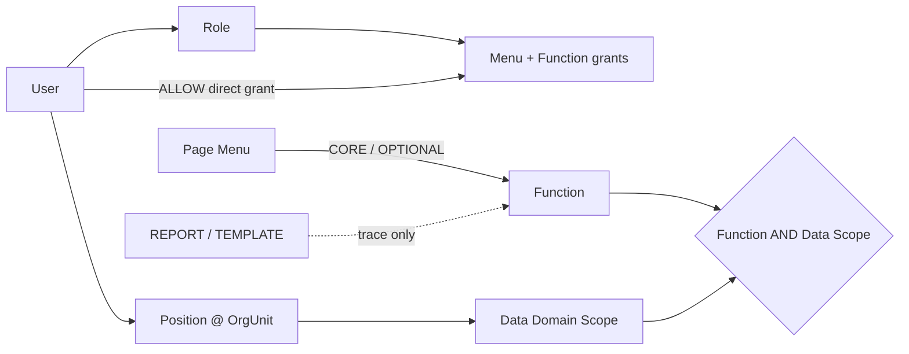
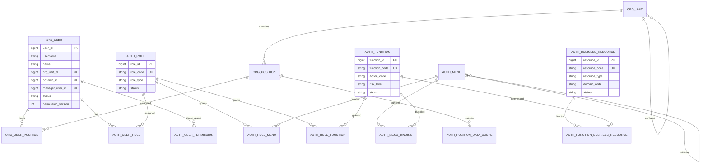

# 企业中台权限架构设计方案（简化最佳实践版）

适用范围：单企业、多业务板块的企业中台系统。 
设计目标：兼顾业内通用最佳实践、企业实际落地成本、长期可扩展性与权限可解释性。 
核心方向：**业务权限编码 + RBAC + 组织数据范围 + 字段策略**。

> **实施口径更新（2026-08-10）**  
> 当前 Nuxt Demo 与主方案采用“菜单 + 功能”两类可授权对象：前端与后端直接使用同一 Function Code，API 不作为 Resource，也不经过 API→Resource→Function 二次映射。Resource scope 收敛为仅供目录追踪的 `REPORT / TEMPLATE` 业务资源，不参与角色、用户、菜单包或运行时授权。功能与业务资源均可编辑，但稳定代码创建后不可修改。本文后续涉及 BUSINESS_OBJECT / FIELD / FILE / WORKFLOW / JOB 资源授权、Resource + Action 绑定及字段策略的段落属于远期扩展备忘，不属于当前实施范围；如与[主方案](./企业中台权限架构方案.md)冲突，以主方案 1.1 为准。

---

# 1. 建设背景与目标

企业中台将逐步承载信息、供应链、设计师、财务、人力资源、系统管理等多个业务板块。随着板块、角色和业务数据增加，传统的“用户 → 角色 → 菜单”或“用户 → 角色 → API”模型将难以回答以下问题：

```text
1. 某个用户可以进入哪些中台板块和页面？
2. 某个用户在页面内可以执行哪些业务操作？
3. 某个用户能够查看、编辑、导出哪些具体业务记录？
4. 某个敏感字段应该完整显示、脱敏、隐藏还是禁止导出？
5. 某项权限来自哪个角色、岗位或临时授权？
6. 权限发生变化后，如何快速生效并可被审计、追踪和模拟？
```

因此，本方案将权限体系建设为企业中台的一项公共基础能力，统一管理：

- 用户与员工身份
- 组织与岗位
- 应用与业务模块
- 菜单与路由
- 业务功能权限
- 业务资源
- 角色与授权关系
- 数据权限
- 字段权限
- 权限上下文与缓存
- 权限模拟与审计

整体采用：

> **RBAC 负责“谁拥有什么业务能力”，组织树与 Data Policy 负责“能操作哪些记录”，Field Policy 负责“记录中的哪些字段可以如何使用”。**

---

# 2. 设计原则

## 2.1 单企业优先，避免过度平台化

本系统服务于单一企业内部，不引入 Tenant / 租户领域，也不为多租户场景预留大量无实际业务价值的抽象。

所有权限数据默认属于当前企业。

## 2.2 User 直接等同于员工

不拆分 Account / User / Employee 三层模型。

```text
User = 登录主体 + 企业员工 + 权限主体
```

一个用户同时拥有：

- 登录账号
- 姓名、手机号、邮箱
- 所属组织
- 岗位
- 直属上级
- 角色
- 状态
- 权限版本号

未来如确实出现一个员工绑定多个外部身份，可增量增加 `user_identity`，而不是第一版预先复杂化。

## 2.3 业务权限编码必须稳定

权限不绑定：

- HTTP URL
- HTTP Method
- 按钮文案
- 前端组件名
- 数据库表名

统一使用稳定的业务权限编码：

```text
information.company.read
supply.supplier.read
supply.supplier.create
supply.supplier.update
supply.supplier.export
finance.payable.approve
hr.employee.update
system.role.manage
```

URL、接口实现、页面组件都允许重构，而业务权限编码应尽量长期稳定。

## 2.4 默认拒绝，第一版只配置 ALLOW

权限规则采用：

```text
有明确授权 → ALLOW
没有明确授权 → DENY
```

第一版不引入通用显式 DENY，以避免多角色组合后出现难以解释的冲突。

特殊限制通过：

- 数据策略 `NONE`
- 字段策略 `HIDDEN / 禁止编辑 / 禁止导出`
- 用户状态
- 业务状态条件

实现。

## 2.5 前端不是安全边界

前端负责：

- 动态菜单
- 动态路由
- 按钮、页签显示
- 字段展示体验

后端负责最终安全判断：

```text
身份认证
→ 功能权限
→ 数据权限
→ 字段权限
→ 业务状态约束
```

前端隐藏按钮只能改善体验，不能替代后端鉴权。

## 2.6 权限必须可解释

系统必须能够回答：

```text
张三为什么能看到供应商 A？
张三为什么不能编辑供应商 B？
王敏为什么能导出供应商？
某个菜单为什么没有显示？
某个字段为什么被脱敏？
这项权限来自哪个角色？
```

因此权限计算必须保留来源信息，而不是只返回一个布尔值。

---

# 3. 简化后的核心领域模型

本方案只保留真正需要长期理解和维护的核心概念。

```text
1. User          用户 / 员工 / 登录主体
2. OrgUnit       组织树节点
3. Position      岗位
4. Role          角色 / 权限集合
5. Application   中台大板块
6. Module        应用内部业务分组
7. Menu          导航 / 页面入口
8. Function      唯一可授权的业务操作
9. BusinessResource  报表/模板资源目录（不可授权）
10. DataPolicy   记录级数据范围
11. FieldPolicy  字段级使用规则
```

其中 Module 只承担结构分组，不直接参与后端授权判断。

---

# 4. User 用户

## 4.1 定义

User 直接代表企业员工，也是登录与权限主体。

```text
张三
├─ 登录账号：zhangsan
├─ 姓名：张三
├─ 所属组织：供应链中心 / 供应商组
├─ 岗位：供应链专员
├─ 直属上级：王敏
├─ 角色：供应链专员
└─ 状态：正常
```

## 4.2 核心字段

| 字段               | 说明                              |
| :----------------- | --------------------------------- |
| user_id            | 用户唯一标识                      |
| username           | 登录名                            |
| password_hash      | 密码摘要                          |
| name               | 员工姓名                          |
| mobile             | 手机号                            |
| email              | 邮箱                              |
| org_unit_id        | 所属组织节点                      |
| position_id        | 岗位                              |
| manager_user_id    | 直属上级                          |
| user_type          | NORMAL / ADMIN / SERVICE          |
| status             | NORMAL / FROZEN / DISABLED / LEFT |
| permission_version | 权限版本                          |
| last_login_at      | 最近登录时间                      |

## 4.3 用户可直接获得少量 ALLOW 加授

常规授权采用：

```text
User → Role → Permission
```

角色仍是常规授权主路径；第一版同时允许对用户直接加授菜单或功能，以满足小企业少量、临时例外。用户直授只支持 `ALLOW`，必须记录原因；失效时间为选填，留空表示长期有效，临时或中高风险授权建议设置。若要让用户少于角色权限，应拆分或移除角色，不引入用户级 `DENY`。

---

# 5. OrgUnit 组织树与 Position 岗位

## 5.1 OrgUnit

组织、公司、部门、团队统一使用一棵树：

```text
集团
├─ 信息中心
├─ 供应链中心
│  ├─ 供应商组
│  ├─ 采购组
│  └─ 库存组
├─ 设计师运营部
├─ 财务部
│  └─ 结算组
└─ 人力资源部
```

节点类型：

```text
GROUP
REGION
COMPANY
DEPARTMENT
TEAM
```

核心字段：

```text
org_unit_id
parent_id
org_code
org_name
org_type
manager_user_id
sort_order
status
```

## 5.2 Position

岗位描述员工承担的职责：

```text
供应链专员
供应链主管
设计师运营
财务审核专员
HR主管
权限管理员
```

岗位可以配置默认角色：

```text
供应链专员岗位
→ 默认授予“供应链专员”角色
```

因此三者边界为：

```text
OrgUnit  = 人在哪里
Position = 人承担什么岗位
Role     = 人拥有什么权限
```

---

# 6. Application 与 Module

## 6.1 Application

Application 用于承载企业中台大板块。

建议初始应用：

| application_code | 应用名称     |
| ---------------- | ------------ |
| information      | 信息板块     |
| supply           | 供应链板块   |
| designer         | 设计师板块   |
| finance          | 财务板块     |
| hr               | 人力资源板块 |
| system           | 系统管理     |

Application 是产品信息架构的最高层，不必单独再做“应用访问权限表”。

默认规则：

> 用户只要拥有某个 Application 下至少一个可见 Menu，则该 Application 显示。

这样可以减少重复授权。

## 6.2 Module

Module 是 Application 内的业务分组：

```text
供应链
├─ 供应商管理
├─ 采购管理
├─ 库存管理
└─ 物流管理
```

Module 不直接参与权限判断，仅用于：

- 权限树分组
- 菜单归类
- 资源归类
- 功能归类
- 统计与筛选

---

# 7. Menu 菜单与路由

## 7.1 Menu 的职责

Menu 只解决：

> 用户能够看到并进入哪些导航页面？

菜单类型：

```text
APPLICATION_ENTRY  应用入口
DIRECTORY          目录
PAGE               页面
HIDDEN_ROUTE       隐藏路由
EXTERNAL_LINK      外部链接
```

## 7.2 菜单与功能权限分离

例如：

```text
菜单：供应商列表
required_function = supply.supplier.read
```

角色必须同时满足：

```text
角色拥有该 Menu
AND
角色拥有 required_function
```

页面才真正可进入。

这种设计可以避免：

```text
菜单显示了，但用户没有页面基础读取能力
```

同时 Menu 不作为后端安全判断依据。

## 7.3 菜单核心字段

```text
menu_id
application_id
module_id
parent_id
menu_code
menu_name
menu_type
route_path
route_name
component_key
required_function_id
icon
sort_order
visible
status
```

---

# 8. Business Resource 业务资源

## 8.1 定义与边界

当前实施中的 Business Resource 不是权限对象，只是对可复用报表和模板的轻量目录。其类型固定为：

```text
REPORT      报表
TEMPLATE    模板
```

API、业务对象、字段、文件分类、工作流、后台任务和数据记录实例都不注册为 Resource。API / 服务方法直接声明 Function Code；业务数据范围由 Function 的 `data_domain` 与岗位策略关联。

## 8.2 与 Function 的关系

资源可以从资源侧可选关联一个或多个 Function，用于回答“这份报表/模板从哪些功能访问或维护”。该关系：

- 不进入角色或用户授权；
- 不进入菜单 CORE / OPTIONAL；
- 不出现在 PermissionContext；
- 不参与后端放行判断；
- 删除关联不会撤销功能权限。

这样既保留资源可发现性，又避免 Function 新建必须绑 Resource、Resource 新建又必须绑 Function 的循环流程。

## 8.3 核心字段

```text
resource_id
resource_code UNIQUE       # report.* / template.*
resource_name
resource_type              # REPORT | TEMPLATE
domain_code
status                     # DRAFT | ACTIVE | DISABLED
description
created_at
updated_at
```

稳定代码与资源类型创建后不可编辑；名称、领域、状态、描述和 Function 追踪关系可编辑，变更必须记录原因与 before / after 审计。

---

# 9. Function 业务功能权限

## 9.1 Function 是核心业务权限

Function 表示“用户可以执行什么稳定业务动作”，是前后端与权限中心唯一的能力合同。

```text
Function = Business Domain + Business Object + Action
```

例如：

```text
业务对象语义：supply.supplier
动作：create
功能编码：supply.supplier.create
功能名称：新增供应商
```

## 9.2 常用 Action

第一版内置：

```text
read        查看
create      新增
update      编辑
delete      删除
export      导出
import      导入
assign      分配
transfer    转移
approve     审核
reject      驳回
download    下载
execute     执行
```

Action 作为系统字典即可，不提供独立“动作管理中心”。

## 9.3 特殊动作

业务确有需要时增加：

```text
claim       领取
release     放回公海
merge       合并
archive     归档
settle      结算
```

## 9.4 Function 核心字段

```text
function_id
application_id
module_id
function_code
function_name
action_code
risk_level
status
description
```

## 9.5 后端直接使用 Function Code 鉴权

例如：

```java
@RequirePermission("supply.supplier.create")
@PostMapping("/suppliers")
public Result createSupplier(...) {
    ...
}
```

这里 URL 只是技术实现，权限系统只认：

```text
supply.supplier.create
```

接口路径改变时角色权限不需要迁移。

Function 可以独立创建、启用和授权，不要求先创建或绑定 Business Resource。

---

# 10. Role 角色

## 10.1 定义

Role 是一组可复用权限集合。

第一版只保留三种角色：

```text
BUSINESS    业务角色
SYSTEM      系统角色
TEMPORARY   临时角色
```

暂不引入：

- Data Role
- Role Inheritance
- 通用显式 DENY

## 10.2 角色可以配置

```text
Role
├─ Menu 权限
├─ Function 权限
└─ Members
```

数据范围不挂在业务角色上，而由“岗位 @ 部门 × 数据域”提供；这样增加业务角色不会意外扩大可见数据。字段策略不属于当前实施 scope。

## 10.3 一个用户可以拥有多个角色

```text
张三
├─ 供应链专员
└─ 合同只读
```

最终功能权限和菜单权限取并集。

## 10.4 UserRole 记录授权来源

`auth_user_role` 不只是关系表，还应记录：

```text
user_role_id
user_id
role_id
source_type
source_id
valid_from
valid_to
granted_by
created_at
```

`source_type` 建议：

```text
MANUAL       管理员手工授权
POSITION     岗位自动授权
TEMPORARY    临时授权
IMPORT       批量导入
SYNC         外部同步
```

用户直接加授另存 `auth_user_permission`，记录 `valid_from / valid_to / reason / source_ticket / granted_by`；它只允许 ALLOW，不与临时角色强耦合。

---

# 11. DataPolicy 数据权限

## 11.1 DataPolicy 解决的问题

Function 解决：

```text
张三能不能执行“查看供应商”？
```

DataPolicy 解决：

```text
张三具体能够查看哪些供应商？
```

完整允许条件：

```text
拥有 Function
AND
业务记录命中 DataPolicy
```

## 11.2 第一版数据范围

```text
NONE                    无任何记录
SELF                    本人负责
DEPT                    本部门
DEPT_AND_DESCENDANTS    本部门及全部下级
CUSTOM_DEPTS            指定组织节点
ALL                     全部
```

不急于第一版引入任意 ABAC 表达式。

## 11.3 按“岗位 + 数据域”配置

同一岗位在不同数据域可以有不同范围；多个有效任职取允许范围并集。未配置的受保护数据域按 `NONE`，而不是 ALL。

| 岗位 @ 部门           | 数据域              | 数据范围             |
| --------------------- | ------------------- | -------------------- |
| 供应链专员 @ 华东组   | `sc.supplier`       | SELF                 |
| 供应链主管 @ 供应链部 | `sc.supplier`       | DEPT_AND_DESCENDANTS |
| 供应链主管 @ 供应链部 | `sc.purchase_order` | DEPT                 |

## 11.4 数据域必须声明归属字段

例如供应商数据域：

```text
data_domain = supply.supplier
owner_field = owner_user_id
dept_field = owner_org_unit_id
creator_field = created_by
collaborator_relation = supplier_collaborator
```

## 11.5 查询列表时必须在数据库层过滤

销售专员查询供应商：

```sql
SELECT s.*
FROM supplier s
WHERE s.owner_user_id = :currentUserId
   OR EXISTS (
       SELECT 1
       FROM supplier_collaborator sc
       WHERE sc.supplier_id = s.id
         AND sc.user_id = :currentUserId
   );
```

不能先查询全部数据再依赖前端过滤。

## 11.6 详情、更新、删除同样需要数据权限

例如：

```text
PUT /suppliers/SUP-003
```

后端判断：

```text
1. supply.supplier.update 是否拥有？
2. SUP-003 是否命中 update 对应的数据范围？
3. 提交字段是否允许修改？
4. 业务状态是否允许修改？
```

---

# 12. FieldPolicy 字段权限

## 12.1 字段权限采用矩阵，而不是单枚举

推荐结构：

| 字段       | 查看    | 编辑 | 导出 | 脱敏规则     |
| ---------- | ------- | ---- | ---- | ------------ |
| 供应商名称 | VISIBLE | YES  | YES  | —            |
| 联系人手机 | MASKED  | YES  | NO   | MOBILE       |
| 年采购额   | VISIBLE | NO   | YES  | —            |
| 银行账号   | MASKED  | NO   | NO   | BANK_ACCOUNT |

## 12.2 View Policy

```text
VISIBLE   完整可见
MASKED    后端脱敏
HIDDEN    不返回或返回空
```

## 12.3 Edit Policy

```text
YES / NO
```

后端更新接口必须过滤或拒绝无权修改的字段，避免 Mass Assignment。

## 12.4 Export Policy

```text
YES / NO
```

用户能看某字段，不代表可以导出该字段。

## 12.5 字段权限必须后端执行

敏感字段不应只通过前端 CSS 或组件隐藏。

推荐：

```text
查询字段裁剪
→ DTO 序列化策略
→ 服务端脱敏
→ 最终响应
```

---

# 13. 菜单、功能、业务资源与数据的边界

这是整套权限系统最重要的认知模型。

| 领域             | 回答的问题                 | 示例           |
| ---------------- | -------------------------- | -------------- |
| Application      | 属于哪个中台板块？         | 供应链         |
| Menu             | 用户从哪里进入？           | 供应商列表     |
| Function         | 可以对对象做什么？         | 编辑供应商     |
| BusinessResource | 有哪些可复用报表/模板？    | 供应商导入模板 |
| DataPolicy       | 可以操作哪些记录？         | 本部门及下级   |
| Role             | 哪类人员拥有上述权限集合？ | 供应链专员     |
| User             | 最终是谁在访问？           | 张三           |

典型权限语义：

```text
张三
通过“供应链专员”角色
拥有 supply.supplier.read
数据范围由“供应链专员 @ 华东组”提供，为 SELF
```

---

# 14. 总体授权模型



运行时不是从 Menu 推导安全权限，而是直接校验 Function。

---

# 15. 权限计算规则

## 15.1 有效角色

```text
有效角色
= 手工角色
+ 岗位自动角色
+ 当前仍有效的临时角色
- 已停用角色
- 已过期授权
```

## 15.2 有效菜单

```text
有效菜单
= 所有有效角色 Menu 并集
∩ 菜单状态为启用
∩ required_function 已拥有
```

父目录无任何可见子节点时自动隐藏。

## 15.3 有效 Function

```text
EffectiveFunctions
= 有效角色 Function 并集
+ 未过期用户 ALLOW 直授
+ 已授权页面菜单的 CORE Function
```

第一版不存在通用 DENY，因此没有冲突求值问题。

## 15.4 数据范围

同一用户通过多个有效“岗位 @ 部门”获得同一个：

```text
Data Domain
```

时，允许数据集合默认取并集：

```text
SELF ∪ DEPT = DEPT 范围
```

但系统应保留命中的具体岗位、部门和策略，供权限模拟解释。

## 15.5 字段权限合并

建议使用“最宽允许集合”合并，同时敏感系统策略可以作为不可覆盖的安全上限。

第一版可简化为：

```text
查看：VISIBLE > MASKED > HIDDEN
编辑：任一有效角色 YES → YES
导出：任一有效角色 YES → YES
```

对于极高敏感字段，可配置系统级 `security_ceiling`，不允许普通角色突破。

---

# 16. 后端鉴权架构

推荐模块：

```text
Identity / Session
Authorization Service
Organization Service
Policy Evaluator
Audit Service
Cache
```

不要求第一版拆成独立微服务，可以先在中台后端作为模块实现。

```text
前端
  │ Token
  ▼
Gateway / Security Filter
  │ 用户身份
  ▼
业务 Controller
  │ @RequirePermission("supply.supplier.update")
  ▼
Function Permission Check
  │
  ▼
Data Scope Interceptor / Repository Filter
  │
  ▼
Field Policy Serializer / Validator
  │
  ▼
业务 Service / Database
```

---

# 17. 后端请求鉴权流程

以编辑供应商为例：

```http
PUT /suppliers/SUP-001
```

## 第一步：身份认证

检查：

```text
Token 是否有效
用户状态是否 NORMAL
会话是否过期
```

## 第二步：Function 权限

接口声明：

```java
@RequirePermission("supply.supplier.update")
```

权限中心判断当前 User 的 EffectiveFunctions 是否包含该编码。

没有则直接 403。

## 第三步：数据权限

查找：

```text
data_domain = supply.supplier
```

获取用户对应 DataPolicy。

例如：

```text
SELF
```

校验：

```text
supplier.owner_user_id == current_user.id
```

不满足返回 403 或按业务安全策略返回 404。

## 第四步：字段权限

请求：

```json
{
  "name": "星海供应",
  "contactMobile": "13800000000",
  "bankAccount": "6222...",
  "ownerUserId": "U002"
}
```

如果当前角色：

```text
name           editable = YES
contactMobile  editable = YES
bankAccount    editable = NO
ownerUserId    editable = NO
```

则后端拒绝非法字段或返回字段权限错误。

## 第五步：业务状态规则

权限系统通过不代表业务状态一定允许。

例如已归档供应商仍可能禁止编辑。

## 第六步：审计

高风险操作写审计日志。

---

# 18. 前端权限架构

## 18.1 登录权限上下文

推荐：

```http
GET /auth/me/context
```

返回：

```json
{
  "user": {
    "id": "U001",
    "name": "张三",
    "orgUnit": "供应链中心 / 供应商组",
    "position": "供应链专员"
  },
  "roles": [
    "supply_staff"
  ],
  "functionPermissions": [
    "supply.supplier.read",
    "supply.supplier.create",
    "supply.supplier.update",
    "supply.purchase_order.read"
  ],
  "menus": [],
  "fieldPolicies": {},
  "permissionVersion": 18
}
```

DataPolicy 可以返回摘要供 UI 解释，但不能依赖前端执行行级过滤。

## 18.2 按钮权限

Vue：

```vue
<el-button v-permission="'supply.supplier.create'">
  新增供应商
</el-button>
```

React：

```tsx
<Can permission="supply.supplier.create">
  <Button>新增供应商</Button>
</Can>
```

## 18.3 路由

菜单由后端返回，前端按 `component_key` 映射本地组件白名单。

后端不能下发任意可执行组件地址。

## 18.4 不在前端复制复杂 DataPolicy

前端可以显示：

```text
你的数据范围：本人及协作
```

但实际列表过滤必须由后端执行。

---

# 19. 数据库核心表设计

建议第一版核心表：

```text
sys_user
org_unit
org_position
org_position_role

auth_application
auth_module

auth_menu
auth_role_menu

auth_business_resource
auth_function_business_resource
auth_function
auth_role_function

auth_role
auth_user_role
auth_user_permission

auth_data_policy
auth_position_data_scope

auth_role_field_policy

auth_audit_log
```

相比大型 IAM 模型，不再需要：

```text
iam_account
iam_employee
iam_user_org
iam_user_department
auth_role_inheritance
auth_permission_condition
通用 API Resource 表
记录级 Resource 表
```

---

# 20. 核心表建议

## 20.1 sys_user

```text
user_id PK
username UNIQUE
password_hash
name
mobile
email
org_unit_id FK
position_id FK
manager_user_id FK
user_type
status
permission_version
last_login_at
created_at
updated_at
```

## 20.2 org_unit

```text
org_unit_id PK
parent_id FK
org_code UNIQUE
org_name
org_type
manager_user_id
sort_order
status
```

## 20.3 org_position

```text
position_id PK
position_code UNIQUE
position_name
org_unit_id NULL
status
```

## 20.4 auth_application

```text
application_id PK
application_code UNIQUE
application_name
route_prefix
icon
sort_order
status
```

## 20.5 auth_module

```text
module_id PK
application_id FK
module_code UNIQUE
module_name
sort_order
status
```

## 20.6 auth_menu

```text
menu_id PK
application_id FK
module_id FK NULL
parent_id FK NULL
menu_code UNIQUE
menu_name
menu_type
route_path
component_key
required_function_id NULL
icon
sort_order
visible
status
```

## 20.7 auth_business_resource

```text
resource_id PK
resource_code UNIQUE
resource_name
resource_type              # REPORT | TEMPLATE
domain_code
description
status
```

与 Function 的可选追踪关系单独存放：

```text
auth_function_business_resource
function_id FK
resource_id FK
UNIQUE(function_id, resource_id)
```

## 20.8 auth_function

```text
function_id PK
application_id FK
module_id FK
function_code UNIQUE
function_name
action_code
risk_level
description
status
```

## 20.9 auth_role

```text
role_id PK
role_code UNIQUE
role_name
role_type
risk_level
status
built_in
created_at
updated_at
```

## 20.10 auth_user_role

```text
user_role_id PK
user_id FK
role_id FK
source_type
source_id NULL
valid_from
valid_to
granted_by
created_at
```

## 20.11 auth_data_policy

```text
policy_id PK
policy_code UNIQUE
policy_name
scope_type
config_json
status
```

`config_json` 仅保存受控配置，不保存可任意执行 SQL。

## 20.12 auth_position_data_scope

```text
id PK
position_id FK
data_domain_code
policy_id FK
UNIQUE(position_id, data_domain_code)
```

## 20.13 auth_role_field_policy

```text
id PK
role_id FK
field_resource_id FK
view_policy
editable
exportable
mask_rule
UNIQUE(role_id, field_resource_id)
```

---

# 21. Mermaid ER 图



---

# 22. 角色管理产品设计

角色编辑页建议：

```text
基本信息
成员
菜单权限
功能权限
数据权限
字段权限
最终权限
变更记录
```

## 22.1 菜单权限

按 Application → Module → Menu 展示。

支持：

```text
全选
半选
父子联动
只选当前节点
```

角色勾选 Page 时，如果缺少该菜单 `required_function`，UI 显示提醒：

```text
该页面最小进入权限 supply.supplier.read 尚未授权
```

可提供“一并授权”，但菜单与 Function 仍分别保存。

## 22.2 功能权限

业务管理员看到：

```text
供应链板块
└─ 供应商管理
   └─ 供应商
      ☑ 查看
      ☑ 新增
      ☑ 编辑
      ☐ 删除
      ☐ 导出
```

而不是技术接口列表。

## 22.3 数据权限

使用矩阵：

| 数据资源 | 查看       | 编辑 | 删除 | 导出 | 审核 |
| -------- | ---------- | ---- | ---- | ---- | ---- |
| 供应商   | 本人及协作 | 本人 | 禁止 | 本人 | 禁止 |
| 采购单   | 本人及协作 | 本人 | 禁止 | 禁止 | 禁止 |

## 22.4 字段权限

字段矩阵：

| 字段     | 查看 | 编辑 | 导出 | 脱敏     |
| -------- | ---- | ---- | ---- | -------- |
| 联系手机 | 脱敏 | 是   | 否   | 手机号   |
| 银行账号 | 脱敏 | 否   | 否   | 银行账号 |

---

# 23. 用户管理产品设计

用户列表展示：

```text
姓名
账号
组织
岗位
直属上级
角色
状态
最后登录
```

用户详情展示：

```text
基础信息
组织岗位
有效角色
角色来源
最终菜单
最终 Function
数据权限摘要
字段权限摘要
权限版本
```

修改岗位时，如岗位存在默认角色：

```text
岗位变更
→ 重新计算 POSITION 来源的 UserRole
→ permission_version + 1
→ 清除权限缓存
→ 写审计
```

---

# 24. Business Resource 管理产品设计

页面名称使用“业务资源”，避免管理员误解为可授权资源。仅提供两个类型筛选：

```text
REPORT      报表
TEMPLATE    模板
```

列表与编辑项：名称、稳定代码、类型、业务域、状态、描述、关联功能。关联功能为可选多选，只用于追踪；保存后不会出现在角色/用户授权树、菜单包或 PermissionContext。

新建和编辑都是真实数据库操作。编辑时代码只读并要求填写变更原因；修改关系只更新资源侧关联和审计，不触发用户权限版本。

---

# 25. Function 管理产品设计

Function 页面按：

```text
Application
→ Module
→ Function
```

显示：

```text
功能名称：新增供应商
功能编码：supply.supplier.create
动作：create
风险：中
状态：启用
```

发布后端版本时，可通过代码扫描或权限注册清单检查“代码中引用但权限中心不存在”的 Function Code。

注意：

> 扫描的是稳定业务权限编码，不再扫描 API URL 作为权限。

Function 页面提供新建与编辑：代码和动作创建后只读；名称、业务域、数据域、风险、敏感标记、状态和说明可编辑，且写入 before / after 审计。Function 不要求绑定 Business Resource 即可启用。

---

# 26. 后端权限注解建议

## 26.1 基础 Function

```java
@RequirePermission("supply.supplier.read")
@GetMapping("/suppliers")
public Page<SupplierVO> page(...) {
    ...
}
```

## 26.2 Data Scope

```java
@RequirePermission("supply.supplier.read")
@DataScope(domain = "supply.supplier")
@GetMapping("/suppliers")
public Page<SupplierVO> page(...) {
    ...
}
```

## 26.3 更新操作

```java
@RequirePermission("supply.supplier.update")
@DataScope(domain = "supply.supplier")
@PutMapping("/suppliers/{id}")
public Result update(...) {
    ...
}
```

实际项目也可以只使用一个组合式注解，减少重复声明。

---

# 27. 权限中心接口设计

## 当前用户上下文

```http
GET /auth/me/context
```

## 用户最终权限

```http
GET /auth/users/{userId}/effective-permissions
```

## 用户角色

```http
PUT /auth/users/{userId}/roles
```

## 角色菜单

```http
PUT /auth/roles/{roleId}/menus
```

## 角色功能

```http
PUT /auth/roles/{roleId}/functions
```

## 角色数据权限

```http
PUT /auth/roles/{roleId}/data-policies
```

## 角色字段策略

```http
PUT /auth/roles/{roleId}/field-policies
```

## 权限检查

```http
POST /auth/check
```

请求：

```json
{
  "userId": "U001",
  "function": "supply.supplier.update",
  "dataDomain": "supply.supplier",
  "objectId": "SUP-001"
}
```

返回：

```json
{
  "allowed": true,
  "matchedRoles": ["supply_staff"],
  "matchedDataPolicies": ["SELF"],
  "reason": "FUNCTION_AND_DATA_SCOPE_MATCHED"
}
```

## 权限模拟

```http
POST /auth/simulate
```

权限模拟属于管理员能力，不能开放给普通业务用户查看其他人的完整权限。

---

# 28. 缓存与一致性

推荐缓存：

```text
auth:user:{userId}:roles
auth:user:{userId}:functions
auth:user:{userId}:menus
auth:user:{userId}:data-policies
auth:user:{userId}:field-policies
```

每个 User 维护：

```text
permission_version
```

角色、岗位、菜单、Function、DataPolicy、FieldPolicy 变化时：

```text
1. 数据库事务提交
2. 找到受影响用户
3. permission_version + 1
4. 清除受影响用户缓存
5. 发布权限变更事件
6. 前端重新拉取 context
7. 写审计日志
```

不要简单全量清空所有权限缓存。

---

# 29. 审计与治理

所有权限配置操作至少记录：

```text
operator_user_id
operation_type
target_type
target_id
before_snapshot
after_snapshot
reason
risk_level
ip
user_agent
created_at
```

重点审计：

```text
新增 / 删除角色
修改高风险 Function
给用户授予 SYSTEM 角色
修改 ALL 数据范围
修改敏感字段查看 / 导出权限
临时提权
批量导出
权限模拟
```

高风险 Function 建议标记：

```text
delete
export
approve
system_manage
sensitive_read
```

后续可以增加审批工作流，但第一阶段不强制所有角色变更都走审批。

---

# 30. 企业定制示例

## 30.1 供应链专员

菜单：

```text
供应链
├─ 供应商管理
│  ├─ 供应商列表
│  └─ 供应商详情
└─ 采购管理
   └─ 采购单列表
```

Function：

```text
supply.supplier.read
supply.supplier.create
supply.supplier.update
supply.purchase_order.read
supply.purchase_order.create
```

不授予：

```text
supply.supplier.delete
supply.supplier.export
supply.supplier.approve
```

数据范围：

```text
供应商 read   → SELF_AND_SHARED
供应商 update → SELF
采购单 read   → SELF_AND_SHARED
```

字段：

```text
联系人手机 → MASKED / 可编辑 / 禁止导出
银行账号   → MASKED / 禁止编辑 / 禁止导出
年采购额   → VISIBLE / 只读 / 禁止导出
```

## 30.2 供应链主管

新增：

```text
supply.supplier.delete
supply.supplier.export
supply.supplier.approve
```

数据范围：

```text
供应商 read/update/export → DEPT_AND_CHILD
供应商 approve            → ALL 或指定审批范围
```

## 30.3 财务审核员

```text
finance.payable.read
finance.payable.approve
```

数据范围：本部门或审批任务范围。

金额、银行账号等字段按照财务字段策略展示。

## 30.4 HR 主管

```text
hr.employee.read
hr.employee.update
```

员工档案数据范围可以为 ALL，但薪资、身份证、银行卡等字段继续由 FieldPolicy 隔离。

## 30.5 权限管理员

拥有系统管理中的：

```text
system.user.read
system.user.role.assign
system.role.read
system.role.manage
system.menu.manage
system.business_resource.manage
system.function.manage
system.policy.manage
system.audit.read
```

权限管理员 ≠ 超级管理员，也不自动获得财务、HR 等业务数据查看权限。

---

# 31. 安全最佳实践

## 31.1 最小权限

角色只包含完成职责所需最低能力。

## 31.2 管理权限与业务权限分离

能够修改“供应链专员角色”的管理员，不代表自己拥有“供应链专员”的业务数据访问能力。

## 31.3 数据权限必须进入查询条件

列表、统计、分页总数、导出、异步任务均必须先应用 DataPolicy。

特别注意：

```text
COUNT
排序
筛选
搜索
聚合
```

也可能泄露隐藏数据的存在，不能只过滤最终列表行。

## 31.4 字段权限覆盖导入导出

字段权限不仅影响页面展示，还应覆盖：

```text
详情
列表
导出
打印
报表
Webhook
异步任务
```

## 31.5 防止 ID 越权

任何详情、修改、删除接口都不能只判断 Function 后按 ID 直接操作。

## 31.6 不使用 URL 作为业务权限主键

后端路由重构不应触发角色权限迁移。

## 31.7 不让业务管理员看到技术实现细节

角色授权页面以：

```text
业务对象 + 功能动作
```

呈现，而不是 Controller、URL、数据库表。

---

# 32. 推荐落地顺序

## 第一阶段：基础业务 RBAC

```text
User
OrgUnit
Position
Role
Application
Module
Menu
Function
RoleMenu
RoleFunction
UserPermission
```

实现：

- 登录权限上下文
- 动态菜单
- 路由守卫
- 按钮 Function 权限
- 后端 `@RequirePermission`
- 角色 / 用户管理

## 第二阶段：数据权限

```text
DataPolicy
auth_position_data_scope
数据域归属字段
列表查询拦截
详情 / 更新数据校验
```

优先覆盖：

```text
SELF
DEPT
DEPT_AND_DESCENDANTS
CUSTOM_DEPTS
ALL
```

## 可选资源目录

```text
Business Resource：REPORT / TEMPLATE
Function 追踪关系
新建 / 编辑 / 停用审计
```

该目录不参与授权。字段权限属于远期扩展，当前敏感字段先采用专用 DTO、脱敏和专门接口。

## 第四阶段：治理能力

```text
临时角色
授权有效期
权限模拟
角色对比
风险权限识别
审批
审计报表
职责分离
```

---

# 33. 权限中心信息架构

```text
权限中心
├─ 权限总览
├─ 架构与授权导览
│
├─ 应用与模块
├─ 组织与岗位
├─ 用户管理
├─ 角色管理
│
├─ 菜单管理
├─ 业务资源（REPORT / TEMPLATE）
├─ 功能权限
├─ 数据策略
├─ 字段策略
│
├─ 权限矩阵
├─ 用户权限上下文
├─ 权限模拟
└─ 审计日志
```

推荐使用“业务视图”作为默认界面：

```text
供应链
└─ 供应商管理
   └─ 供应商
      ├─ 查看
      ├─ 新增
      ├─ 编辑
      ├─ 删除
      ├─ 导出
      └─ 审核
```

---

# 34. 权限中心管理权限（Meta Permission）

权限中心本身也必须被权限系统保护。

建议系统 Function：

```text
system.user.read
system.user.create
system.user.update
system.user.role.assign

system.role.read
system.role.create
system.role.update
system.role.publish

system.menu.read
system.menu.manage

system.business_resource.read
system.business_resource.manage

system.function.read
system.function.manage

system.data_policy.manage
system.field_policy.manage

system.permission.simulate
system.audit.read
```

例如：

```text
权限管理员
可以编辑角色和授权
但不能修改企业组织架构

组织管理员
可以维护用户、组织和岗位
但不能修改财务角色权限

审计员
只能读取审计与权限来源
不能修改任何授权
```

---

# 35. 关键验收标准

第一版上线前至少验证：

```text
[ ] 用户冻结后立即失去访问能力
[ ] 用户换岗后岗位来源角色重新计算
[ ] 没有 Menu 的用户看不到导航
[ ] 有 Menu 但缺少 required_function 时页面不可进入
[ ] 后端接口直接调用仍校验 Function
[ ] Function Code 不依赖 URL
[ ] 列表 DataPolicy 在 SQL 层生效
[ ] 详情 ID 不可越权
[ ] 编辑时无权字段不可提交
[ ] 导出应用独立字段导出权限
[ ] 多角色 Function 正确取并集
[ ] 多角色数据范围正确取允许集合并集
[ ] 权限修改后 permission_version 更新
[ ] 审计能追踪角色与用户授权来源
[ ] 权限模拟能解释允许 / 拒绝原因
```

---


# 36. 前端、后端与系统权限管理员实施工作流

本章用于回答权限体系真正落地时最常见的问题：

> 一个新页面、新按钮、新业务对象、新数据范围或新员工出现后，前端、后端和系统权限管理员分别应该做什么？

本方案要求三方围绕同一套业务语言协作：

```text
Application / Module
        ↓
Function Code
        ↓
Role
        ↓
User
```

其中：

```text
前端负责“正确消费权限”
后端负责“定义并强制执行权限”
权限管理员负责“把权限正确授权给角色和用户”
```

三方都不应各自维护一套互不关联的权限名称。

例如“新增供应商”在整个系统中统一称为：

```text
supply.supplier.create
```

而不是分别存在：

```text
前端：canCreateSupplier
后端：SUPPLIER_ADD
管理员：供应商新增权限
```

统一业务权限编码是整个实施流程能够长期稳定的关键。

---

## 36.1 三方职责边界

| 角色            | 主要职责                                                  | 不应承担的职责                             |
| --------------- | --------------------------------------------------------- | ------------------------------------------ |
| 前端开发        | 动态菜单、路由守卫、按钮/页签/字段展示、无权限体验        | 不负责最终安全判断，不自行实现数据范围过滤 |
| 后端开发        | Function 定义与强制鉴权、数据域与范围谓词、审计           | 不以按钮是否隐藏作为授权依据               |
| 系统权限管理员  | 创建角色、配置菜单/功能、用户加授、岗位数据范围、审计授权 | 不修改代码，不自行编写 SQL 权限条件        |
| 产品/业务负责人 | 定义谁在什么场景下应当能做什么                            | 不定义技术接口权限                         |
| 审计/安全人员   | 检查高风险授权、权限来源、敏感数据使用                    | 不参与日常业务代码实现                     |

推荐责任原则：

```text
产品定义业务能力
↓
后端定义并直接执行 Function 的安全语义
↓
前端消费 Function Code
↓
权限管理员把 Function 授给 Role
↓
User 通过 Role 获得常规权限，少量例外可直接加授
```

---

## 36.2 新业务功能开发的标准工作流

以“供应链板块新增供应商导出功能”为例。

业务需求：

```text
供应链主管可以导出本部门及下级部门的供应商
供应链专员默认不能导出
导出时联系人手机号可以导出
银行账号禁止导出
```

整个开发流程建议如下。

### 第一步：产品与后端确定业务权限语义

先定义：

```text
Application：供应链
Module：供应商管理
Data Domain：supply.supplier
Action：export
Function Code：supply.supplier.export
风险等级：HIGH
```

这里不要先讨论 URL。

即使实际接口未来从：

```text
POST /suppliers/export
```

改成：

```text
POST /v2/supplier-files
```

业务权限仍然保持：

```text
supply.supplier.export
```

### 第二步：后端注册 Function

权限初始化数据或功能注册清单：

```json
{
  "application": "supply",
  "module": "supplier",
  "dataDomain": "supply.supplier",
  "functionCode": "supply.supplier.export",
  "functionName": "导出供应商",
  "action": "export",
  "riskLevel": "HIGH"
}
```

对应数据库：

```text
auth_function
```

推荐由代码仓库维护一份声明式注册清单，部署时同步到权限中心。

### 第三步：后端实现 Function 强校验

```java
@RequirePermission("supply.supplier.export")
@DataScope(domain = "supply.supplier")
@PostMapping("/suppliers/export")
public ExportTaskVO exportSupplier(SupplierExportQuery query) {
    return supplierExportService.createTask(query);
}
```

后端依次负责：

```text
1. 当前用户是否拥有 supply.supplier.export
2. 当前有效岗位在 supply.supplier 数据域的合并范围是什么
3. 查询是否只包含允许的数据记录
4. 是否需要记录高风险导出审计
```

例如供应链主管：

```text
Function：ALLOW
DataPolicy：DEPT_AND_CHILD
手机号：EXPORTABLE
银行账号：NOT_EXPORTABLE
```

最终生成 SQL 时必须带数据范围：

```sql
SELECT ...
FROM supplier s
WHERE s.owner_dept_id IN (:currentDeptTree)
```

导出字段投影：

```text
supplier_name        YES
contact_mobile       YES
bank_account         NO
```

### 第四步：前端接入 Function Code

按钮：

```vue
<el-button v-permission="'supply.supplier.export'">
  导出供应商
</el-button>
```

或：

```ts
const canExportSupplier = permissionStore.has(
  'supply.supplier.export'
)
```

前端只负责：

```text
没有权限 → 不显示按钮
有权限 → 允许用户发起请求
```

前端不要实现：

```ts
if (user.department === supplier.department) {
  // 允许导出
}
```

这种 DataPolicy 判断必须留在后端。

### 第五步：权限管理员配置角色

权限管理员打开：

```text
角色管理
→ 供应链主管
→ 功能权限
→ 供应链
→ 供应商管理
→ 供应商
→ 勾选“导出”
```

然后配置：

```text
数据权限
→ 供应商 / 导出
→ 本部门及下级
```

字段权限：

```text
联系人手机 / 导出：允许
银行账号 / 导出：禁止
```

发布角色变更。

系统执行：

```text
角色变更落库
→ 找到受影响用户
→ permission_version + 1
→ 清理用户权限缓存
→ 发布权限变更事件
→ 写审计日志
```

### 第六步：前后端联调

至少测试：

```text
供应链主管：按钮可见
供应链专员：按钮不可见

主管直接调用接口：允许
专员绕过前端直接调用：403

主管导出：只能拿到 DEPT_AND_CHILD 范围数据
主管提交其它部门供应商 ID：不可越权
银行账号：导出结果中不存在
```

这才算一项权限功能真正完成。

---

## 36.3 新页面 / 新菜单开发工作流

以新增页面：

```text
供应链 → 供应商管理 → 供应商风险名单
```

为例。

### 后端 / 产品先确定页面最小进入能力

定义：

```text
页面：供应商风险名单
required_function：supply.supplier.risk.read
```

并注册 Function：

```text
supply.supplier.risk.read
```

### 前端新增页面与组件白名单

前端本地注册：

```ts
const componentRegistry = {
  'supply/supplier/risk-list': () =>
    import('@/views/supply/supplier/risk-list.vue')
}
```

后端 Menu 数据只保存：

```json
{
  "menuCode": "supply.supplier.risk",
  "menuName": "供应商风险名单",
  "routePath": "/supply/suppliers/risk",
  "componentKey": "supply/supplier/risk-list",
  "requiredFunction": "supply.supplier.risk.read"
}
```

不允许权限中心直接下发：

```text
任意文件路径
任意远程 JS
任意可执行代码
```

### 权限管理员授权

角色管理：

```text
供应链主管
├─ 菜单权限
│  └─ ☑ 供应商风险名单
└─ 功能权限
   └─ ☑ 查看供应商风险名单
```

如果只勾 Menu，没有 `required_function`，系统应提示：

```text
页面入口已经授权，但缺少最小进入权限 supply.supplier.risk.read
```

并允许“一并授权”。

### 运行时

```text
登录
→ 后端计算角色菜单
→ 过滤无 required_function 的页面
→ 返回可见菜单树
→ 前端构建动态路由
```

用户手工输入 URL 时，前端路由守卫再次判断 Function。

即使路由守卫被绕过，后端业务接口仍执行 `@RequirePermission`。

---

## 36.4 新业务资源接入工作流

只有确实需要在权限中心被发现和追踪的报表或模板才登记，例如“采购合同导入模板”。

### 资源维护者登记

```json
{
  "resourceCode": "template.supply.purchase_contract_import",
  "resourceName": "采购合同导入模板",
  "resourceType": "TEMPLATE",
  "domain": "supply",
  "functionPermissionIds": ["supply.purchase_contract.import"]
}
```

`functionPermissionIds` 为可选追踪关系。后端仍在导入执行点直接校验 `supply.purchase_contract.import`，权限管理员也只把该 Function 授给角色或用户。

### 编辑规则

资源名称、业务域、状态、说明和功能关联可以编辑；稳定代码和资源类型只读，编辑必须填写原因。资源不会出现在授权树和菜单包，关联变化不会让任何用户获得或失去功能权限。

采购主管：

```text
read    → DEPT_AND_CHILD
update  → DEPT_AND_CHILD
export  → DEPT_AND_CHILD
approve → DEPT_AND_CHILD
```

---

## 36.5 DataPolicy 开发与管理工作流

DataPolicy 分成两种责任：

```text
后端开发：定义“系统允许使用哪些策略类型，以及如何安全执行”
权限管理员：为角色选择策略，不编写 SQL
```

### 后端先提供受控策略类型

第一版：

```text
NONE
SELF
SELF_AND_SHARED
DEPT
DEPT_AND_CHILD
CUSTOM
ALL
```

例如：

```java
switch (policy.getScopeType()) {
    case SELF:
        return eq(resource.ownerField(), currentUser.id());

    case DEPT_AND_CHILD:
        return in(
            resource.deptField(),
            orgService.currentDeptTree(currentUser)
        );
}
```

权限管理员只看到：

```text
仅本人
本人及协作
本部门
本部门及下级
指定组织
全部
```

而不是：

```sql
WHERE owner_id = ...
```

### 新增自定义组织范围

例如华南采购审核员只能访问：

```text
深圳公司
广州公司
```

管理员创建：

```json
{
  "policyCode": "SUPPLY_SOUTH_CHINA",
  "scopeType": "CUSTOM",
  "config": {
    "orgUnitIds": ["ORG_SZ", "ORG_GZ"],
    "includeChildren": true
  }
}
```

后端策略引擎根据 `config_json` 编译为安全查询条件。

---

## 36.6 敏感字段新增工作流

假设供应商新增字段：

```text
法人身份证号
```

资源编码：

```text
supply.supplier.legal_person_id_card
```

### 后端

注册 FIELD Resource：

```json
{
  "resourceCode": "supply.supplier.legal_person_id_card",
  "resourceType": "FIELD",
  "parent": "supply.supplier",
  "sensitiveLevel": "HIGH",
  "defaultMaskRule": "ID_CARD"
}
```

查询与序列化阶段应用 FieldPolicy。

更新 DTO 也必须检查字段编辑权限，不能只依赖前端禁用输入框。

### 前端

使用后端返回的字段策略：

```text
HIDDEN  → 不渲染字段
MASKED  → 展示后端脱敏值
VISIBLE → 正常展示
```

编辑表单：

```text
editable = false
→ disabled / readonly
```

但前端状态只是交互体验。

### 权限管理员

供应链专员：

```text
查看：MASKED
编辑：NO
导出：NO
```

供应链主管：

```text
查看：MASKED
编辑：NO
导出：NO
```

合规专员：

```text
查看：VISIBLE
编辑：YES
导出：NO
```

即使管理员拥有 `system.field_policy.manage`，也不意味着管理员本人可以查看法人身份证完整值。

---

## 36.7 前端开发的日常实施规范

前端新增一个页面或业务动作时，推荐执行以下步骤。

### 1. 从需求中获得 Function Code

例如：

```text
supply.supplier.update
```

禁止临时自行创造：

```text
supplierEdit
canEditSupplier
edit_supplier_btn
```

如果业务 Function 尚不存在，应先进入权限设计流程。

### 2. 页面入口使用 Menu + required_function

```ts
{
  path: '/supply/suppliers',
  componentKey: 'supply/supplier/list',
  requiredFunction: 'supply.supplier.read'
}
```

### 3. 按钮使用 Function Code

```vue
<el-button v-permission="'supply.supplier.update'">
  编辑
</el-button>
```

### 4. 页签 / 批量操作同样使用 Function

```vue
<el-tab-pane
  v-if="hasPermission('supply.supplier.audit.read')"
  label="审核记录"
/>
```

### 5. 字段展示读取 FieldPolicy

```ts
const policy = fieldPolicyStore.get(
  'supply.supplier.bank_account'
)
```

不要硬编码：

```ts
if (user.roleName === '供应链主管') {
  showBankAccount()
}
```

前端不应该知道“某角色应该拥有什么”，只应该消费最终权限结果。

### 6. 不实现数据权限

禁止在前端通过：

```text
userId
roleName
departmentName
ownerId
```

推导记录能否访问。

### 7. 处理权限实时变化

当：

```text
permissionVersion != 本地版本
```

重新请求：

```http
GET /auth/me/context
```

并重新构建菜单和权限状态。

### 8. 前端 Definition of Done

```text
[ ] 页面入口受 required_function 控制
[ ] 所有新增/编辑/删除/导出按钮使用 Function Code
[ ] 不通过角色名称硬编码权限
[ ] 不通过组织字段自行实现 DataPolicy
[ ] 敏感字段遵循 FieldPolicy
[ ] 403 有统一错误体验
[ ] 权限上下文刷新后 UI 能正确更新
```

---

## 36.8 后端开发的日常实施规范

后端是最终安全边界。

### 1. Controller / Application Service 声明 Function

```java
@RequirePermission("supply.supplier.update")
```

### 2. 涉及业务记录时声明 DataScope

```java
@DataScope(domain = "supply.supplier")
```

### 3. 敏感字段采用专用 DTO / 脱敏

```java
// 当前 scope 不提供通用字段权限；显式限定可写 DTO 字段并在服务端脱敏
```

### 4. 所有 ID 型接口防止越权

错误示例：

```java
Supplier supplier = repository.findById(id);
repository.update(supplier);
```

正确语义：

```text
Function ALLOW
AND DataPolicy MATCH
AND FieldPolicy MATCH
AND Business Rule MATCH
```

才能更新。

### 5. 列表查询在数据库层应用 DataPolicy

DataPolicy 必须影响：

```text
列表行
COUNT
分页总数
统计
搜索
筛选
聚合
导出
异步任务
```

### 6. 写入接口防止 Mass Assignment

例如用户提交：

```json
{
  "name": "新名称",
  "ownerUserId": "U999",
  "bankAccount": "..."
}
```

即使 DTO 能接收这些字段，也必须根据 FieldPolicy 拒绝无权字段。

推荐：

```text
FIELD_PERMISSION_DENIED
```

而不是静默忽略敏感字段。

### 7. 高风险动作写审计

```text
delete
export
approve
sensitive_read
role_manage
```

### 8. 后端 Definition of Done

```text
[ ] Function 已注册并使用稳定编码
[ ] 后端方法执行 @RequirePermission
[ ] 列表已接入 DataPolicy
[ ] 详情 / 更新 / 删除防止 IDOR
[ ] 更新接口校验 FieldPolicy
[ ] 导出独立检查数据范围和字段导出权限
[ ] 高风险动作有审计
[ ] 权限缓存失效逻辑覆盖角色变更
[ ] 单元测试包含 ALLOW / DENY 场景
```

---

## 36.9 系统权限管理员的日常管理工作流

权限管理员不需要理解代码结构，主要通过业务视图完成授权。

### 场景 A：新员工入职

例如：

```text
张三
组织：供应链中心 / 供应商组
岗位：供应链专员
```

管理员执行：

```text
用户管理
→ 新建张三
→ 选择组织
→ 选择岗位
```

如果：

```text
供应链专员岗位
→ 默认角色：供应链专员
```

系统自动生成：

```text
UserRole
source_type = POSITION
source_id = POS_SUPPLY_STAFF
```

管理员检查“最终权限”：

```text
菜单
Function
数据范围
字段范围
角色来源
```

确认后启用账号。

### 场景 B：员工换岗

例如张三从：

```text
供应链专员
```

变为：

```text
供应链主管
```

系统执行：

```text
岗位修改
→ 撤销旧 POSITION 来源角色
→ 授予新 POSITION 来源角色
→ 保留仍有效的 MANUAL / TEMPORARY 角色
→ permission_version + 1
→ 清缓存
→ 写审计
```

管理员必须确认：

```text
原来手工授予的临时财务权限是否仍应保留？
```

不能简单“所有角色覆盖”。

### 场景 C：给角色新增权限

例如供应链主管新增：

```text
supply.supplier.export
```

管理员操作：

```text
角色管理
→ 供应链主管
→ 功能权限
→ 勾选“导出供应商”
→ 数据权限设置 DEPT_AND_CHILD
→ 字段权限确认导出字段
→ 查看影响用户
→ 发布
```

发布前系统建议展示：

```text
影响用户：12 人
新增高风险 Function：1
数据范围扩大：否
敏感字段权限扩大：否
```

### 场景 D：临时授权

例如王敏需要 3 天：

```text
供应商导出权限
```

不要修改其永久岗位角色。

创建临时角色或临时 UserRole：

```text
角色：供应商临时导出
valid_from = 2026-08-07 10:00
valid_to   = 2026-08-10 18:00
source_type = TEMPORARY
reason = 月度供应商数据核对
```

到期自动失效。

管理员不应记住“3 天后手工删除”。

### 场景 E：冻结离职员工

离职时：

```text
User.status = DISABLED
```

必须优先于角色权限生效。

系统执行：

```text
冻结 User
→ Token / Session 失效
→ 清权限缓存
→ 禁止继续登录
→ 保留历史 UserRole 与审计记录
```

不要为了离职而删除历史角色和审计关系。

### 场景 F：排查“为什么看不到这条数据”

管理员进入：

```text
权限模拟
```

输入：

```text
User：张三
Function：supply.supplier.update
Data Domain：supply.supplier
Object：SUP-003
```

系统输出：

```text
用户状态：PASS
角色：供应链专员
Function：PASS
DataPolicy：SELF
Object.ownerUserId = U007
CurrentUser = U001
DataPolicy：FAIL
最终：DENY
```

管理员据此判断问题属于：

```text
权限配置问题
还是业务数据归属问题
```

而不是直接给用户增加 ALL 数据权限。

### 权限管理员 Definition of Done

```text
[ ] 新角色先按最小权限原则设计
[ ] Menu 与 required_function 配套检查
[ ] 高风险 Function 授权前确认影响范围
[ ] ALL 数据策略有明确业务理由
[ ] 敏感字段完整查看 / 导出单独检查
[ ] 临时权限设置 valid_to
[ ] 换岗检查 POSITION / MANUAL / TEMPORARY 来源
[ ] 发布前查看差异和影响用户
[ ] 权限异常优先使用模拟器排查
[ ] 所有重要变更可在审计日志追踪
```

---

## 36.10 端到端示例：开发“编辑供应商”能力

### 产品需求

```text
供应链专员可以编辑本人负责的供应商
供应链主管可以编辑本部门及下级供应商
银行账号不可编辑
```

### 权限模型

```text
Application：supply
Module：supplier
Data Domain：supply.supplier
Function：supply.supplier.update
Action：update
```

### 后端

```java
@RequirePermission("supply.supplier.update")
@DataScope(domain = "supply.supplier")
@PutMapping("/suppliers/{id}")
public Result updateSupplier(...) {
    ...
}
```

### 前端

```vue
<el-button
  v-permission="'supply.supplier.update'"
  @click="openEdit(row)"
>
  编辑
</el-button>
```

表单读取字段策略：

```text
name        editable = true
mobile      editable = true
bankAccount editable = false
ownerUserId editable = false
```

### 权限管理员

供应链专员：

```text
Function：supply.supplier.update
DataPolicy：SELF
```

供应链主管：

```text
Function：supply.supplier.update
DataPolicy：DEPT_AND_CHILD
```

### 运行结果

张三编辑自己的 SUP-001：

```text
Function PASS
DataPolicy SELF PASS
FieldPolicy PASS
业务状态 PASS
→ 200
```

张三编辑王敏负责的 SUP-002：

```text
Function PASS
DataPolicy SELF FAIL
→ 403 / 404
```

张三篡改请求增加：

```json
{
  "bankAccount": "6222..."
}
```

结果：

```text
Function PASS
DataPolicy PASS
FieldPolicy FAIL
→ FIELD_PERMISSION_DENIED
```

这说明三层权限分别解决不同问题，不能相互替代。

---

## 36.11 端到端示例：新增“供应商审核”岗位

业务新增岗位：

```text
供应商审核专员
```

要求：

```text
可以查看待审核供应商
可以执行审核
不能新增 / 删除供应商
只能查看审批任务范围内的数据
银行账号仅脱敏
```

### 后端准备

Function：

```text
supply.supplier.read
supply.supplier.approve
```

如审批任务范围属于新的 DataPolicy 语义，后端增加受控策略：

```text
APPROVAL_TASK
```

而不是让权限管理员编写自定义 SQL。

### 权限管理员建角色

```text
角色：供应商审核专员
```

Menu：

```text
供应链
└─ 供应商管理
   └─ 供应商审核
```

Function：

```text
supply.supplier.read
supply.supplier.approve
```

不授予：

```text
create
update
export
delete
```

DataPolicy：

```text
read    → APPROVAL_TASK
approve → APPROVAL_TASK
```

FieldPolicy：

```text
银行账号 → MASKED / NO_EDIT / NO_EXPORT
```

### 用户入岗

```text
Position：供应商审核专员
→ 默认 Role：供应商审核专员
```

后续员工调岗时自动重算 POSITION 来源角色。

---

## 36.12 权限异常排查工作流

建议统一按照以下顺序排查，不直接修改角色碰运气。

### 问题一：页面完全看不到

检查：

```text
User 是否正常
→ Role 是否有效
→ Menu 是否授权
→ required_function 是否存在
→ Function 是否授权
→ permission_version / 前端缓存是否刷新
```

### 问题二：页面能进，但按钮没有

检查：

```text
按钮绑定 Function Code 是否正确
→ 用户有效 Function 是否包含该编码
→ 角色是否发布
→ 前端 context 是否刷新
```

### 问题三：按钮有，但接口 403

优先检查：

```text
后端 @RequirePermission Code
是否与权限中心 Function Code 完全一致
```

然后检查用户最终 Function。

### 问题四：接口权限通过，但某条记录打不开

检查：

```text
Data Domain
→ PositionDataScope
→ Object owner / dept
```

这通常是数据权限问题，不是 Function 问题。

### 问题五：记录能看，但字段消失或脱敏

检查：

```text
FIELD Resource
→ RoleFieldPolicy
→ view_policy
→ mask_rule
```

### 问题六：页面显示完整字段，但导出没有

这是正常可能情况。

检查：

```text
exportable
```

不要把：

```text
VISIBLE
```

等同于：

```text
EXPORTABLE
```

---

## 36.13 发布与变更管理工作流

权限定义属于产品与安全契约，不建议在生产库直接随意修改。

推荐生命周期：

```text
草稿
→ 校验
→ 发布
→ 生效
→ 停用
```

Function 由开发侧产生时：

```text
代码声明
→ CI 扫描 Function Code
→ 与权限中心 Registry 比对
→ 发现新增 / 删除 / 重命名
→ 生成变更清单
→ 部署
→ 权限中心同步
```

Business Resource 由资源维护者在权限中心新建/编辑，仅同步 REPORT / TEMPLATE 元数据和可选功能追踪关系，不参与上述授权发布链。

角色变更由管理员产生时：

```text
编辑角色草稿
→ 查看差异
→ 查看受影响用户
→ 高风险提示 / 必要时审批
→ 发布
→ permission_version 更新
→ 缓存失效
→ 审计
```

禁止直接修改生产数据库的：

```text
auth_role_function
auth_role_data_policy
auth_role_field_policy
```

绕过权限中心后台和审计流程。

---

## 36.14 三方协作的最小接口契约

为了避免前后端和权限管理员理解不一致，每一个 Function 至少具有：

```json
{
  "functionCode": "supply.supplier.update",
  "functionName": "编辑供应商",
  "application": "supply",
  "module": "supplier",
  "dataDomain": "supply.supplier",
  "action": "update",
  "riskLevel": "MEDIUM",
  "description": "修改供应商基础资源"
}
```

前端使用：

```text
functionCode
```

后端使用：

```text
functionCode
```

权限管理员看到：

```text
functionName + 所属业务域 + 风险等级
```

这种设计保证：

```text
同一份权限定义
→ 面向开发是机器可读编码
→ 面向管理员是业务可读名称
```

---

## 36.15 建议的团队开发检查流程

每个包含权限影响的需求，在 Jira / TAPD / 禅道等任务模板中增加：

```text
【权限影响】

Application：
Module：
Data Domain：
新增 Function Code：
复用 Function Code：
是否需要 Menu：
是否涉及 DataPolicy：
是否涉及敏感字段：
是否涉及导出：
风险等级：
需要调整的 Role：
```

代码评审时检查：

```text
前端 Reviewer
→ 是否使用 Function Code
→ 是否存在 roleName / deptName 权限硬编码

后端 Reviewer
→ 是否有 @RequirePermission
→ 是否存在 IDOR
→ DataPolicy 是否进入 SQL
→ FieldPolicy 是否覆盖写入与导出

权限管理员 / 产品
→ 哪些角色应该授权
→ 数据范围是否合理
→ 是否扩大敏感数据访问
```

上线前再使用权限模拟器验证典型用户。

这样权限设计就从“上线后管理员再补配置”，变成真正参与需求、开发、测试、发布全流程的基础能力。

---

# 37. 最终结论

本方案针对企业中台采用一套“足够完整但不过度抽象”的权限模型：

```text
User
├─ OrgUnit
├─ Position
├─ Role → Menu + Function
└─ Direct ALLOW → Menu + Function

Position @ OrgUnit → Data Domain Scope
Business Resource → REPORT / TEMPLATE（trace only）
```

其中：

```text
Application 负责中台大板块
Module      负责业务分组
Menu        负责导航与页面入口
Business Resource 只登记报表与模板，不授权
Function    是前后端统一的稳定业务权限编码
Role        是可复用权限集合
User        直接等同于企业员工
DataPolicy  由岗位与数据域决定可访问哪些记录
```

后端最终安全链路：

```text
身份认证
→ Function Permission
→ Data Policy
→ 业务状态规则
→ 审计
```

该结构保留了 RBAC 的易理解和易维护，同时通过用户 ALLOW 直授处理少量例外，通过组织岗位数据范围覆盖 CRM、供应链、财务、HR 等常见行级隔离；又避免了 Account / Employee 分层、角色继承、通用 DENY、任意 ABAC、API-Based 权限和可授权 Resource 层等第一阶段不必要的复杂度。

> **推荐将业务 Function Code 作为企业中台长期稳定的授权语言，让产品、前端、后端、权限管理员和审计人员都围绕同一套业务语义进行协作。**
