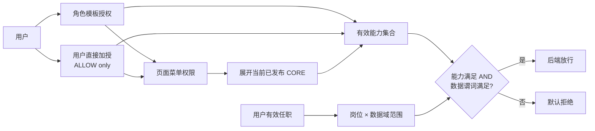

# 企业中台权限中心 Demo

这是对《企业中台权限架构方案》的可运行全栈实现。它把运营侧看到的授权对象从 `GET /api/...` 这类接口标识，提升为稳定、可解释的业务功能，例如“查看客户”“审批采购单”。前端按钮与后端执行点共同使用 `crm.customer.read`、`sc.purchase_order.create` 一类功能码；API 不再建模为可授权资源。

项目严格限定为小型企业的单企业场景：没有租户、`tenant_id`、跨租户委派或用户级 `DENY`。

## 已实现能力

- Nuxt 4 + TypeScript + Nuxt UI 的全栈单体，Nitro 提供服务端 API。
- Drizzle ORM + SQLite，本地启动自动执行迁移并幂等初始化演示数据。
- 角色模板（RBAC）与用户直接加授（ALLOW only）并存。
- 板块 → 目录 → 页面菜单三级树；页面菜单可发布 CORE / OPTIONAL 权限包。
- 权限目录只包含菜单和功能；功能码是前后端唯一的能力合同。
- 可选业务资源目录仅保留报表（REPORT）与模板（TEMPLATE），可关联功能用于追踪，但不能授权。
- 单根组织树、岗位、任职和按数据域配置的数据范围。
- 树形授权抽屉、有效权限来源解释、权限模拟器、before / after 审计和策略版本。
- 用户、角色、功能、业务资源、菜单、部门与岗位的“新建”均为真实 API + 数据库写入，不是 Toast 占位。
- 功能与业务资源均支持真实编辑；稳定代码及其动作/类型不可改，变更原因与 before / after 写入审计。

## 快速启动

要求 Node.js 22.13 或更高版本。

```bash
npm install
npm run dev
```

打开 `http://127.0.0.1:3000`。首次启动会创建 `.data/permission-center.db`；需要恢复初始数据时运行：

```bash
npm run db:reset
```

生产构建与本地预览：

```bash
npm run typecheck
npm run build
node .output/server/index.mjs
```

### 从旧 RESOURCE 模型升级

迁移 `0002_simplify_resources.sql` 会删除旧的可授权 `RESOURCE` 权限及其关联表，再创建非授权的 REPORT / TEMPLATE 业务资源表。执行迁移前应先备份数据库，并导出旧资源授权用于人工复核；不要把旧 API 权限机械回填为新功能，以免扩大历史角色权限。本工作区已保留迁移前副本 `.data/permission-center.before-function-only.db`。

## 核心判定模型



有效能力是三个来源的并集：

```text
Role grants ∪ User direct grants ∪ Menu CORE expansion
```

如果功能声明了 `dataScoped`，最终结果还必须与岗位数据范围做 `AND`。前端菜单隐藏和按钮隐藏只改善体验，不能替代服务端权限检查。

关键约束：

- 用户直授只支持加授，不支持 `DENY`；想让用户少于角色权限，应拆分或移除角色。
- 用户直授的失效时间为选填；留空表示长期有效，填写时必须晚于当前时间，临时或高风险授权建议设置。
- 高风险功能不能放入菜单 CORE，只能作为 OPTIONAL 单独授权。
- 板块、目录的勾选只展开“当前叶子集合”；未来新增菜单不会自动进入历史授权。
- 未配置岗位数据策略时按 `NONE`，而不是按全部数据处理。
- 详情、修改、删除、导出和批量任务都应复用同一个服务端数据谓词。

## 数据模型

数据库包含 21 张表，按职责分组：

| 分组         | 主要表                                                                                                                               | 目的                                                   |
| ------------ | ------------------------------------------------------------------------------------------------------------------------------------ | ------------------------------------------------------ |
| 身份与角色   | `iam_user`、`iam_role`、`iam_user_role`                                                                                              | 用户、角色模板与有时效的角色分配                       |
| 权限目录     | `iam_permission`、`iam_function`                                                                                                     | 可授权的稳定功能码与页面菜单权限                       |
| 业务资源     | `iam_business_resource`、`iam_function_business_resource`                                                                            | REPORT / TEMPLATE 资源及其可选功能追踪关系；不参与授权 |
| 菜单权限包   | `iam_menu`、`iam_menu_binding`                                                                                                       | 三级菜单树及 CORE / OPTIONAL 发布结果                  |
| 直接加授     | `iam_user_permission`                                                                                                                | 用户级 ALLOW 例外、原因、工单与有效期                  |
| 组织数据范围 | `org_unit`、`org_closure`、`org_position`、`org_user_position`、`iam_data_domain`、`iam_position_data_scope`、`iam_scope_department` | 上下级、岗位任职及按数据域的数据策略                   |
| 运维与演示   | `policy_meta`、`iam_audit_log`、`demo_customer`                                                                                      | 版本失效、审计与可验证的数据过滤                       |

组织关系同时保存邻接关系与 closure table，`DEPT_AND_DESCENDANTS` 在服务端展开为明确部门集合。缓存键可使用 `userId + authzVersion + policyVersion`。

## 页面与真实新建流程

| 页面       | 真实操作                                                          | 保存后回显                                          |
| ---------- | ----------------------------------------------------------------- | --------------------------------------------------- |
| 用户管理   | 新建用户、分配主部门/岗位/初始角色、发布用户直授                  | 用户列表、菜单 CORE 锁定反显、OPTIONAL 显眼待选提示、有效权限与 authzVersion |
| 角色模板   | 新建角色、树形分配菜单/功能                                       | 角色计数、成员有效权限与审计                        |
| 功能与资源 | 新建/编辑功能；新建/编辑 REPORT 或 TEMPLATE；从资源侧可选关联功能 | 功能目录、资源目录、关联计数、审计与 catalogVersion |
| 菜单权限包 | 新建板块/目录/页面菜单、发布 CORE/OPTIONAL                        | 菜单树、权限包详情与有效权限来源                    |
| 组织与岗位 | 新建下级部门/小组、岗位和每个数据域的范围                         | 组织树、岗位卡片、数据范围解释                      |
| 权限模拟器 | 选择用户、功能和客户数据行                                        | 服务端能力来源、数据范围和最终判定                  |
| 授权审计   | 查询每次写操作                                                    | 操作人、原因、实体和 before/after 详情              |

## 服务端 API

| 方法       | 路径                            | 用途                                             |
| ---------- | ------------------------------- | ------------------------------------------------ |
| GET        | `/api/bootstrap`                | 总览、策略版本和当前演示主体                     |
| GET / POST | `/api/users`                    | 用户列表 / 新建用户                              |
| GET / POST | `/api/roles`                    | 角色列表 / 新建角色                              |
| GET        | `/api/catalog`                  | 功能、业务资源、菜单树和数据域                   |
| POST       | `/api/catalog/functions`        | 新建功能                                         |
| PUT        | `/api/catalog/functions/:id`    | 编辑功能；稳定代码与动作类型不可变               |
| POST       | `/api/catalog/resources`        | 新建 REPORT / TEMPLATE 业务资源，可选关联功能    |
| PUT        | `/api/catalog/resources/:id`    | 编辑业务资源与追踪关系；稳定代码与资源类型不可变 |
| POST       | `/api/menus`                    | 新建板块、目录或页面菜单                         |
| PUT        | `/api/menus/:id/bindings`       | 发布 CORE / OPTIONAL 菜单权限包                  |
| GET        | `/api/org`                      | 组织、岗位和数据策略                             |
| POST       | `/api/org/units`                | 新建下级部门或小组                               |
| POST       | `/api/org/positions`            | 新建岗位及初始数据策略                           |
| PUT        | `/api/org/positions/:id/scopes` | 更新岗位按数据域的数据范围                       |
| GET / PUT  | `/api/subjects/:type/:id`       | 查询或发布用户/角色授权                          |
| GET        | `/api/effective/:userId`        | 解释用户有效权限与全部来源                       |
| POST       | `/api/simulate`                 | 服务端模拟能力与数据行联合判定                   |
| GET        | `/api/demo/customers`           | 使用相同数据谓词过滤演示客户                     |
| GET        | `/api/audit`                    | 授权审计列表                                     |

所有写 API 都先校验当前服务端主体的管理功能，再进行 Zod 输入校验、事务写入、审计落库和版本递增。

## 测试与质量门禁

```bash
# TypeScript + Nuxt 类型检查
npm run typecheck

# 纯规则单元测试
npm test

# 生产构建
npm run build

# 合并运行上述三项
npm run verify

# UI 端到端测试；默认使用系统 Chrome
npm run test:e2e
```

`npm run test:contract` 会对正在运行的本地服务执行完整写契约：创建并编辑功能与业务资源，创建三级菜单、角色、组织、岗位和用户，并验证业务资源不能进入菜单包、高风险 CORE 拒绝、直授失效时间可选与已填日期校验、菜单 CORE 展开、数据范围、审计和版本。它会写入目标测试库；建议用独立的 `DATABASE_PATH` 启动服务。

当前自动化覆盖：

- 6 条纯权限规则单元测试。
- 1 条全链路 API 写契约，覆盖全部新建对象及关键拒绝规则。
- 4 条 Playwright UI 用例，覆盖总览、新建用户、树形授权、菜单高风险约束和模拟器。
- 已验证 Nuxt/Nitro 生产构建和 `.output/server/index.mjs` 启动。

## 目录结构

```text
app/                         Nuxt UI 页面、布局、树与授权抽屉
server/api/                  Nitro API
server/database/             Drizzle schema 与幂等 seed
server/services/             权限合并、数据范围、审计与树服务
drizzle/                     SQL migrations
scripts/setup-db.ts          迁移 / 重置数据库
scripts/api-contract-test.ts 全写链路契约测试
tests/unit/                  纯规则测试
tests/e2e/                   Playwright UI 测试
```

## 从 Demo 进入生产前

这个仓库实现的是架构和交互 Demo，不应直接作为互联网生产系统上线。至少还要完成：

1. 用企业 SSO / OIDC Session 替换固定的 `DEMO_ACTOR_ID`，只信任服务端验证过的 principal。
2. 把功能码校验接入控制器、服务方法、导出任务和消息消费者，并用 CI 阻止未声明功能码的管理端执行点。
3. 将 SQLite 换为受备份、监控和高可用保护的生产数据库；Drizzle 模型可继续复用。
4. 对高风险授权接入审批流、定时回收和离职/调岗事件。
5. 增加 CSRF、防重放、限流、安全响应头、密钥管理和集中审计投递。
6. 用实际业务数据表验证每个数据域的过滤谓词，并防止 ORM/raw SQL 绕过。

生产依赖审计当前只报告 1 个低危项：`@nuxt/fonts → fontless → esbuild 0.27.x` 的 Windows 本地开发服务器文件读取公告。项目已关闭 Nuxt Fonts，生产 Nitro 服务不使用该开发服务器；仍建议在上游升级后更新锁文件。

## 方案资源

- [完整架构方案](../企业中台权限架构方案.md)
- [简化最佳实践版](../%23%20企业中台权限架构设计方案（简化最佳实践版）.md)
- [研发演示概要](../企业中台权限架构研发演示概要.md)
- 应用内也提供 `/docs` 页面，便于演示时直接查阅核心方案。
