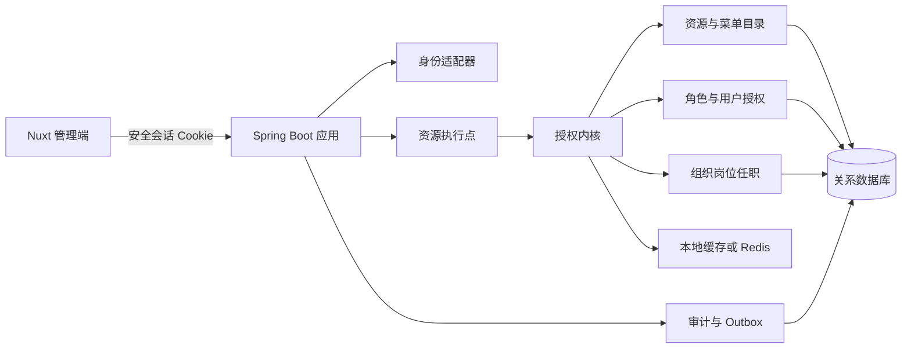

# 企业中台权限中心开发实施文档

> 文档版本：2.0
> 更新日期：2026-08-13
> 适用对象：架构、前端、后端、测试、运维与权限管理员
> Demo 基线：`permission-nuxt-demo` 最终实现

## 1. 文档目的

本文定义小型企业中台权限中心的研发合同，回答以下问题：

1. 用户、角色、菜单和资源如何建模；
2. 前后端如何共用 `sc.purchase_order.create` 一类业务资源码；
3. 菜单 CORE / OPTIONAL 资源包如何授权、反显和计算；
4. 用户直授与角色授权如何合并并解释来源；
5. 组织、岗位与用户任职如何独立维护；
6. 前端如何实现函数、组件、指令和路由校验；
7. 后端如何默认拒绝、逐请求裁决、审计和测试；
8. 岗位数据边界如何作为后端二期能力建设。

本文中的“必须”是安全或一致性要求，“应”是默认方案，“可以”是可替换实现。技术栈示例采用 Vue 3 / Nuxt 4 / TypeScript 与 Spring Boot / Spring Security / MyBatis；其他技术栈应保持相同领域语义。

## 2. 范围与阶段

### 2.1 当前静态 Demo 已实现

Demo 用浏览器内模拟数据演示管理交互，不连接数据库，也不是生产鉴权服务。当前包括：

- 用户列表、创建、状态筛选和授权抽屉；
- 角色列表、创建和授权抽屉；
- 板块、目录、页面菜单树及编辑；
- 业务资源目录及编辑；
- 页面菜单绑定 CORE / OPTIONAL 资源；
- 角色批量授予、用户角色多选与用户直接加授；
- 菜单 CORE 在资源页签自动反显，OPTIONAL 显著提示并由管理员显式选择；
- 组织树、岗位列表与用户任职；
- 任职时选择用户、组织、岗位，并可选补录工号；
- 有效权限来源解释和 Mock 审计。

Demo 的明确边界：

- 角色没有板块字段；
- 用户列表不显示内部策略版本；
- 创建用户只填写姓名、登录账号和状态，不填写工号、组织、岗位或角色；
- 工号只在组织与岗位页面设置任职时选填；
- 用户授权时角色支持多选，并优先展示在授权抽屉上方；
- 不包含数据域、数据范围、客户数据行或权限模拟器交互；
- 页面隐藏、路由跳转和浏览器模拟结果均不是后端安全边界。

### 2.2 生产一期范围

生产一期应交付：

- 可信登录会话与用户状态校验；
- 资源、菜单、角色和用户直授的持久化；
- 菜单资源包发布；
- 有效菜单、有效资源与来源解释；
- 组织、岗位和单一主任职；
- 权限变更审计、版本与缓存失效；
- 后端执行点的资源码强制校验；
- 前端导航和操作可见性控制；
- 从旧 API 标识平滑迁移。

第一期不实现用户级 DENY、角色继承、角色嵌套、权限通配符、动态脚本策略、多主任职、字段级权限和审批引擎。

### 2.3 后端二期建议

岗位 × 数据域的数据边界属于后端二期设计建议，不是当前 Demo 已实现能力。二期可增加：

- 数据域目录；
- 岗位在各数据域的正式范围；
- 组织后代展开；
- Repository / SQL 谓词下推；
- 列表、详情、更新、删除、导出和任务的一致数据过滤。

前端不负责计算或拼接数据边界；二期管理入口应放在组织与岗位页面，而不是用户授权页。

## 3. 模型定位与术语

### 3.1 模型定位

方案采用：

```text
RBAC 角色模板
+ 用户直接 ALLOW 例外
+ 菜单资源包
+ 独立的组织岗位任职
```

由于允许资源直接授予用户，本方案属于以 RBAC 为主体的扩展模型，而不是严格 Core RBAC。角色是常规授权主路径，用户直授只处理少量例外，并要求原因与审计。

### 3.2 统一术语

| 术语 | 定义 | 示例 |
| --- | --- | --- |
| 用户 User | 可登录的账号主体 | 林悦 / `lin.yue` |
| 角色 Role | 可复用的 ALLOW 授权模板 | 销售主管 |
| 资源 Resource | 稳定的业务动作权限，是唯一功能授权原子 | `crm.customer.export` |
| 菜单 Menu | 导航入口及资源包载体 | 客户列表 |
| CORE | 打开并正常使用页面所需的最低资源集合 | `crm.customer.read` |
| OPTIONAL | 页面内按职责选配的操作资源 | `crm.customer.export` |
| 板块 Board | 一级业务分区 | 信息板块 |
| 目录 Directory | 板块下的导航分组 | 客户管理 |
| 组织 Org Unit | 企业组织树节点 | 华东销售部 |
| 岗位 Position | 隶属于组织、用于表达任职 | 销售主管 |
| 任职 Assignment | 用户、组织与岗位的有效关系 | 林悦任华东销售部销售主管 |
| 执行点 Enforcement Point | 控制器、服务方法、任务消费者等校验位置 | 创建采购单方法 |

“资源”对应授权语义中的 permission / authority。采购单、客户、设计稿等业务记录是受保护对象，不是权限中心资源目录中的资源。API、服务方法和任务是资源的执行点，不需要登记为另一层授权对象。

## 4. 核心规则

### 4.1 授权原子

前端与后端只使用业务资源码，例如：

```text
sc.purchase_order.read
sc.purchase_order.create
sc.purchase_order.approve
crm.customer.export
designer.asset.archive
```

禁止继续把 `GET /api/...`、控制器类名或页面路径作为权限标识。一个业务动作可以对应多个技术执行点，同一执行点也可在重构后拆成多个业务动作。

### 4.2 有效资源

一期采用 ALLOW-only，用户有效资源集合为：

```text
角色显式资源
∪ 角色菜单产生的 CORE 资源
∪ 用户直接资源
∪ 用户直接菜单产生的 CORE 资源
```

计算后还必须过滤：

- 用户、角色、资源和菜单是否启用；
- 用户直授是否尚未生效或已经到期；
- 菜单绑定是否启用；
- 资源码是否存在且已发布。

同一资源可有多个来源。结果按资源 ID 去重，但保留全部来源，便于解释和安全撤销。移除一个来源时，其他来源仍可使资源生效。

### 4.3 菜单资源包

页面菜单可绑定资源：

- CORE：授予页面菜单时自动生效，并在授权抽屉的资源页签自动反显；
- OPTIONAL：不自动生效，使用醒目标识提醒管理员按需勾选；
- 高风险资源不得设为 CORE；
- 同一菜单与资源不能同时存在 CORE 和 OPTIONAL；
- 板块和目录不直接绑定资源包。

菜单包是运行时引用，不把 CORE 复制到每个角色或用户关系表。菜单包更新后，获得该菜单的主体随新包生效；发布操作必须提示影响范围、提升版本并写审计。

### 4.4 父节点勾选

授权树中的父节点只用于批量操作。保存时展开为当时已启用的页面菜单叶子：

- 不持久化“拥有整个目录未来全部菜单”的通配语义；
- 后续新建页面不会自动进入历史授权；
- 部分子节点选中时父节点显示半选；
- 反选父节点只移除当前可见后代，不应误删搜索外数据。

### 4.5 角色与用户直授

- 角色扁平、可复用，不设置板块归属字段；
- 一个用户可以选择多个角色；
- 授权抽屉先显示角色多选，再显示菜单和资源；
- 用户直授只允许加授，不提供 DENY；
- 用户直授原因必填，去除空白后非空即可；
- 失效时间选填，留空代表长期有效；
- 常规权限应进入角色，直授应定期复核。

用户需要少于某角色的权限时，应拆分角色或移除角色，不用复杂反向规则修补过宽角色。

### 4.6 任职

- 创建用户时不设置组织、岗位、工号或角色；
- 在组织与岗位页面选择用户、组织和岗位后保存任职；
- 工号是任职时的可选字段，不是创建账号的必填字段；
- 第一期每个用户只有一条有效主任职；
- 调岗不隐式改变业务角色，也不迁移业务数据 owner；
- 组织或岗位停用后，新的任职不能选中它们。

## 5. 编码规范

### 5.1 菜单类编码

菜单树采用明确前缀：

| 类型 | 格式 | 示例 |
| --- | --- | --- |
| 板块 | `BOARD_<DOMAIN>` | `BOARD_INFO` |
| 目录 | `DIR_<DOMAIN>_<GROUP>` | `DIR_INFO_CUSTOMER` |
| 页面菜单 | `MENU_<DOMAIN>_<PAGE>` | `MENU_INFO_CUSTOMER_LIST` |

要求：

1. 只允许大写字母、数字和下划线；
2. 编码全局唯一，创建后不可原地改义；
3. 展示名称可调整，编码不跟随文案变化；
4. 页面路由由受控注册表映射，不由编码动态猜测；
5. 删除已引用节点前必须先完成影响分析，生产默认只停用。

### 5.2 角色编码

角色使用 `ROLE_` 前缀：

```text
ROLE_SALES_REP
ROLE_SALES_MANAGER
ROLE_PURCHASE_APPROVER
ROLE_PERMISSION_ADMIN
```

角色编码只表达职责，不拼接板块字段，不包含用户、组织或时间信息。角色名称面向运营，角色编码面向研发与审计。

### 5.3 业务资源码

格式：

```text
<domain>.<object>.<action>
```

规则：

1. 全小写，以点分段；
2. 领域与对象使用稳定英文名；
3. 动作优先使用 `read/create/update/delete/export/import/approve/cancel/archive/assign`；
4. 不包含 HTTP Method、URL、组件名或数据库表名；
5. 不使用 `*` 通配符；
6. 语义改变时创建新码、迁移引用并停用旧码；
7. 风险等级是资源属性，不写进资源码；
8. 进入开发前应完成登记和评审。

建议在仓库维护机器可读 manifest，并由 CI 生成 Java 常量、TypeScript 联合类型和初始化脚本：

```yaml
resources:
  - code: sc.purchase_order.read
    name: 查看采购单
    risk: LOW
  - code: sc.purchase_order.approve
    name: 审批采购单
    risk: HIGH
```

manifest 与管理 UI 不应各自维护两套资源真相。推荐代码仓库控制编码和风险基线，管理 UI 编辑名称、状态和菜单包关系；ACTIVE 资源码只读。

## 6. 推荐架构

小型企业第一期采用模块化单体即可，不必先拆策略微服务。



| 模块 | 职责 |
| --- | --- |
| Identity Adapter | 对接 SSO、OIDC 或 Session，生成不可伪造的 Principal |
| Catalog Service | 资源、菜单、菜单资源包与目录版本 |
| Grant Service | 用户角色、角色菜单/资源、用户直接菜单/资源 |
| Effective Authorization | 合并来源、展开 CORE、过滤状态和有效期 |
| Organization Service | 组织树、岗位和单主任职 |
| Enforcement | 在 HTTP、服务方法、任务和消费者强制校验 |
| Audit Service | 记录操作者、前后值、原因、版本和 traceId |
| Version Service | 维护用户授权版本和目录版本，驱动缓存失效 |

认证回答“你是谁”，授权回答“你能做什么”。客户端提交的用户 ID、资源集合和角色集合不能作为可信授权上下文；业务接口始终从服务端 Principal 获取当前用户。

## 7. 数据库设计

### 7.1 设计原则

- 资源、菜单分别建表，保留外键约束；
- 角色菜单、角色资源、用户菜单直授、用户资源直授分别建关系表；
- 菜单 CORE / OPTIONAL 单独建绑定表；
- 任职表第一期对 `user_id` 唯一；
- 被引用对象默认停用而非物理删除；
- 编码采用规范化结果唯一索引；
- 授权写入、版本提升、审计和 outbox 在同一事务完成；
- 表结构只存显式事实，CORE 派生结果不反写授权关系。

示例采用接近 MySQL 8 的写法。团队应根据实际数据库调整自增、时间和 JSON 类型。

### 7.2 核心目录表

```sql
CREATE TABLE iam_user (
  id             BIGINT PRIMARY KEY,
  username       VARCHAR(96)  NOT NULL,
  display_name   VARCHAR(128) NOT NULL,
  status         VARCHAR(16)  NOT NULL,
  authz_version  BIGINT       NOT NULL DEFAULT 1,
  created_at     TIMESTAMP    NOT NULL,
  updated_at     TIMESTAMP    NOT NULL,
  CONSTRAINT uk_iam_user_username UNIQUE (username),
  CONSTRAINT ck_iam_user_status CHECK (status IN ('ACTIVE', 'DISABLED'))
);

CREATE TABLE iam_role (
  id          BIGINT PRIMARY KEY,
  code        VARCHAR(96)  NOT NULL,
  name        VARCHAR(128) NOT NULL,
  status      VARCHAR(16)  NOT NULL,
  row_version BIGINT       NOT NULL DEFAULT 1,
  created_at  TIMESTAMP    NOT NULL,
  updated_at  TIMESTAMP    NOT NULL,
  CONSTRAINT uk_iam_role_code UNIQUE (code),
  CONSTRAINT ck_iam_role_status CHECK (status IN ('ACTIVE', 'DISABLED'))
);

CREATE TABLE iam_resource (
  id          BIGINT PRIMARY KEY,
  code        VARCHAR(160) NOT NULL,
  name        VARCHAR(160) NOT NULL,
  risk_level  VARCHAR(16)  NOT NULL,
  status      VARCHAR(16)  NOT NULL,
  row_version BIGINT       NOT NULL DEFAULT 1,
  created_at  TIMESTAMP    NOT NULL,
  updated_at  TIMESTAMP    NOT NULL,
  CONSTRAINT uk_iam_resource_code UNIQUE (code),
  CONSTRAINT ck_iam_resource_risk CHECK (risk_level IN ('LOW', 'MEDIUM', 'HIGH')),
  CONSTRAINT ck_iam_resource_status CHECK (status IN ('ACTIVE', 'DISABLED'))
);

CREATE TABLE iam_menu (
  id           BIGINT PRIMARY KEY,
  parent_id    BIGINT NULL,
  node_type    VARCHAR(16)  NOT NULL,
  code         VARCHAR(128) NOT NULL,
  name         VARCHAR(128) NOT NULL,
  route_path   VARCHAR(256) NULL,
  sort_no      INT          NOT NULL DEFAULT 0,
  status       VARCHAR(16)  NOT NULL,
  row_version  BIGINT       NOT NULL DEFAULT 1,
  CONSTRAINT uk_iam_menu_code UNIQUE (code),
  CONSTRAINT fk_iam_menu_parent FOREIGN KEY (parent_id) REFERENCES iam_menu(id),
  CONSTRAINT ck_iam_menu_type CHECK (node_type IN ('BOARD', 'DIRECTORY', 'MENU')),
  CONSTRAINT ck_iam_menu_status CHECK (status IN ('ACTIVE', 'DISABLED'))
);

CREATE INDEX idx_iam_menu_parent_status
  ON iam_menu(parent_id, status, sort_no);
```

服务层必须保证：BOARD 无父级；DIRECTORY 的父级为 BOARD；MENU 的父级为 DIRECTORY，且页面菜单具有受控路由；角色和用户只能获得 ACTIVE 的 MENU 叶子。移动节点前检测自环和祖先环。

### 7.3 菜单资源包

```sql
CREATE TABLE iam_menu_resource_binding (
  menu_id       BIGINT      NOT NULL,
  resource_id   BIGINT      NOT NULL,
  bundle_level  VARCHAR(16) NOT NULL,
  status        VARCHAR(16) NOT NULL,
  PRIMARY KEY (menu_id, resource_id),
  FOREIGN KEY (menu_id) REFERENCES iam_menu(id),
  FOREIGN KEY (resource_id) REFERENCES iam_resource(id),
  CONSTRAINT ck_binding_level CHECK (bundle_level IN ('CORE', 'OPTIONAL')),
  CONSTRAINT ck_binding_status CHECK (status IN ('ACTIVE', 'DISABLED'))
);

CREATE INDEX idx_binding_resource
  ON iam_menu_resource_binding(resource_id, menu_id);
```

跨表规则“HIGH 不得为 CORE”不能仅靠普通 CHECK 完成，必须在服务事务中校验。非法 CORE 整单返回 422，不要静默改为 OPTIONAL。

### 7.4 角色关系

```sql
CREATE TABLE iam_user_role (
  user_id BIGINT NOT NULL,
  role_id BIGINT NOT NULL,
  PRIMARY KEY (user_id, role_id),
  FOREIGN KEY (user_id) REFERENCES iam_user(id),
  FOREIGN KEY (role_id) REFERENCES iam_role(id)
);

CREATE INDEX idx_user_role_role ON iam_user_role(role_id, user_id);

CREATE TABLE iam_role_resource (
  role_id     BIGINT NOT NULL,
  resource_id BIGINT NOT NULL,
  PRIMARY KEY (role_id, resource_id),
  FOREIGN KEY (role_id) REFERENCES iam_role(id),
  FOREIGN KEY (resource_id) REFERENCES iam_resource(id)
);

CREATE TABLE iam_role_menu (
  role_id BIGINT NOT NULL,
  menu_id BIGINT NOT NULL,
  PRIMARY KEY (role_id, menu_id),
  FOREIGN KEY (role_id) REFERENCES iam_role(id),
  FOREIGN KEY (menu_id) REFERENCES iam_menu(id)
);
```

### 7.5 用户直接授权

```sql
CREATE TABLE iam_user_resource_grant (
  id            BIGINT PRIMARY KEY,
  user_id       BIGINT       NOT NULL,
  resource_id   BIGINT       NOT NULL,
  valid_from    TIMESTAMP    NULL,
  valid_to      TIMESTAMP    NULL,
  reason        VARCHAR(512) NOT NULL,
  source_ticket VARCHAR(128) NULL,
  created_by    BIGINT       NOT NULL,
  created_at    TIMESTAMP    NOT NULL,
  CONSTRAINT uk_user_resource_grant UNIQUE (user_id, resource_id),
  FOREIGN KEY (user_id) REFERENCES iam_user(id),
  FOREIGN KEY (resource_id) REFERENCES iam_resource(id)
);

CREATE INDEX idx_user_resource_expiry
  ON iam_user_resource_grant(user_id, valid_to);

CREATE TABLE iam_user_menu_grant (
  id            BIGINT PRIMARY KEY,
  user_id       BIGINT       NOT NULL,
  menu_id       BIGINT       NOT NULL,
  valid_from    TIMESTAMP    NULL,
  valid_to      TIMESTAMP    NULL,
  reason        VARCHAR(512) NOT NULL,
  source_ticket VARCHAR(128) NULL,
  created_by    BIGINT       NOT NULL,
  created_at    TIMESTAMP    NOT NULL,
  CONSTRAINT uk_user_menu_grant UNIQUE (user_id, menu_id),
  FOREIGN KEY (user_id) REFERENCES iam_user(id),
  FOREIGN KEY (menu_id) REFERENCES iam_menu(id)
);
```

若业务要求同一资源存在多段授权历史，应把唯一键改为“当前有效记录”约束或引入 grant revision；不要用覆盖更新抹掉历史审计。

### 7.6 组织、岗位与任职

```sql
CREATE TABLE iam_org_unit (
  id          BIGINT PRIMARY KEY,
  parent_id   BIGINT NULL,
  code        VARCHAR(96)  NOT NULL,
  name        VARCHAR(128) NOT NULL,
  unit_type   VARCHAR(32)  NOT NULL,
  status      VARCHAR(16)  NOT NULL,
  sort_no     INT          NOT NULL DEFAULT 0,
  FOREIGN KEY (parent_id) REFERENCES iam_org_unit(id),
  CONSTRAINT uk_org_unit_code UNIQUE (code)
);

CREATE TABLE iam_position (
  id          BIGINT PRIMARY KEY,
  org_unit_id BIGINT       NOT NULL,
  code        VARCHAR(96)  NOT NULL,
  name        VARCHAR(128) NOT NULL,
  status      VARCHAR(16)  NOT NULL,
  FOREIGN KEY (org_unit_id) REFERENCES iam_org_unit(id),
  CONSTRAINT uk_position_org_code UNIQUE (org_unit_id, code)
);

CREATE TABLE iam_user_assignment (
  id           BIGINT PRIMARY KEY,
  user_id      BIGINT       NOT NULL,
  org_unit_id  BIGINT       NOT NULL,
  position_id  BIGINT       NOT NULL,
  employee_no  VARCHAR(64)  NULL,
  effective_at TIMESTAMP    NOT NULL,
  updated_by   BIGINT       NOT NULL,
  updated_at   TIMESTAMP    NOT NULL,
  CONSTRAINT uk_assignment_user UNIQUE (user_id),
  FOREIGN KEY (user_id) REFERENCES iam_user(id),
  FOREIGN KEY (org_unit_id) REFERENCES iam_org_unit(id),
  FOREIGN KEY (position_id) REFERENCES iam_position(id)
);

CREATE UNIQUE INDEX uk_assignment_employee_no
  ON iam_user_assignment(employee_no);
```

允许工号为空时，应核验所用数据库对多个 NULL 唯一值的行为。服务端必须验证岗位属于所选组织；调岗只更新主任职和授权版本，不修改角色或业务对象归属。

### 7.7 审计与 Outbox

```sql
CREATE TABLE iam_audit_log (
  id             BIGINT PRIMARY KEY,
  actor_user_id  BIGINT        NOT NULL,
  action         VARCHAR(96)   NOT NULL,
  entity_type    VARCHAR(64)   NOT NULL,
  entity_id      VARCHAR(128)  NOT NULL,
  before_json    JSON          NULL,
  after_json     JSON          NULL,
  reason         VARCHAR(512)  NULL,
  source_ticket  VARCHAR(128)  NULL,
  request_id     VARCHAR(128)  NULL,
  trace_id       VARCHAR(128)  NULL,
  created_at     TIMESTAMP     NOT NULL
);

CREATE TABLE iam_outbox (
  id             BIGINT PRIMARY KEY,
  event_type     VARCHAR(96)  NOT NULL,
  aggregate_id   VARCHAR(128) NOT NULL,
  payload_json   JSON         NOT NULL,
  created_at     TIMESTAMP    NOT NULL,
  published_at   TIMESTAMP    NULL
);
```

追加写审计表仍需要独立写权限、访问监控、备份和篡改检测，不能仅凭表名声称不可篡改。

## 8. API 合同

### 8.1 约定

- 基础路径使用 `/api/v1`；
- ID 在 URL 中只定位目标，不承担授权；
- 操作者来自服务端 Principal；
- 列表接口分页；
- 授权写操作携带 `expectedVersion` 或 `If-Match`；
- 验证失败使用 422，并返回字段级问题；
- 权限不足使用 403；业务对象不存在或越界可统一使用 404；
- 错误体使用 RFC 9457 `application/problem+json`；
- 前端客户端由 OpenAPI 生成，不在页面散写返回类型。

### 8.2 推荐端点

| Method | Path | 说明 |
| --- | --- | --- |
| GET / POST | `/api/v1/users` | 用户列表 / 创建 |
| PUT | `/api/v1/users/{id}/status` | 启停用户 |
| GET / PUT | `/api/v1/users/{id}/authorization` | 查询 / 发布用户授权 |
| GET / POST | `/api/v1/roles` | 角色列表 / 创建 |
| GET / PUT | `/api/v1/roles/{id}/authorization` | 查询 / 发布角色授权 |
| GET / POST | `/api/v1/resources` | 资源列表 / 创建 |
| PUT | `/api/v1/resources/{id}` | 编辑资源元数据 |
| GET / POST | `/api/v1/menus` | 菜单树 / 创建节点 |
| PUT | `/api/v1/menus/{id}` | 编辑菜单节点 |
| GET / PUT | `/api/v1/menus/{id}/package` | 查询 / 发布菜单包 |
| GET / POST | `/api/v1/org-units` | 组织树 / 创建组织 |
| GET / POST | `/api/v1/positions` | 岗位列表 / 创建岗位 |
| PUT | `/api/v1/assignments/{userId}` | 设置主任职，可选工号 |
| GET | `/api/v1/session/authorization` | 当前用户有效上下文 |
| GET | `/api/v1/audit-logs` | 审计查询 |

### 8.3 创建用户

```json
POST /api/v1/users
{
  "displayName": "周睿",
  "username": "zhou.rui",
  "status": "ACTIVE"
}
```

创建用户不接收 `employeeNo`、组织、岗位或角色。创建成功后分别在任职页面与授权抽屉维护。

### 8.4 设置任职

```json
PUT /api/v1/assignments/10042
{
  "orgUnitId": "2008",
  "positionId": "3006",
  "employeeNo": "EMP0401",
  "reason": "入职任职初始化",
  "expectedVersion": 2
}
```

`employeeNo` 允许为 `null` 或空白归一化后的 `null`。服务端校验用户、组织、岗位均有效，且岗位属于所选组织。

### 8.5 发布角色授权

```json
PUT /api/v1/roles/5001/authorization
{
  "menuIds": ["7003", "7008"],
  "resourceIds": ["8002", "8005"],
  "reason": "销售主管标准职责调整",
  "expectedVersion": 12
}
```

`resourceIds` 只存显式资源；菜单产生的 CORE 由后端实时展开，不写回数组。

### 8.6 发布用户授权

```json
PUT /api/v1/users/10042/authorization
{
  "roleIds": ["5001", "5003"],
  "directMenuIds": ["7009"],
  "directResourceIds": ["8012"],
  "validTo": null,
  "reason": "季度项目协作例外",
  "sourceTicket": "IAM-2026-0813",
  "expectedVersion": 7
}
```

角色为多选，UI 应把角色模板放在菜单和资源之前。`validTo` 非必填；若填写必须晚于当前时间。原因只要求 trim 后非空，不设置任意最短字符数。

### 8.7 当前用户授权上下文

```json
GET /api/v1/session/authorization
{
  "user": {
    "id": "10042",
    "displayName": "周睿"
  },
  "menuTree": [
    {
      "code": "BOARD_INFO",
      "name": "信息板块",
      "children": []
    }
  ],
  "resourceCodes": [
    "crm.customer.read",
    "crm.customer.export"
  ],
  "authzVersion": 7,
  "catalogVersion": 22,
  "expiresAt": "2026-08-13T12:30:00Z"
}
```

普通业务前端只需要菜单树、资源码和版本，不下载全部角色关系、授权原因或审计细节。详细来源只向权限管理员开放。

### 8.8 Problem Details

```json
{
  "type": "https://example.com/problems/authorization-denied",
  "title": "Forbidden",
  "status": 403,
  "code": "IAM_RESOURCE_DENIED",
  "detail": "当前用户不能执行该操作",
  "traceId": "01K2..."
}
```

不要把堆栈、SQL、Token 或内部策略明细返回浏览器。

## 9. 后端实现

### 9.1 安全基线

Spring Boot Starter Security 不会自动启用方法级授权，必须显式启用：

```java
@Configuration
@EnableMethodSecurity
class SecurityConfiguration {

    @Bean
    SecurityFilterChain security(HttpSecurity http) throws Exception {
        return http
            .authorizeHttpRequests(registry -> registry
                .requestMatchers("/health", "/login/**", "/oauth2/**").permitAll()
                .requestMatchers("/api/**").authenticated()
                .anyRequest().denyAll())
            .build();
    }
}
```

这只是请求层认证基线，不替代资源校验。Spring 方法安全不会自动保护未标注方法，因此项目必须：

1. 在所有非公开业务服务方法声明资源；
2. 用 ArchUnit、自定义注解处理器或构建扫描阻止漏标；
3. 对非 HTTP 入口复用同一服务方法；
4. 若网关或端点 manifest 能表达资源映射，可再增加请求层运行时校验；
5. 未明确公开、未进入受保护服务边界的新增入口不得发布。

### 9.2 资源常量

```java
public final class ResourceCodes {
    private ResourceCodes() {}

    public static final String PURCHASE_ORDER_READ =
        "sc.purchase_order.read";
    public static final String PURCHASE_ORDER_CREATE =
        "sc.purchase_order.create";
    public static final String PURCHASE_ORDER_APPROVE =
        "sc.purchase_order.approve";
}
```

常量应由 manifest 生成，避免 Java、TypeScript 与初始化脚本各自手写。

### 9.3 方法授权

若有效资源已映射为 `GrantedAuthority`，优先使用简单表达式：

```java
@Service
public class PurchaseOrderService {

    @PreAuthorize("hasAuthority('sc.purchase_order.create')")
    @Transactional
    public PurchaseOrderVO create(CreatePurchaseOrderCommand command) {
        // 当前用户从可信上下文取得
        return doCreate(command);
    }

    @PreAuthorize("hasAuthority('sc.purchase_order.approve')")
    @Transactional
    public PurchaseOrderVO approve(long orderId) {
        return doApprove(orderId);
    }
}
```

若系统要求每次按版本动态加载，可用自定义 Bean：

```java
@PreAuthorize("@authorization.hasResource(authentication, 'sc.purchase_order.approve')")
public PurchaseOrderVO approve(long orderId) { ... }
```

团队应统一一种主模式，避免控制器与服务重复做昂贵计算。写操作必须在业务变更前校验，不要只靠 `@PostAuthorize` 保护数据库写入。

### 9.4 有效授权计算

伪代码：

```java
EffectiveAuthorization resolve(long userId, Instant now) {
    User user = users.requireActive(userId);
    Map<Long, EffectiveResource> resources = new LinkedHashMap<>();
    Set<Long> menuIds = new LinkedHashSet<>();

    for (Role role : roles.findActiveByUser(userId)) {
        addRoleResources(resources, role);
        addRoleMenus(menuIds, role);
    }

    addActiveDirectResources(resources, userId, now);
    addActiveDirectMenus(menuIds, userId, now);
    addCoreResourcesFromMenus(resources, menuIds);

    removeDisabledCatalogItems(resources, menuIds);
    return explain(user, resources, menuIds);
}
```

每个有效资源至少保留：

```java
record PermissionSource(
    SourceType type,  // ROLE, DIRECT, MENU_CORE
    long sourceId,
    String sourceName,
    Long viaMenuId
) {}

record EffectiveResource(
    long id,
    String code,
    RiskLevel risk,
    List<PermissionSource> sources
) {}
```

OPTIONAL 不参加菜单自动展开。它只有在角色资源或用户直授资源中显式存在时生效。

### 9.5 菜单包发布

菜单包事务必须：

1. 校验目标为 ACTIVE 页面菜单；
2. 校验所有资源存在且 ACTIVE；
3. 拒绝 HIGH CORE；
4. 拒绝 CORE / OPTIONAL 重复；
5. 读取 before，计算 diff 和受影响用户；
6. 替换显式绑定；
7. 提升包 revision、目录版本和受影响用户授权版本；
8. 写审计与 outbox；
9. 同一事务提交。

服务端永远重新计算 CORE，不接受客户端提交派生 CORE 集合。

### 9.6 并发与幂等

角色授权、用户授权、菜单包和任职都应带版本：

```text
If-Match: "12"
```

或 body 中的 `expectedVersion`。不一致返回 412，不得静默覆盖。创建接口可使用幂等键防止网络重试产生重复记录。

### 9.7 缓存

推荐缓存键：

```text
authz:{userId}:{authzVersion}:{catalogVersion}
```

缓存 TTL 不能超过最近一条直授的到期时间：

```text
TTL = min(常规 TTL, 最近 validTo - now)
```

用户禁用时立即提升版本并撤销会话。单实例可先用本地缓存；多实例且已有 Redis 时再使用 Redis。数据库与版本号始终是真实来源。

不建议把长期有效的完整资源集合永久写入 JWT。必须使用 JWT 时应短时有效，并携带可校验的授权版本。

## 10. 前端实现

前端负责可用性，不负责最终裁决。用户可以绕过 DOM 和路由逻辑直接发请求，因此后端必须再次校验。

### 10.1 类型

```ts
export type ResourceCode =
  | 'sc.purchase_order.read'
  | 'sc.purchase_order.create'
  | 'sc.purchase_order.approve'
  | 'crm.customer.read'
  | 'crm.customer.export'

export interface AuthorizationContext {
  menuTree: MenuNode[]
  resourceCodes: ResourceCode[]
  authzVersion: number
  catalogVersion: number
  expiresAt: string
}
```

联合类型应由 manifest 生成。

### 10.2 `useAuthorization`

```ts
export function useAuthorization() {
  const context = useState<AuthorizationContext | null>(
    'authorization-context',
    () => null
  )
  const loading = useState('authorization-loading', () => false)

  const resourceSet = computed(
    () => new Set(context.value?.resourceCodes ?? [])
  )
  const ready = computed(() => context.value !== null)

  async function refresh() {
    loading.value = true
    try {
      context.value = await $fetch('/api/v1/session/authorization')
    } finally {
      loading.value = false
    }
  }

  function can(code: ResourceCode) {
    return ready.value && resourceSet.value.has(code)
  }

  function canAny(codes: readonly ResourceCode[]) {
    return ready.value && codes.some(can)
  }

  function canAll(codes: readonly ResourceCode[]) {
    return ready.value && codes.every(can)
  }

  return {
    context: readonly(context),
    loading: readonly(loading),
    ready,
    refresh,
    can,
    canAny,
    canAll
  }
}
```

权限上下文未加载或加载失败时默认拒绝，不乐观展示全部入口。

### 10.3 函数使用

```vue
<script setup lang="ts">
const { can } = useAuthorization()
const canCreate = computed(() => can('sc.purchase_order.create'))
</script>

<template>
  <UButton
    v-if="canCreate"
    label="新建采购单"
    @click="openCreateDrawer"
  />
</template>
```

若用户需要知道某功能存在但无权限，可以禁用并给出提示；隐藏和禁用都不能代替后端授权。

### 10.4 `<Can>` 组件

结构性内容优先使用声明式组件：

```vue
<!-- app/components/Can.vue -->
<script setup lang="ts">
import type { ResourceCode } from '~/types/authorization'

const props = withDefaults(defineProps<{
  resource?: ResourceCode
  any?: ResourceCode[]
  all?: ResourceCode[]
}>(), {
  any: () => [],
  all: () => []
})

const authz = useAuthorization()
const allowed = computed(() => {
  if (props.resource && !authz.can(props.resource)) return false
  if (props.any.length && !authz.canAny(props.any)) return false
  if (props.all.length && !authz.canAll(props.all)) return false
  return Boolean(props.resource || props.any.length || props.all.length)
})
</script>

<template>
  <slot v-if="allowed" />
  <slot v-else name="fallback" />
</template>
```

```vue
<Can resource="sc.purchase_order.create">
  <UButton label="新建采购单" />
</Can>
```

### 10.5 `v-permission`

Vue 官方说明，自定义指令仅应在需要直接操作 DOM 时使用；可声明式实现时优先组件、组合式函数和内置指令。`v-permission` 只作为原生 DOM 元素的语法糖：

```ts
// app/plugins/permission.client.ts
import type { DirectiveBinding } from 'vue'
import type { ResourceCode } from '~/types/authorization'

type PermissionValue = ResourceCode | {
  any?: ResourceCode[]
  all?: ResourceCode[]
  mode?: 'hide' | 'disable'
}

export default defineNuxtPlugin((nuxtApp) => {
  const authz = useAuthorization()

  function allowed(value?: PermissionValue) {
    if (!value) return false
    if (typeof value === 'string') return authz.can(value)
    if (value.any?.length && !authz.canAny(value.any)) return false
    if (value.all?.length && !authz.canAll(value.all)) return false
    return Boolean(value.any?.length || value.all?.length)
  }

  function apply(el: HTMLElement, value?: PermissionValue) {
    const ok = allowed(value)
    const mode = typeof value === 'object' ? value.mode ?? 'hide' : 'hide'
    if (mode === 'disable' && el instanceof HTMLButtonElement) {
      el.hidden = false
      el.disabled = !ok
      el.setAttribute('aria-disabled', String(!ok))
      return
    }
    el.hidden = !ok
    el.setAttribute('aria-hidden', String(!ok))
  }

  nuxtApp.vueApp.directive('permission', {
    mounted(el: HTMLElement, binding: DirectiveBinding<PermissionValue>) {
      apply(el, binding.value)
    },
    updated(el: HTMLElement, binding: DirectiveBinding<PermissionValue>) {
      apply(el, binding.value)
    }
  })
})
```

不要把指令直接挂在 Nuxt UI 或普通 Vue 组件上；组件根节点可能变化，多根组件会忽略指令并产生警告。组件场景使用 `<Can>` 或 `v-if`。

### 10.6 路由 middleware

```ts
// app/types/page-meta.d.ts
declare module '#app' {
  interface PageMeta {
    requiredMenu?: string
    requiredResource?: ResourceCode
    requiredAnyResources?: ResourceCode[]
  }
}
export {}
```

```ts
// app/middleware/authorization.ts
export default defineNuxtRouteMiddleware(async (to) => {
  const authz = useAuthorization()

  if (!authz.ready.value) {
    try {
      await authz.refresh()
    } catch {
      return navigateTo('/login')
    }
  }

  if (to.meta.requiredResource
      && !authz.can(to.meta.requiredResource)) {
    return navigateTo('/403')
  }

  if (to.meta.requiredAnyResources?.length
      && !authz.canAny(to.meta.requiredAnyResources)) {
    return navigateTo('/403')
  }
})
```

```ts
definePageMeta({
  middleware: 'authorization',
  requiredMenu: 'MENU_SUPPLY_PURCHASE_LIST',
  requiredResource: 'sc.purchase_order.read'
})
```

Nuxt route middleware 运行在 Vue 应用侧，与 Nitro server middleware 不同，不能保护后端 API。SSR 首屏应从服务端可读的安全会话获取上下文，不依赖仅客户端可读的 localStorage 权限。

### 10.7 菜单渲染

后端返回已过滤的有效菜单树，前端与受控路由注册表对齐：

```ts
const routeRegistry: Record<string, string> = {
  MENU_INFO_CUSTOMER_LIST: '/info/customer/list',
  MENU_SUPPLY_PURCHASE_LIST: '/supply/purchase/list',
  MENU_DESIGNER_TASK_LIST: '/designer/tasks'
}
```

不要把后端返回的任意组件字符串直接交给动态 import。板块或目录无可见叶子时不展示。

### 10.8 授权抽屉交互

用户授权抽屉建议顺序：

1. 角色模板多选，显示已选数量和角色摘要；
2. 菜单页签，树形勾选页面菜单；
3. 资源页签，CORE 自动反显且只读标识，OPTIONAL 醒目标注并可选；
4. 有效权限页签，按来源解释最终结果；
5. 授权原因、来源工单和可选失效时间；
6. 保存前展示新增、移除和间接变化摘要。

角色授权抽屉不显示角色板块字段。用户列表不显示授权内部版本。任何异步加载失败必须显示可重试错误，不能把空列表伪装成“无权限项”。

## 11. 后端二期：岗位 × 数据域

本章是正式后端二期建议。当前静态 Demo 不含本章的配置页、业务数据行或交互结果。

### 11.1 模型

资源权限回答“能做什么”；数据域范围回答“能对哪些数据做”。二期联合判定：

```text
ALLOW = hasResource(resourceCode)
        AND rowMatches(positionScope, dataDomain)
```

数据域不是每张表一个值，而是一组归属字段与过滤语义相同的数据：

```text
crm.customer
sc.purchase_order
designer.asset
```

资源可选声明 `data_domain_code`。为空时只校验资源；非空时还必须应用该数据域范围。

### 11.2 固定范围

第一版二期可限定：

| 类型 | 含义 |
| --- | --- |
| `NONE` | 不可访问任何记录 |
| `SELF` | `owner_user_id = currentUserId` |
| `DEPT` | 当前主任职组织 |
| `DEPT_AND_DESCENDANTS` | 当前组织及全部下级组织 |
| `CUSTOM_DEPTS` | 策略指定组织，可配置是否展开下级 |
| `ALL` | 不追加归属限制，必须显式配置 |

无任职、岗位停用、数据域停用或无策略一律返回 `NONE`。正式范围绑定岗位，不绑定业务角色，也不在用户授权页提供临时范围。

### 11.3 建议表

```sql
CREATE TABLE iam_data_domain (
  id           BIGINT PRIMARY KEY,
  code         VARCHAR(128) NOT NULL UNIQUE,
  name         VARCHAR(128) NOT NULL,
  status       VARCHAR(16)  NOT NULL
);

CREATE TABLE iam_position_data_scope (
  id                  BIGINT PRIMARY KEY,
  position_id         BIGINT       NOT NULL,
  data_domain_id      BIGINT       NOT NULL,
  scope_type          VARCHAR(32)  NOT NULL,
  include_descendants BOOLEAN      NOT NULL DEFAULT FALSE,
  row_version         BIGINT       NOT NULL DEFAULT 1,
  CONSTRAINT uk_position_domain UNIQUE (position_id, data_domain_id),
  FOREIGN KEY (position_id) REFERENCES iam_position(id),
  FOREIGN KEY (data_domain_id) REFERENCES iam_data_domain(id)
);

CREATE TABLE iam_scope_org_unit (
  scope_id    BIGINT NOT NULL,
  org_unit_id BIGINT NOT NULL,
  PRIMARY KEY (scope_id, org_unit_id),
  FOREIGN KEY (scope_id) REFERENCES iam_position_data_scope(id),
  FOREIGN KEY (org_unit_id) REFERENCES iam_org_unit(id)
);
```

只有 `CUSTOM_DEPTS` 可有指定组织；其他类型保存时清空关联组织。`ALL` 必须是显式记录，不能用“查不到策略”表示。

### 11.4 类型安全范围

```java
public record DataScope(
    String dataDomainCode,
    boolean all,
    boolean self,
    long userId,
    Set<Long> orgUnitIds
) {
    public boolean none() {
        return !all && !self && orgUnitIds.isEmpty();
    }
}
```

范围对象只能由服务端根据当前有效任职与岗位策略生成，不能从请求 body 反序列化。

### 11.5 SQL 谓词下推

禁止查询全量数据后在 Java 或前端过滤：

```xml
<sql id="PurchaseOrderScopePredicate">
  <choose>
    <when test="scope.all">
      <!-- 显式 ALL -->
    </when>
    <when test="scope.none()">
      AND 1 = 0
    </when>
    <otherwise>
      AND (
        1 = 0
        <if test="scope.self">
          OR po.owner_user_id = #{scope.userId}
        </if>
        <if test="scope.orgUnitIds != null and !scope.orgUnitIds.isEmpty()">
          OR po.owner_org_unit_id IN
          <foreach collection="scope.orgUnitIds" item="orgId"
                   open="(" separator="," close=")">
            #{orgId}
          </foreach>
        </if>
      )
    </otherwise>
  </choose>
</sql>
```

详情、更新和删除应把对象 ID 与范围放进同一 WHERE，根据影响行数返回结果。越界业务对象可统一返回 404，减少枚举信息。

### 11.6 MyBatis-Plus 选项

若受控 Mapper 数量较多，可以使用 `DataPermissionInterceptor` 在 SQL 执行前追加表达式。以下是本项目安全约束，不是插件自动保证：

1. 锁定 MyBatis-Plus 与 JSQLParser 版本；
2. 只对明确登记的数据域和表启用；
3. 用 `mappedStatementId + table + alias` 定位数据域；
4. `NONE` 返回 `1 = 0`，不得返回 `null`；
5. 组织 ID 只能来自服务端 `DataScope`；
6. `ALL` 只有显式策略才跳过范围；
7. JOIN、别名、子查询、UNION、CTE、分页、更新和删除以锁定版本和真实 Mapper 测试为准；
8. 不能假设拦截器覆盖所有手写 SQL。

小型系统优先使用显式 QuerySpec 或 SQL 片段，代码更容易审计；规模扩大后再评估统一拦截器。

## 12. 安全、审计与可观测性

### 12.1 安全基线

- 最小权限；
- 未命中规则默认拒绝；
- 每次业务请求都由后端校验；
- 前端不作为授权裁决点；
- 对可猜 ID 执行对象级检查；
- 授权加载失败时 fail closed；
- 统一处理 401、403、404 和 5xx；
- 高风险操作启用二次确认或强认证；
- 定期复核长期直授和权限膨胀。

### 12.2 必审计操作

- 用户角色和直接授权变化；
- 角色菜单与资源变化；
- 菜单资源包发布；
- 资源创建、启停和风险变化；
- 用户任职变化；
- 组织节点移动或停用；
- 系统管理员角色变化；
- 鉴权失败和高风险业务操作；
- 二期岗位数据策略变化。

至少记录：

```text
actorUserId, action, entityType, entityId,
before, after, reason, sourceTicket,
requestId, traceId, authzVersion, createdAt
```

操作者只能来自 Principal。日志不得记录 Session、Token、密码、完整业务对象或敏感字段。审计写失败时，权限变更事务必须回滚。

### 12.3 发布事务

```text
校验管理员权限
→ 校验 expectedVersion
→ 校验引用、状态和跨字段规则
→ 读取 before
→ 计算 diff 与受影响用户
→ 写显式关系
→ 提升版本
→ 写 append-only audit
→ 写 outbox/cache invalidation event
→ commit
```

任何一步失败整体回滚。

### 12.4 指标与告警

建议指标：

- 授权判断耗时与缓存命中率；
- 401 / 403 / 404 数量；
- 按资源码归类的拒绝数；
- 用户和角色授权发布成功/失败数；
- 缓存失效延迟；
- 到期直授清理延迟；
- 审计/outbox 积压；
- 高风险资源使用次数。

资源码标签数量应受控，用户 ID 和对象 ID 不进入指标标签，避免高基数。

## 13. 研发工作流

### 13.1 新增业务动作

以采购单审批为例：

1. 确认目录中没有同义资源；
2. 在 manifest 登记 `sc.purchase_order.approve`；
3. 设置名称和 HIGH 风险；
4. CI 生成 Java / TypeScript 常量；
5. 后端服务方法声明该资源码；
6. 前端按钮使用同一资源码；
7. 菜单管理员可把它设为 OPTIONAL，不得设为 CORE；
8. 增加允许、拒绝和绕过尝试测试；
9. 发布目录、角色或用户授权；
10. 核对审计和版本失效。

### 13.2 前端接入

1. 从生成的 `ResourceCode` 选择资源；
2. 页面入口声明 middleware 和必需资源；
3. 结构性区域使用 `<Can>` 或 `v-if`；
4. 原生按钮可用 `v-permission`；
5. 正确处理 401、403、404；
6. 不根据角色名硬编码 UI；
7. 不自行展开 CORE 或信任客户端缓存为最终结果。

### 13.3 后端接入

1. 非公开业务服务方法声明明确资源码；
2. 不创建 URL 权限字符串；
3. 从 Principal 获取当前用户；
4. 使用统一授权服务；
5. 记录关键业务审计；
6. 增加正向、无权限、停用、过期和非 HTTP 入口测试；
7. CI 扫描执行点和资源目录一致性；
8. 二期受数据域保护的 Repository 必须下推范围谓词。

### 13.4 权限管理员

1. 优先维护少量稳定角色；
2. 用户可多选角色；
3. 菜单用于批量授予页面及 CORE；
4. OPTIONAL 按职责显式选择；
5. 直授只做例外并填写原因；
6. 定期复核长期直授和 HIGH 资源；
7. 不用反向规则修补过宽角色。

### 13.5 组织管理员

1. 维护单根组织树；
2. 在组织下创建岗位；
3. 在组织页选择用户、组织和岗位；
4. 按需补录工号；
5. 调岗后核对版本与审计；
6. 业务数据转交由业务流程处理。

## 14. 测试与 CI

### 14.1 测试分层

| 层级 | 重点 |
| --- | --- |
| 纯函数单测 | 来源合并、CORE / OPTIONAL、有效期和状态过滤 |
| Repository 集成测试 | 目录关系、分页、并发；二期增加 SQL 范围 |
| Service 集成测试 | 事务、版本、审计、缓存和到期 |
| Controller 安全测试 | 401、403、404、对象越权和错误契约 |
| 前端组件测试 | composable、`<Can>`、指令、路由 middleware |
| E2E | 用户、角色、菜单包、任职和有效权限来源 |
| 迁移影子测试 | 旧 API 标识与新资源码结果差异 |

### 14.2 必测矩阵

| 场景 | 期望 |
| --- | --- |
| 用户禁用 | 所有资源立即拒绝 |
| 角色禁用 | 该角色来源不再生效 |
| 资源停用 | 所有来源均不生效 |
| 菜单停用 | 菜单及其 CORE 来源不生效 |
| 直授未到生效时间 | 不生效 |
| 直授到期 | 立即失效，缓存不得继续放行 |
| 同一资源多来源 | 去重并保留全部来源 |
| 撤销一个来源 | 其他来源仍生效 |
| OPTIONAL 未选 | 不生效 |
| HIGH 放入 CORE | 后端返回 422 |
| CORE / OPTIONAL 重复 | 后端返回 422 |
| 父菜单勾选 | 保存当时启用的页面叶子 |
| 后续新增叶子 | 不自动进入历史授权 |
| 用户多选角色 | 所有有效角色来源合并 |
| 岗位不属于组织 | 后端返回 422 |
| 工号为空 | 任职可保存 |
| 组织树成环 | 后端拒绝 |
| 直接调用隐藏操作 API | 后端返回 403 |
| 两个管理员并发编辑 | 后提交者返回 412 |
| 事务回滚 | 关系、版本、审计无半完成数据 |
| 授权数据加载失败 | UI 显示错误且不展示全量能力 |

二期增加：无任职/无策略为 NONE；SELF、部门、下级组织集合正确；列表、详情、写操作、导出和任务范围一致。

### 14.3 CI Gate

- 菜单编码符合 `BOARD_` / `DIR_` / `MENU_` 规范；
- 角色编码符合 `ROLE_` 规范；
- 资源码全局唯一且符合三段式规范；
- 代码声明的资源码存在于 manifest；
- 非公开业务服务方法通过覆盖扫描；
- HIGH 不得进入 CORE 初始化数据；
- CORE / OPTIONAL 不重复；
- Java 常量、TypeScript 类型和目录生成结果无差异；
- 数据库迁移包含唯一键、外键和必要索引；
- 授权、安全与 E2E 测试通过；
- 生产构建不包含 Mock 仓库。

## 15. 从 API 标识迁移

### 15.1 盘点

导出：旧 API 权限标识、后端注解位置、前端路由和按钮引用、角色分配及实际访问日志。

### 15.2 建立映射

```text
GET /api/crm/customers
POST /api/crm/customers/export
    ↓
crm.customer.read
crm.customer.export
```

不要机械地一条 API 创建一个资源。多个接口可以服务同一业务动作，一个过宽接口也可能需要拆分动作并重构执行点。映射表只用于迁移和差异分析，切换后归档。

### 15.3 影子计算

迁移期对同一请求计算旧、新结果但只执行旧结果，记录：

- 用户、执行点、旧结果和新结果；
- 差异原因；
- 缺失资源码；
- 角色或菜单包映射缺口。

不得记录 Token 或敏感请求体。

### 15.4 灰度顺序

```text
冻结旧标识新增
→ 建资源 manifest
→ 回填角色和菜单包
→ 影子计算
→ 前后端切换资源码
→ 按板块灰度强制
→ 停止返回旧 API 列表
→ 删除旧运行时链路
```

迁移期间授权变更需要双写或短期冻结，避免两套数据漂移。完成后尽快移除双轨。

## 16. 发布阶段与验收

### Phase 0：目录治理

- 确认术语、编码与 manifest；
- 建立资源和菜单目录；
- 定义 CORE / OPTIONAL 规则；
- 建立迁移映射。

### Phase 1：功能授权与任职

- 用户、角色、菜单、资源和菜单包；
- 用户多角色与直接 ALLOW；
- 组织、岗位、主任职和可选工号；
- 服务方法授权、前端 UX、审计、版本与缓存；
- 旧 API 标识灰度退出。

### Phase 2：后端数据边界

- 数据域与岗位正式策略；
- 组织后代展开；
- SQL 谓词和对象级检查；
- 缓存、审计及完整测试矩阵。

### 验收清单

- [ ] Demo 与文档均不把未实现的二期能力描述为现状；
- [ ] 角色无板块字段；
- [ ] 用户列表无内部策略版本；
- [ ] 创建用户只有姓名、账号、状态；
- [ ] 任职时工号可选；
- [ ] 用户授权支持多选角色且角色优先展示；
- [ ] 菜单 CORE 自动反显，OPTIONAL 醒目且显式选择；
- [ ] 资源码不是 API URL；
- [ ] 编码前缀统一；
- [ ] 前后端使用同一资源码；
- [ ] 后端对每个业务执行点做资源裁决；
- [ ] 权限变更有原因、版本、审计和缓存失效；
- [ ] 生产构建不包含浏览器 Mock；
- [ ] 二期数据边界在 Repository 执行，而不是前端过滤。

## 17. 一手与官方参考资料

以下资料于 2026-08-13 核验。NIST RBAC 项目页已归档，仍可作为历史模型与术语入口；NIST IR 6192 是 1998 年以 Final 状态发布的技术报告。本文只做模型映射，不宣称通过任何机构认证。

### 模型与安全指导

| 机构 | 资料 | 用途 |
| --- | --- | --- |
| NIST | [Role-Based Access Control Project](https://csrc.nist.gov/Projects/Role-Based-Access-Control) | RBAC 历史模型与术语 |
| NIST | [IR 6192: A Revised Model for Role Based Access Control](https://csrc.nist.gov/pubs/ir/6192/final) | 用户、角色和权限关系基线 |
| NIST | [RBAC FAQ](https://csrc.nist.gov/Projects/role-based-access-control/faqs) | 严格 RBAC 与扩展模型边界 |
| OWASP | [Authorization Cheat Sheet](https://cheatsheetseries.owasp.org/cheatsheets/Authorization_Cheat_Sheet.html) | 最小权限、默认拒绝、逐请求后端校验和测试 |
| OWASP | [Logging Cheat Sheet](https://cheatsheetseries.owasp.org/cheatsheets/Logging_Cheat_Sheet.html) | 授权失败、高风险操作和日志保护 |

### 框架官方文档

| 项目 | 资料 | 用途 |
| --- | --- | --- |
| Spring Security | [Method Security](https://docs.spring.io/spring-security/reference/servlet/authorization/method-security.html) | `@EnableMethodSecurity`、`@PreAuthorize` 与服务方法授权 |
| Spring Security | [Authorize HttpServletRequests](https://docs.spring.io/spring-security/reference/servlet/authorization/authorize-http-requests.html) | 请求层规则和 catch-all |
| Vue | [Custom Directives](https://vuejs.org/guide/reusability/custom-directives.html) | 指令适用边界与生命周期 |
| Nuxt | [Route Middleware](https://nuxt.com/docs/4.x/directory-structure/app/middleware) | 页面导航校验和客户端边界 |
| MyBatis-Plus | [Data Permission Plugin](https://baomidou.com/plugins/data-permission/) | 二期 SQL 数据权限拦截选项 |
| IETF | [RFC 9457: Problem Details for HTTP APIs](https://www.rfc-editor.org/rfc/rfc9457.html) | 标准错误响应 |
| OpenAPI Initiative | [OpenAPI Specification 3.1.1](https://spec.openapis.org/oas/v3.1.1.html) | API 合同与客户端生成 |

框架文档是实现参考，不等于业务规则。业务规则先确定，再选择框架能力并编写项目测试。

> 最终原则：角色负责复用，直授负责例外，菜单负责打包，资源码负责前后端合同，组织页负责任职；前端提供友好可见性，后端完成可信裁决，未命中规则一律拒绝。
