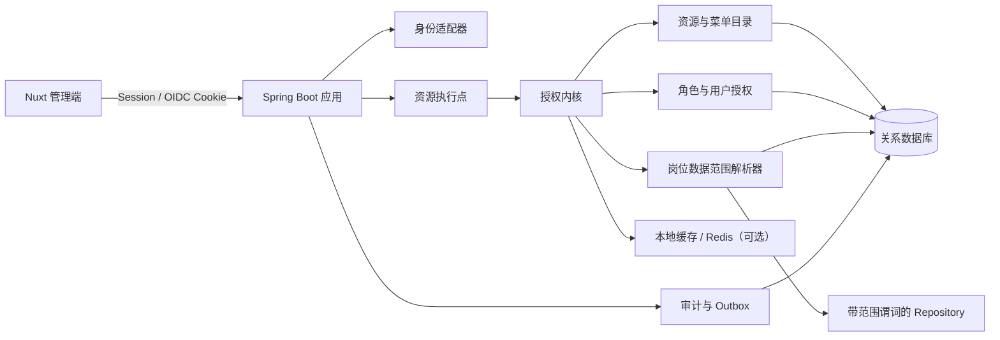
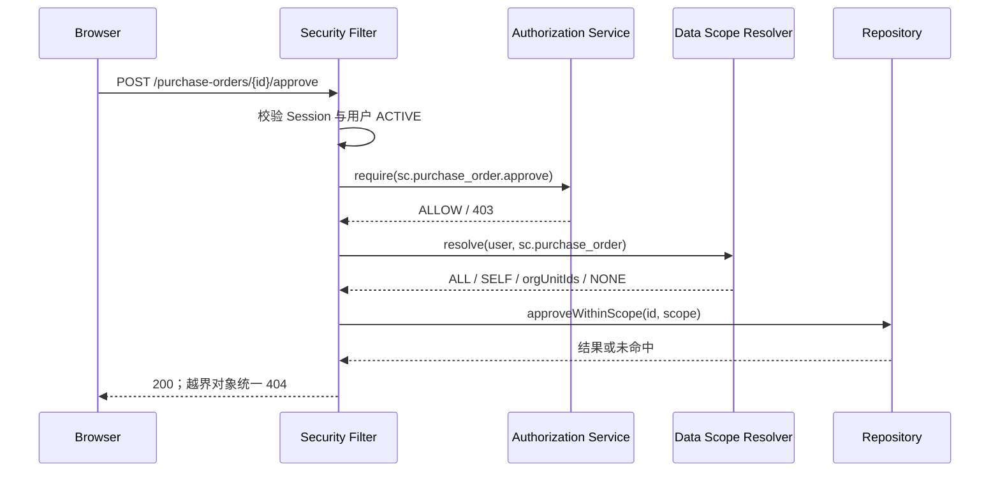
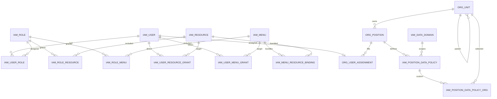

# 企业中台权限中心开发实施文档

| 文档属性 | 内容 |
| --- | --- |
| 状态 | 评审稿（Development Guide） |
| 版本 | 1.0 |
| 更新日期 | 2026-08-13 |
| 适用范围 | 单企业、小型企业中台管理系统 |
| Demo 基线 | `permission-nuxt-demo` 最终实现 |
| 推荐参考栈 | Nuxt 4 / Vue 3 / TypeScript + Spring Boot / Spring Security / MyBatis（或同等技术） |

本文档面向前端、后端、测试、架构、运维及权限管理员，定义权限中心的生产级实现合同。文中的“必须”“应”“可以”分别表示强制要求、默认建议和可选实现。

---

## 1. 文档目标

本文档解决以下问题：

1. 如何把当前静态 Demo 的领域模型落地为可信的生产权限服务；
2. 前后端如何统一使用 `sc.purchase_order.create` 一类稳定资源码；
3. 角色、用户直授、菜单 CORE / OPTIONAL 如何存储、发布和计算；
4. 组织、岗位和数据域如何形成正式数据范围；
5. 前端如何实现组合式函数、权限组件、`v-permission` 指令与路由校验；
6. 后端如何在控制器、服务、查询、异步任务中强制执行权限；
7. 数据库、缓存、审计、并发、错误码、测试和迁移应如何设计。

本文档不是多租户、通用策略引擎或 IAM 产品建设指南。第一版应保持为一个边界清晰的模块化权限中心，避免为小型企业引入不必要的复杂度。

### 阅读导航

- 产品与架构边界：第 2～5 章；
- 数据库与 API：第 6～7 章；
- 后端实现：第 8 章；
- 前端校验组件、函数、指令与路由：第 9 章；
- 数据权限、缓存、审计与错误契约：第 10～13 章；
- 开发流程、测试、迁移和安全：第 14～20 章；
- 当前 Demo 接口与代码评审清单：附录 A～B。

相关材料：

- [完整架构方案](企业中台权限架构方案.md)
- [简化最佳实践版](%23%20企业中台权限架构设计方案（简化最佳实践版）.md)
- [研发演示概要](企业中台权限架构研发演示概要.md)
- [Nuxt 静态 Demo 说明](permission-nuxt-demo/README.md)

### 1.1 明确不在范围内

- 多租户及 `tenant_id`；
- API URL / HTTP Method 权限表；
- 原 REPORT / TEMPLATE 等“业务资源”层；
- 用户级 DENY；
- 用户临时数据范围；
- 角色继承、角色嵌套和通配符权限；
- 动态脚本策略、通用 ABAC / ReBAC 引擎；
- 组织矩阵、多主任职和跨组织兼职；
- 字段级脱敏、字段级授权和审批流引擎。

### 1.2 授权模型定位

本方案采用：

```text
RBAC 角色模板
+ 用户直接 ALLOW 例外
+ 菜单资源包
+ 岗位 × 数据域的数据约束
```

由于允许资源直接授予用户，本方案属于“以 RBAC 为主体的混合授权模型 / RBAC 扩展”，不是严格的 Core RBAC。角色仍是常规授权主路径，用户直授只用于少量例外。

---

## 2. 最终实现决策

### 2.1 一句话心智模型

> 角色做复用，直授做例外，菜单做资源包，资源码贯穿前后端，组织页设置任职，岗位决定正式数据边界。

### 2.2 核心决策表

| 主题 | 最终决策 |
| --- | --- |
| 授权原子 | “资源”是唯一业务动作授权原子，例如 `sc.purchase_order.create` |
| API | API、服务方法和任务只是执行点，直接校验资源码，不登记为授权资源 |
| 角色 | 扁平、可复用、ALLOW only，不携带数据范围 |
| 用户直授 | 允许直接加授菜单或资源，只支持 ALLOW；原因必填，失效时间选填 |
| 菜单 | 板块 → 目录 → 页面菜单；只有页面菜单可授权 |
| 菜单包 | CORE 随菜单自动生效；OPTIONAL 只提示、需显式授予；HIGH 不可 CORE |
| 组织岗位 | 用户创建时不设置；在“组织与岗位”页选择用户后单独设置 |
| 数据范围 | 仅由“岗位 × 数据域”提供正式范围；用户页不展示范围 |
| 判定 | 有效资源与数据范围必须同时命中；任一缺失均拒绝 |
| 默认规则 | 默认拒绝、最小权限、逐请求后端校验 |
| 第一版边界 | 单企业、单主任职、无 DENY、无临时范围、无角色继承 |

### 2.3 统一术语

| 术语 | 开发含义 | 示例 |
| --- | --- | --- |
| 用户 User | 可登录的账号主体 | 林悦 / `lin.yue` |
| 角色 Role | 可复用授权模板 | 销售主管 |
| 资源 Resource | 一个稳定的业务动作权限；不是 API、报表或数据库记录 | `crm.customer.export` |
| 菜单 Menu | 前端导航入口及资源包载体 | 客户列表 |
| CORE | 页面正常打开所需的安全最小资源 | `crm.customer.read` |
| OPTIONAL | 页面内可选业务动作 | `crm.customer.export` |
| 组织单元 Org Unit | 公司、部门、小组构成的单根树 | 客户成功部 |
| 岗位 Position | 属于某一组织，承载正式数据策略 | 销售主管 |
| 数据域 Data Domain | 一类具有相同归属字段和过滤语义的业务数据 | `crm.customer` |
| 数据范围 Data Scope | 岗位在一个数据域内可访问的数据集合 | 本部门及下级 |
| 执行点 Enforcement Point | 控制器、服务方法、任务消费者或查询 | 创建采购单接口 |

“资源”在本系统中对应授权意义上的 permission / authority。业务数据库里的采购单、客户、设计稿是受控数据对象，不再称为权限中心的“资源”。

---

## 3. 当前 Demo 基线与生产差异

### 3.1 Demo 已实现

当前 `permission-nuxt-demo` 是 Nuxt 4 纯静态演示项目，核心实现如下：

| 文件 | 当前职责 |
| --- | --- |
| `app/pages/users.vue` | 用户基础信息和用户授权入口 |
| `app/pages/roles.vue` | 角色模板和角色授权入口 |
| `app/pages/catalog.vue` | 资源登记与编辑 |
| `app/pages/menus.vue` | 三级菜单树和 CORE / OPTIONAL 资源包 |
| `app/pages/organization.vue` | 组织树、岗位、任职、岗位数据范围 |
| `app/pages/simulator.vue` | “资源 AND 数据范围”的判定演示 |
| `app/components/AuthorizationDrawer.vue` | 用户 / 角色共用授权抽屉 |
| `app/composables/useMockApi.ts` | 浏览器端 Mock DB、API、计算、审计与持久化 |
| `app/utils/menu-package-reflection.ts` | 菜单包 CORE / OPTIONAL 反显纯函数 |
| `app/utils/policy-rules.ts` | 来源合并和数据行判定纯函数 |

Demo 的数据保存在浏览器 `localStorage`，存储键为：

```text
permission-center-static-demo-v2
```

Demo 中的有效权限计算为：

```text
有效权限(u)
  = 启用角色的显式菜单与资源
  ∪ 未过期的用户直接菜单与资源
  ∪ 已授权页面菜单的已发布 CORE 资源
```

相同权限按 ID 去重，但保留 `ROLE`、`DIRECT`、`MENU_CORE` 等来源，以便解释和安全撤销。

### 3.2 Demo 尚未实现

以下能力是本文档给出的生产推荐实现，当前 Demo 尚未作为业务运行时能力实现：

- `useAuthorization()` / `can()` 组合式函数；
- `<Can>` 权限组件；
- `v-permission` 指令；
- 页面路由 `meta` 权限声明和 Nuxt route middleware；
- 登录用户的真实服务端 Session / OIDC；
- 真实数据库、缓存、HTTP API 和追加写、受控防篡改审计；
- 业务接口逐请求后端授权；
- 数据范围 SQL 下推；
- 并发控制、幂等、标准错误码和分布式缓存失效。

`PermissionTree` 是“配置授权”的树组件，不是业务页面的运行时安全组件；`simulator.vue` 是规则演示，不是生产策略执行点。

### 3.3 原型代码不能直接进入生产的部分

- `localStorage` 可被用户修改，不能作为可信授权来源；
- Mock API 允许从参数指定模拟用户，生产接口必须从认证上下文获取用户；
- Mock 错误是普通 `Error`，生产必须返回稳定 HTTP 状态和错误码；
- Mock 用户授权采用全量重建直授，生产必须通过 diff 保留未变化授权的来源、时间和审计；
- Mock 审计 actor 固定且仅保留 100 条，生产必须使用真实操作者并持久化；
- Mock 未完整处理禁用用户、`validFrom`、并发修改和数据库引用约束。

---

## 4. 授权模型与不变量

### 4.1 资源码规范

推荐格式：

```text
<业务域>.<业务对象>.<动作>
```

示例：

```text
crm.customer.read
crm.customer.create
crm.customer.update
crm.customer.export
sc.purchase_order.create
sc.purchase_order.approve
designer.asset.review
iam.role.manage
```

规则：

1. 全局唯一，只允许小写字母、数字和下划线，段间使用 `.`；
2. 使用业务语义，不使用 URL、HTTP Method、组件路径或数据库表名；
3. 一个码表达一个可独立授权、审计和测试的动作；
4. `read`、`create`、`update`、`delete`、`export`、`approve` 等敏感度不同的动作应拆开；
5. 创建并投入使用后不可原地改码；语义改变时创建新码、迁移引用、停用旧码；
6. 不允许 `crm.*`、`*` 等运行时通配符；
7. 资源不存在、未启用或执行点声明错误时必须 fail closed；运行时执行点清单与服务层校验见 8.2；

建议在代码仓库维护机器可读目录，并由 CI 生成 Java / TypeScript 常量：

```yaml
# authz/resource-catalog.yaml
resources:
  - code: sc.purchase_order.read
    name: 查看采购单
    domain: supply-chain
    dataDomain: sc.purchase_order
    risk: LOW
  - code: sc.purchase_order.create
    name: 新建采购单
    domain: supply-chain
    dataDomain: sc.purchase_order
    risk: MEDIUM
  - code: sc.purchase_order.approve
    name: 审批采购单
    domain: supply-chain
    dataDomain: sc.purchase_order
    risk: HIGH
```

目录文件用于编译期检查和初始化，不应演变为 API → 资源运行时映射表。

#### 资源目录的真相源

建议把源码仓库中的 `resource-catalog.yaml` 作为“研发交付的期望状态”，数据库 `iam_resource` 作为“运行时已发布状态”：

1. 权限管理员可在 UI 中先创建 DRAFT，供产品和研发评审；
2. 进入开发的资源码必须同步进 manifest 并经过代码评审；
3. CI 从 manifest 生成前后端常量，并检查重复、格式和 HIGH CORE；
4. 数据库迁移或受控发布任务将 manifest 幂等 upsert 到运行时目录；
5. 只有随版本发布并通过执行点覆盖检查的资源才转为 ACTIVE；
6. UI 仍可编辑名称、风险、数据域和状态，但 ACTIVE code 不可修改。

这样既保留运营人员友好的目录界面，又避免生产代码引用一个只存在于某个环境、未进入版本控制的资源码。若团队不采用 manifest，也必须指定唯一审批和发布流程，禁止 UI 与源码各自维护一套不一致的目录。

### 4.2 有效授权公式

令：

- `RoleExplicit(u)`：用户所有启用角色显式拥有的菜单和资源；
- `Direct(u, now)`：用户当前有效的直接菜单和资源；
- `GrantedMenus(u)`：前两项中所有有效页面菜单；
- `Core(m)`：菜单当前已发布的 CORE 资源；
- `Active(x)`：对象当前为启用状态。

则：

```text
Explicit(u) = RoleExplicit(u) ∪ Direct(u, now)

EffectiveResources(u)
  = Active(explicit resources in Explicit(u))
  ∪ Active(⋃ Core(m), m ∈ GrantedMenus(u))

EffectiveMenus(u)
  = Active(explicit menus in Explicit(u))
```

OPTIONAL 不参与自动展开。只有被角色显式授予，或被用户直接授予时才进入有效资源集。

### 4.3 能力与数据范围联合判定

```text
Allow(user, resourceCode, row)
  = user.status == ACTIVE
  AND resourceCode ∈ EffectiveResources(user)
  AND resource.status == ACTIVE
  AND (
        resource.dataDomainCode IS NULL
        OR row ∈ ResolveDataScope(user.position, resource.dataDomainCode)
      )
```

若资源声明了数据域，则必须同时通过数据范围。资源权限回答“能做什么”，岗位数据策略回答“能对哪些数据做”。

### 4.4 强制不变量

1. 角色和用户直授均只产生 ALLOW；
2. 角色不绑定数据范围；
3. 用户授权页不配置数据范围；
4. 任职只在组织与岗位模块维护；
5. 第一版一个用户只有一个当前主任职；
6. 只有页面菜单可授权，板块与目录选择必须展开为当前启用叶子快照；
7. 未来新增菜单不能自动进入历史父节点授权；
8. HIGH 资源不能成为 CORE；
9. CORE 只派生，不重复写入角色资源表或用户资源直授表；
10. OPTIONAL 只有显式选中才持久化；
11. 同一菜单与资源不能同时存在 CORE 和 OPTIONAL 绑定；
12. 未配置岗位数据策略等同 `NONE`；
13. 前端隐藏不构成安全边界；
14. 列表、详情、编辑、删除、导出、批处理与异步任务必须复用同一数据范围语义。

---

## 5. 推荐总体架构

小型企业第一版推荐采用模块化单体，不必先拆独立策略微服务。



### 5.1 模块职责

| 模块 | 职责 |
| --- | --- |
| Identity Adapter | 对接企业 SSO / OIDC / Session，生成不可伪造的 Principal |
| Catalog Service | 资源、菜单、菜单资源包和目录版本 |
| Grant Service | 用户角色、角色菜单/资源、用户直接菜单/资源 |
| Effective Policy Service | 合并来源、展开菜单 CORE、过滤状态和有效期 |
| Data Scope Resolver | 由当前任职和岗位策略生成类型安全范围对象 |
| Enforcement | 在控制器、服务、任务和 Repository 强制校验 |
| Audit Service | 记录 actor、before/after、原因、版本、traceId |
| Version Service | 维护 `authzVersion`、`policyVersion`、`catalogVersion` |

### 5.2 认证与授权分离

- 认证回答“你是谁”，由 SSO / OIDC / Session 完成；
- 授权回答“你能做什么、能访问哪些数据”，由本权限模块完成；
- 客户端提交的 `userId`、资源集合、组织集合均不能作为可信上下文；
- 业务接口始终从服务端 Principal 获取当前用户 ID。

### 5.3 推荐请求链路



---

## 6. 数据库设计建议

### 6.1 设计原则

- 不添加 `tenant_id`；
- 资源、菜单分别建表，避免多态外键失去数据库约束；
- 角色菜单、角色资源、用户菜单直授、用户资源直授分别建关系表；
- 第一版任职表对 `user_id` 唯一，明确单主任职；
- CUSTOM_DEPTS 使用关系表，不把部门 ID 数组塞入难以约束的 JSON；
- 被引用的资源、菜单、角色只停用，不物理删除；
- 授权写入、版本提升、审计和 outbox 在同一事务完成；
- 所有业务受控表必须具有标准归属列和索引。

以下 DDL 明确以 **MySQL 8.0.16+** 为示例方言（该版本起 `CHECK` 才实际执行），服务层仍必须重复做枚举、引用和跨表校验。所有时间按 UTC 存储和比较，在 API 边界使用带时区的 ISO 8601。

PostgreSQL 落地时需要编写独立迁移，不能直接执行下列 DDL：`DATETIME(3)` 应改为 `timestamptz(3)`，`JSON` 改为 `jsonb`，`ADD INDEX` 改为独立 `CREATE INDEX`；还可用部分唯一索引表达“当前有效记录”。

### 6.2 ER 关系



### 6.3 核心表

以下字段是第一版核心字段。`created_at`、`created_by`、`updated_at`、`updated_by` 可通过统一基类补充，不需要全部出现在运营表单中。

#### 6.3.1 用户、角色和资源

```sql
CREATE TABLE iam_user (
  id              BIGINT PRIMARY KEY,
  username        VARCHAR(64)  NOT NULL,
  employee_no     VARCHAR(64)  NOT NULL,
  display_name    VARCHAR(128) NOT NULL,
  status          VARCHAR(16)  NOT NULL,
  authz_version   BIGINT       NOT NULL DEFAULT 1,
  row_version     BIGINT       NOT NULL DEFAULT 1,
  created_at      DATETIME(3)  NOT NULL,
  updated_at      DATETIME(3)  NOT NULL,
  CONSTRAINT uk_iam_user_username UNIQUE (username),
  CONSTRAINT uk_iam_user_employee_no UNIQUE (employee_no),
  CONSTRAINT ck_iam_user_status CHECK (status IN ('ACTIVE', 'DISABLED'))
);

CREATE TABLE iam_role (
  id              BIGINT PRIMARY KEY,
  code            VARCHAR(96)  NOT NULL,
  name            VARCHAR(128) NOT NULL,
  domain_code     VARCHAR(64)  NOT NULL,
  status          VARCHAR(16)  NOT NULL,
  row_version     BIGINT       NOT NULL DEFAULT 1,
  created_at      DATETIME(3)  NOT NULL,
  updated_at      DATETIME(3)  NOT NULL,
  CONSTRAINT uk_iam_role_code UNIQUE (code),
  CONSTRAINT ck_iam_role_status CHECK (status IN ('ACTIVE', 'DISABLED'))
);

CREATE TABLE iam_data_domain (
  code            VARCHAR(96)  PRIMARY KEY,
  name            VARCHAR(128) NOT NULL,
  status          VARCHAR(16)  NOT NULL,
  CONSTRAINT ck_data_domain_status CHECK (status IN ('ACTIVE', 'DISABLED'))
);

CREATE TABLE iam_resource (
  id                BIGINT PRIMARY KEY,
  code              VARCHAR(160) NOT NULL,
  name              VARCHAR(128) NOT NULL,
  domain_code       VARCHAR(64)  NOT NULL,
  data_domain_code  VARCHAR(96)  NULL,
  risk_level        VARCHAR(16)  NOT NULL,
  status            VARCHAR(16)  NOT NULL,
  row_version       BIGINT       NOT NULL DEFAULT 1,
  created_at        DATETIME(3)  NOT NULL,
  updated_at        DATETIME(3)  NOT NULL,
  CONSTRAINT uk_iam_resource_code UNIQUE (code),
  CONSTRAINT fk_resource_data_domain
    FOREIGN KEY (data_domain_code) REFERENCES iam_data_domain(code),
  CONSTRAINT ck_resource_risk CHECK (risk_level IN ('LOW', 'MEDIUM', 'HIGH')),
  CONSTRAINT ck_resource_status CHECK (status IN ('DRAFT', 'ACTIVE', 'DISABLED'))
);
```

资源码建议使用大小写敏感或统一小写的唯一索引。MySQL 项目应确认列 collation；最简单的做法是入库前强制小写并对规范化结果建立唯一约束。

#### 6.3.2 菜单与菜单资源包

```sql
CREATE TABLE iam_menu (
  id                    BIGINT PRIMARY KEY,
  parent_id             BIGINT NULL,
  node_type             VARCHAR(16)  NOT NULL,
  name                  VARCHAR(128) NOT NULL,
  code                  VARCHAR(128) NOT NULL,
  menu_permission_code  VARCHAR(160) NULL,
  route_path            VARCHAR(256) NULL,
  sort_order            INT          NOT NULL DEFAULT 0,
  status                VARCHAR(16)  NOT NULL,
  package_revision      BIGINT       NOT NULL DEFAULT 1,
  row_version           BIGINT       NOT NULL DEFAULT 1,
  CONSTRAINT uk_iam_menu_code UNIQUE (code),
  CONSTRAINT uk_iam_menu_permission_code UNIQUE (menu_permission_code),
  CONSTRAINT fk_iam_menu_parent FOREIGN KEY (parent_id) REFERENCES iam_menu(id),
  CONSTRAINT ck_iam_menu_type CHECK (node_type IN ('BOARD', 'DIRECTORY', 'MENU')),
  CONSTRAINT ck_iam_menu_status CHECK (status IN ('ACTIVE', 'DISABLED'))
);

CREATE INDEX idx_iam_menu_parent_status
  ON iam_menu(parent_id, status, sort_order);

CREATE TABLE iam_menu_resource_binding (
  menu_id        BIGINT      NOT NULL,
  resource_id    BIGINT      NOT NULL,
  bundle_level   VARCHAR(16) NOT NULL,
  PRIMARY KEY (menu_id, resource_id),
  CONSTRAINT fk_binding_menu FOREIGN KEY (menu_id) REFERENCES iam_menu(id),
  CONSTRAINT fk_binding_resource FOREIGN KEY (resource_id) REFERENCES iam_resource(id),
  CONSTRAINT ck_binding_level CHECK (bundle_level IN ('CORE', 'OPTIONAL'))
);

CREATE INDEX idx_menu_binding_resource
  ON iam_menu_resource_binding(resource_id, menu_id);
```

跨表的“HIGH 不得为 CORE”不能仅靠普通 `CHECK` 约束表达，必须在服务层事务中校验；需要更强保护时可增加数据库触发器。服务端应对非法 CORE 整单返回 422，不要像 Demo 一样静默降级为 OPTIONAL。

绑定表只保存当前已发布包，没有草稿行或 `PUBLISHED` 字段；整包 PUT 事务完成后，该表内容就是菜单当前发布版本，版本号保存在 `iam_menu.package_revision`。

服务层还必须保证结构语义：BOARD 的 `parent_id` 为空；DIRECTORY 的父级是 BOARD；MENU 的父级是 DIRECTORY，且 `menu_permission_code`、`route_path` 非空；角色和用户菜单表只接受 ACTIVE MENU 叶子。移动节点前检测菜单树环。

#### 6.3.3 角色与用户授权

```sql
CREATE TABLE iam_user_role (
  user_id BIGINT NOT NULL,
  role_id BIGINT NOT NULL,
  PRIMARY KEY (user_id, role_id),
  FOREIGN KEY (user_id) REFERENCES iam_user(id),
  FOREIGN KEY (role_id) REFERENCES iam_role(id)
);

CREATE INDEX idx_user_role_role ON iam_user_role(role_id, user_id);

CREATE TABLE iam_role_resource (
  role_id     BIGINT NOT NULL,
  resource_id BIGINT NOT NULL,
  PRIMARY KEY (role_id, resource_id),
  FOREIGN KEY (role_id) REFERENCES iam_role(id),
  FOREIGN KEY (resource_id) REFERENCES iam_resource(id)
);

CREATE INDEX idx_role_resource_resource ON iam_role_resource(resource_id, role_id);

CREATE TABLE iam_role_menu (
  role_id BIGINT NOT NULL,
  menu_id BIGINT NOT NULL,
  PRIMARY KEY (role_id, menu_id),
  FOREIGN KEY (role_id) REFERENCES iam_role(id),
  FOREIGN KEY (menu_id) REFERENCES iam_menu(id)
);

CREATE INDEX idx_role_menu_menu ON iam_role_menu(menu_id, role_id);

CREATE TABLE iam_user_resource_grant (
  id             BIGINT PRIMARY KEY,
  user_id        BIGINT       NOT NULL,
  resource_id    BIGINT       NOT NULL,
  reason         VARCHAR(500) NOT NULL,
  source_ticket  VARCHAR(128) NULL,
  valid_from     DATETIME(3)  NOT NULL,
  valid_to       DATETIME(3)  NULL,
  created_by     BIGINT       NOT NULL,
  created_at     DATETIME(3)  NOT NULL,
  CONSTRAINT uk_user_resource_grant UNIQUE (user_id, resource_id),
  FOREIGN KEY (user_id) REFERENCES iam_user(id),
  FOREIGN KEY (resource_id) REFERENCES iam_resource(id)
);

CREATE INDEX idx_user_resource_expiry
  ON iam_user_resource_grant(user_id, valid_to);

CREATE TABLE iam_user_menu_grant (
  id             BIGINT PRIMARY KEY,
  user_id        BIGINT       NOT NULL,
  menu_id        BIGINT       NOT NULL,
  reason         VARCHAR(500) NOT NULL,
  source_ticket  VARCHAR(128) NULL,
  valid_from     DATETIME(3)  NOT NULL,
  valid_to       DATETIME(3)  NULL,
  created_by     BIGINT       NOT NULL,
  created_at     DATETIME(3)  NOT NULL,
  CONSTRAINT uk_user_menu_grant UNIQUE (user_id, menu_id),
  FOREIGN KEY (user_id) REFERENCES iam_user(id),
  FOREIGN KEY (menu_id) REFERENCES iam_menu(id)
);

CREATE INDEX idx_user_menu_expiry
  ON iam_user_menu_grant(user_id, valid_to);
```

用户直授的有效条件为：

```text
valid_from <= now AND (valid_to IS NULL OR now < valid_to)
```

失效时间为选填。留空表示长期有效，不能作为表单校验失败的原因。

上述两张直授表采用“当前态快照”语义：撤销时删除当前行，过期后再次加授时复用并更新当前行，完整历史由审计表保留。若法规要求保留每次 grant 实体，则增加 `revoked_at` 和历史表，并使用数据库能力保证同一用户、同一目标最多一条当前有效授权。

#### 6.3.4 组织、岗位、任职和正式数据策略

```sql
CREATE TABLE org_unit (
  id              BIGINT PRIMARY KEY,
  parent_id       BIGINT NULL,
  name            VARCHAR(128) NOT NULL,
  unit_type       VARCHAR(16)  NOT NULL,
  leader_user_id  BIGINT NULL,
  sort_order      INT NOT NULL DEFAULT 0,
  status          VARCHAR(16) NOT NULL,
  row_version     BIGINT NOT NULL DEFAULT 1,
  FOREIGN KEY (parent_id) REFERENCES org_unit(id),
  FOREIGN KEY (leader_user_id) REFERENCES iam_user(id),
  CONSTRAINT ck_org_unit_type CHECK (unit_type IN ('COMPANY', 'DEPARTMENT', 'GROUP')),
  CONSTRAINT ck_org_unit_status CHECK (status IN ('ACTIVE', 'DISABLED'))
);

CREATE INDEX idx_org_unit_parent ON org_unit(parent_id, status, sort_order);

CREATE TABLE org_position (
  id           BIGINT PRIMARY KEY,
  org_unit_id  BIGINT       NOT NULL,
  name         VARCHAR(128) NOT NULL,
  status       VARCHAR(16)  NOT NULL,
  row_version  BIGINT       NOT NULL DEFAULT 1,
  FOREIGN KEY (org_unit_id) REFERENCES org_unit(id),
  CONSTRAINT uk_position_id_unit UNIQUE (id, org_unit_id),
  CONSTRAINT ck_position_status CHECK (status IN ('ACTIVE', 'DISABLED'))
);

CREATE INDEX idx_position_org ON org_position(org_unit_id, status);

CREATE TABLE org_user_assignment (
  user_id      BIGINT PRIMARY KEY,
  org_unit_id  BIGINT      NOT NULL,
  position_id  BIGINT      NOT NULL,
  row_version  BIGINT      NOT NULL DEFAULT 1,
  updated_by   BIGINT      NOT NULL,
  updated_at   DATETIME(3) NOT NULL,
  FOREIGN KEY (user_id) REFERENCES iam_user(id),
  CONSTRAINT fk_assignment_position_unit
    FOREIGN KEY (position_id, org_unit_id)
    REFERENCES org_position(id, org_unit_id)
);

CREATE INDEX idx_assignment_position ON org_user_assignment(position_id, user_id);

CREATE TABLE iam_position_data_policy (
  id                   BIGINT PRIMARY KEY,
  position_id          BIGINT      NOT NULL,
  data_domain_code     VARCHAR(96) NOT NULL,
  scope_type           VARCHAR(32) NOT NULL,
  include_descendants  BOOLEAN     NOT NULL DEFAULT FALSE,
  row_version          BIGINT      NOT NULL DEFAULT 1,
  CONSTRAINT uk_position_domain UNIQUE (position_id, data_domain_code),
  FOREIGN KEY (position_id) REFERENCES org_position(id),
  FOREIGN KEY (data_domain_code) REFERENCES iam_data_domain(code),
  CONSTRAINT ck_scope_type CHECK (
    scope_type IN ('NONE', 'SELF', 'DEPT', 'DEPT_AND_DESCENDANTS', 'CUSTOM_DEPTS', 'ALL')
  )
);

CREATE TABLE iam_position_data_policy_org (
  policy_id    BIGINT NOT NULL,
  org_unit_id  BIGINT NOT NULL,
  PRIMARY KEY (policy_id, org_unit_id),
  FOREIGN KEY (policy_id) REFERENCES iam_position_data_policy(id),
  FOREIGN KEY (org_unit_id) REFERENCES org_unit(id)
);
```

任职必须通过组织模块单独设置。`POST /users` 不接受 `orgUnitId` 或 `positionId`。复合外键从数据库层保证岗位确实属于所选组织。

组织服务必须保证只有一个 COMPANY 根；DEPARTMENT / GROUP 的父级类型合法；停用、移动和删除前检测自环、祖先环、在岗用户与下级节点。数据库枚举约束本身不能表达这些树结构规则。

#### 6.3.5 版本与审计

```sql
CREATE TABLE iam_policy_state (
  id               SMALLINT PRIMARY KEY,
  policy_version   BIGINT      NOT NULL,
  catalog_version  BIGINT      NOT NULL,
  updated_at       DATETIME(3) NOT NULL,
  CONSTRAINT ck_policy_singleton CHECK (id = 1)
);

CREATE TABLE iam_audit_log (
  id              BIGINT PRIMARY KEY,
  actor_user_id   BIGINT        NOT NULL,
  action          VARCHAR(64)   NOT NULL,
  entity_type     VARCHAR(64)   NOT NULL,
  entity_id       VARCHAR(128)  NOT NULL,
  before_json     JSON          NULL,
  after_json      JSON          NULL,
  reason          VARCHAR(500)  NULL,
  source_ticket   VARCHAR(128)  NULL,
  request_id      VARCHAR(128)  NOT NULL,
  trace_id        VARCHAR(128)  NOT NULL,
  policy_version  BIGINT        NOT NULL,
  created_at      DATETIME(3)   NOT NULL,
  FOREIGN KEY (actor_user_id) REFERENCES iam_user(id)
);

CREATE INDEX idx_audit_entity_time
  ON iam_audit_log(entity_type, entity_id, created_at);
CREATE INDEX idx_audit_actor_time
  ON iam_audit_log(actor_user_id, created_at);
CREATE INDEX idx_audit_request
  ON iam_audit_log(request_id);

CREATE TABLE iam_idempotency_record (
  idempotency_key  VARCHAR(128) NOT NULL,
  actor_user_id    BIGINT       NOT NULL,
  operation        VARCHAR(96)  NOT NULL,
  request_hash     VARCHAR(128) NOT NULL,
  response_json    JSON         NULL,
  status           VARCHAR(16)  NOT NULL,
  expires_at       DATETIME(3)  NOT NULL,
  created_at       DATETIME(3)  NOT NULL,
  PRIMARY KEY (actor_user_id, operation, idempotency_key),
  CONSTRAINT ck_idempotency_status CHECK (status IN ('PROCESSING', 'SUCCEEDED', 'FAILED')),
  FOREIGN KEY (actor_user_id) REFERENCES iam_user(id)
);

CREATE INDEX idx_idempotency_expiry
  ON iam_idempotency_record(expires_at);
```

审计表应 append-only。应用数据库账号只授予 INSERT / SELECT，不授予 UPDATE / DELETE；高要求环境再把日志异步归档到独立安全域、WORM 存储或带完整性校验的日志平台，并监控缺口。普通 append-only 表本身不等于不可篡改。

`Idempotency-Key` 使用独立幂等记录表或命令表去重，不要把审计的 `request_id` 设为全局唯一，因为一个请求可能合法地产生多条审计。相同主键但 `request_hash` 不同应返回 409；响应快照可能含敏感信息，应加密或裁剪并短期保留。生产环境可增加 `iam_outbox_event`，将缓存失效事件和审计写入与授权变更放在同一事务中。

### 6.4 业务表的归属字段

每个受数据范围控制的业务表必须有明确、不可歧义的归属列。存量表不要直接添加 `NOT NULL`：先添加可空列，按已确认规则回填并核对空值，再增加外键和索引，最后改为 `NOT NULL`。

```sql
ALTER TABLE sc_purchase_order
  ADD COLUMN owner_user_id BIGINT NULL,
  ADD COLUMN owner_org_unit_id BIGINT NULL;

-- 业务确认后分批回填并核验零空值，再执行：
ALTER TABLE sc_purchase_order
  MODIFY owner_user_id BIGINT NOT NULL,
  MODIFY owner_org_unit_id BIGINT NOT NULL,
  ADD CONSTRAINT fk_po_owner_user
    FOREIGN KEY (owner_user_id) REFERENCES iam_user(id),
  ADD CONSTRAINT fk_po_owner_org
    FOREIGN KEY (owner_org_unit_id) REFERENCES org_unit(id),
  ADD INDEX idx_po_owner_user(owner_user_id),
  ADD INDEX idx_po_owner_org(owner_org_unit_id);
```

归属变更本身也是敏感业务动作，应有独立资源码和审计。禁止根据创建人、最后修改人或当前登录部门临时猜测数据归属。

---

## 7. API 设计

### 7.1 API 设计原则

1. 管理关系使用数据库 ID；运行时校验使用稳定 code；
2. 菜单 ID 与资源 ID 分字段传递，避免一个 `permissionIds` 混合两种类型；
3. 服务端永远重新计算 CORE，不接受客户端提交的派生 CORE 集合；
4. 全量 PUT 应幂等，并用 `expectedVersion` 或 `If-Match` 防止覆盖他人修改；
5. 授权发生变化时原因必须 trim 后非空，但不设置“至少 4 个字符”一类任意限制；
6. `validTo` 可空；非空时必须晚于当前时间；
7. 列表接口分页；管理接口生成 OpenAPI 客户端；
8. 错误响应使用 `application/problem+json`；
9. 返回值中的用户身份来自服务端会话，不能信任请求 body 的 actor 或当前用户 ID。

数据库使用 `BIGINT` 时，OpenAPI 和 JSON 中的 ID 一律定义为 `type: string`，TypeScript 也使用 `string`，避免超过 JavaScript `Number.MAX_SAFE_INTEGER`。

### 7.2 当前用户运行时上下文

```http
GET /api/v1/me/authorization
```

```json
{
  "data": {
    "user": {
      "id": "100108",
      "displayName": "林悦"
    },
    "menuTree": [
      {
        "id": "3001",
        "code": "BOARD_INFO",
        "name": "信息板块",
        "nodeType": "BOARD",
        "children": []
      }
    ],
    "menuCodes": [
      "menu.info.customer.list"
    ],
    "resourceCodes": [
      "crm.customer.read",
      "crm.customer.create"
    ]
  },
  "meta": {
    "authzVersion": 7,
    "policyVersion": 18,
    "catalogVersion": 4,
    "expiresAt": "2026-08-13T10:30:00Z"
  }
}
```

普通业务前端只需要菜单树、菜单码、资源码和版本，不应下载全部角色关系、授权原因或数据范围。详细来源只向权限管理员开放。

### 7.3 生产建议端点

| 方法 | 路径 | 用途 |
| --- | --- | --- |
| GET | `/api/v1/me/authorization` | 当前用户运行时上下文 |
| GET / POST | `/api/v1/users` | 用户查询 / 创建基础账号 |
| GET / POST | `/api/v1/roles` | 角色查询 / 创建 |
| GET / POST | `/api/v1/resources` | 资源目录查询 / 创建 |
| PUT | `/api/v1/resources/{id}` | 编辑资源，code 只读 |
| GET / POST | `/api/v1/menus` | 菜单树查询 / 创建 |
| PUT | `/api/v1/menus/{id}/package` | 发布 CORE / OPTIONAL 包 |
| GET / PUT | `/api/v1/roles/{id}/grants` | 查询 / 发布角色菜单与资源 |
| GET / PUT | `/api/v1/users/{id}/authorization` | 查询 / 发布用户角色与直授 |
| GET | `/api/v1/users/{id}/effective-authorization` | 管理员查看有效权限及来源 |
| GET | `/api/v1/organization` | 组织、岗位、成员和数据策略 |
| POST | `/api/v1/org-units` | 创建组织单元 |
| POST | `/api/v1/positions` | 创建岗位 |
| PUT | `/api/v1/users/{id}/assignment` | 在组织模块设置主任职 |
| PUT | `/api/v1/positions/{id}/data-policies` | 发布岗位正式数据策略 |
| GET | `/api/v1/audit-logs` | 审计查询 |

当前 Demo 的 `/api/subjects/{type}/{id}` 可在原型期保留，但生产 API 建议拆成用户和角色两个明确契约，便于 OpenAPI 类型生成和校验。

### 7.4 创建用户

```http
POST /api/v1/users
```

```json
{
  "displayName": "李晨",
  "username": "li.chen",
  "employeeNo": "EMP0401",
  "status": "ACTIVE"
}
```

响应创建的用户没有组织、岗位、角色和直授。任职与授权由不同管理页面后续设置。

### 7.5 发布角色授权

```http
PUT /api/v1/roles/2003/grants
If-Match: "12"
Idempotency-Key: 98db6963-...
```

```json
{
  "menuIds": ["3003"],
  "resourceIds": ["4002", "4003"],
  "reason": "销售主管标准模板调整"
}
```

`resourceIds` 只包含显式资源。菜单产生的 CORE 由服务端运行时展开，不写回该数组。

### 7.6 发布用户授权

```http
PUT /api/v1/users/100108/authorization
If-Match: "7"
```

```json
{
  "roleIds": ["2003"],
  "directMenuIds": [],
  "directResourceIds": ["4010"],
  "reason": "季度客户清理专项",
  "validTo": null,
  "sourceTicket": "AUTH-2026-021"
}
```

`reason` 是本次发布命令的审计原因；顶层 `validTo` 和 `sourceTicket` 只应用于本次新增的直授，`validTo: null` 表示这些新增项长期有效。生产服务应通过 diff：

- 保留未变化直授原有的 grant ID、`validFrom`、原因和失效时间；
- 只为新增项创建 grant；
- 只撤销移除项；
- 不要像静态 Demo 一样重建全部 grant。

该全量 PUT 不修改未变化 grant 的原因、工单或失效时间。若要调整某条现有 grant 的元数据，使用后续增量 grant endpoint，避免 `null` 究竟是“清空旧失效时间”还是“仅新增长期有效”的歧义。

若不同直授需要不同失效时间，后续可增加增量的 `POST /direct-grants` 和 `DELETE /direct-grants/{id}`，第一版不必强行做复杂批量编辑器。

### 7.7 设置用户任职

```http
PUT /api/v1/users/100108/assignment
If-None-Match: *
```

```json
{
  "orgUnitId": "5008",
  "positionId": "6004",
  "reason": "转入华东客户组"
}
```

首次任职使用 `If-None-Match: *`；已有任职的调岗改用 `If-Match: "<assignment-row-version>"`。服务端必须校验：用户、组织、岗位均有效，且岗位属于所选组织。调岗只更新主任职和权限版本，不隐式修改角色或转移业务数据。

### 7.8 发布菜单资源包

```http
PUT /api/v1/menus/3003/package
If-Match: "5"
```

```json
{
  "coreResourceIds": ["4001"],
  "optionalResourceIds": ["4002", "4003", "4004"],
  "reason": "客户列表页面能力调整"
}
```

服务端校验：

- 目标必须是 ACTIVE 页面菜单；
- 所有资源必须存在、为 ACTIVE 且类型正确；
- 两个集合互斥；
- CORE 至少有一个安全的页面基本资源；
- HIGH 不能进入 CORE；
- 整包在一个事务内替换并提升 revision；
- 返回受影响用户数和版本。

### 7.9 标准成功响应

```json
{
  "data": {
    "id": "2003",
    "affectedUsers": 18
  },
  "meta": {
    "policyVersion": 19,
    "catalogVersion": 4,
    "traceId": "01J5..."
  }
}
```

---

## 8. 后端实现

### 8.1 推荐包结构

```text
com.company.platform.iam
├─ identity/           # Principal、SSO/OIDC 适配
├─ catalog/            # Resource、Menu、MenuPackage
├─ grant/              # Role、UserRole、DirectGrant
├─ policy/             # EffectiveAuthorization、版本与缓存
├─ datascope/          # DataDomain、DataScopeResolver、QuerySpec
├─ organization/       # OrgUnit、Position、Assignment
├─ enforcement/        # 注解、AuthorizationFacade
├─ audit/              # AuditLog、Outbox
└─ api/                # REST DTO、Controller、Problem Details
```

领域层不要依赖控制器 DTO；数据范围对象不要由前端直接构造。

### 8.2 安全基线

HTTP 过滤链先建立认证基线：

```java
@Configuration
@EnableMethodSecurity
class SecurityConfiguration {

    @Bean
    SecurityFilterChain security(HttpSecurity http) throws Exception {
        return http
            .authorizeHttpRequests(registry -> registry
                .requestMatchers("/health", "/login/**", "/oauth2/**").permitAll()
                .anyRequest().authenticated())
            .build();
    }
}
```

Spring Boot Starter Security 不会自动启用方法级授权，必须显式使用 `@EnableMethodSecurity`。这里的 `.anyRequest().authenticated()` **只表示其余请求必须登录，不是资源级默认拒绝**；漏写方法授权时，已登录用户仍可能调用。

因此必须增加运行时 / 启动期的 fail-closed 执行点登记：

```java
@Target(ElementType.METHOD)
@Retention(RetentionPolicy.RUNTIME)
public @interface PublicEndpoint {}

@Target(ElementType.METHOD)
@Retention(RetentionPolicy.RUNTIME)
public @interface RequireResource {
    String value();
}

@Component
final class AuthorizationMappingValidator
        implements SmartInitializingSingleton {
    private final RequestMappingHandlerMapping mappings;
    private final ResourceCatalog catalog;

    AuthorizationMappingValidator(
            RequestMappingHandlerMapping mappings,
            ResourceCatalog catalog) {
        this.mappings = mappings;
        this.catalog = catalog;
    }

    @Override
    public void afterSingletonsInstantiated() {
        mappings.getHandlerMethods().forEach((mapping, method) -> {
            if (!method.getBeanType().getPackageName()
                    .startsWith("com.company.platform")) {
                return; // 排除 Spring 基础设施 Handler
            }
            boolean publicEndpoint = AnnotatedElementUtils.hasAnnotation(
                method.getMethod(), PublicEndpoint.class);
            RequireResource required = AnnotatedElementUtils.findMergedAnnotation(
                method.getMethod(), RequireResource.class);

            if (!publicEndpoint && required == null) {
                throw new IllegalStateException(
                    "非公开执行点缺少 @RequireResource: " + method);
            }
            if (required != null && !catalog.isActive(required.value())) {
                throw new IllegalStateException(
                    "执行点声明了不存在或未启用的资源: " + required.value());
            }
        });
    }
}

@Aspect
@Component
final class RequireResourceAspect {
    private final AuthorizationFacade authorization;

    RequireResourceAspect(AuthorizationFacade authorization) {
        this.authorization = authorization;
    }

    @Before("@annotation(required)")
    public void authorize(RequireResource required) {
        authorization.requireResource(
            CurrentPrincipal.userId(),
            required.value()
        );
    }
}
```

生产实现需排除 Spring 自带错误处理、Actuator 等基础设施 Handler，公开端点必须显式列入白名单或标记 `@PublicEndpoint`。`@RequireResource` 必须由 Aspect 或自定义 MethodInterceptor 真正执行（Aspect 方案需引入 Spring AOP starter），不能只做文档标签。CI / ArchUnit 扫描作为第二道 Gate，不能替代启动期和运行时兜底；服务方法授权仍是最终业务边界。

### 8.3 资源常量

```java
public final class ResourceCodes {
    private ResourceCodes() {}

    public static final String PURCHASE_ORDER_READ =
        "sc.purchase_order.read";
    public static final String PURCHASE_ORDER_CREATE =
        "sc.purchase_order.create";
    public static final String PURCHASE_ORDER_APPROVE =
        "sc.purchase_order.approve";
}
```

常量应从资源目录生成，避免 Java、TypeScript 和数据库初始化脚本各自手写一份。

### 8.4 控制器与服务校验

推荐直接使用资源码，不使用 `hasRole` 或 URL 字符串。若登录时能把当前有效资源装载为版本化 `GrantedAuthority`，首选 Spring 原生的简单表达式：

```java
@PreAuthorize("hasAuthority('sc.purchase_order.create')")
```

若需要按当前策略版本动态加载，则使用上面的 `@RequireResource` + Aspect，或自定义 Bean。以下示例选择 `@RequireResource` 模式；团队应二选一并统一，不在同一方法叠加重复校验：

```java
@RestController
@RequestMapping("/api/v1/purchase-orders")
class PurchaseOrderController {

    private final PurchaseOrderService service;

    PurchaseOrderController(PurchaseOrderService service) {
        this.service = service;
    }

    @PostMapping
    @RequireResource("sc.purchase_order.create")
    PurchaseOrderVO create(@Valid @RequestBody CreatePurchaseOrderCommand command) {
        return service.create(CurrentPrincipal.userId(), command);
    }

    @PostMapping("/{id}/approve")
    @RequireResource("sc.purchase_order.approve")
    PurchaseOrderVO approve(@PathVariable long id) {
        return service.approve(CurrentPrincipal.userId(), id);
    }
}
```

`AuthorizationFacade` 每次根据可信 Principal 和当前策略版本判断：

```java
@Component("authorization")
public final class AuthorizationFacade {
    private final EffectiveAuthorizationService policies;

    AuthorizationFacade(EffectiveAuthorizationService policies) {
        this.policies = policies;
    }

    public boolean hasResource(Authentication authentication, String code) {
        if (authentication == null
                || !authentication.isAuthenticated()
                || !(authentication.getPrincipal()
                    instanceof PlatformPrincipal principal)) {
            return false;
        }
        return principal.active()
            && policies.load(principal.userId()).resourceCodes().contains(code);
    }

    public void requireResource(long userId, String code) {
        if (!policies.load(userId).resourceCodes().contains(code)) {
            throw new AccessDeniedException("resource denied");
        }
    }
}
```

`policies.load()` 仍必须核验数据库中的用户为 ACTIVE，不能只信 Session 创建时的 `principal.active` 快照。

服务层是 HTTP、任务、消息消费等所有入口共享的最终边界：

```java
@Transactional
public PurchaseOrderVO approve(long userId, long orderId) {
    authorization.requireResource(
        userId,
        ResourceCodes.PURCHASE_ORDER_APPROVE
    );

    DataScope scope = dataScopes.resolve(userId, "sc.purchase_order");
    PurchaseOrder order = repository
        .findOneWithinScope(orderId, scope)
        .orElseThrow(NotFoundException::new);

    order.approve();
    return mapper.toVO(order);
}
```

控制器注解用于快速拒绝和可读性，服务层校验保证非 HTTP 调用不能绕过。若团队能确保所有业务只经受保护的服务方法，也可把 `@PreAuthorize` 直接放在服务方法上，避免重复计算。

不要仅靠 `@PostAuthorize` 保护数据库写操作；授权检查发生在写入后会过晚。

### 8.5 有效权限计算

建议返回代码集合与可解释来源：

```java
public record PermissionSource(
    SourceType type,
    long sourceId,
    String sourceName,
    Long viaMenuId
) {}

public record EffectiveResource(
    long id,
    String code,
    String dataDomainCode,
    RiskLevel risk,
    List<PermissionSource> sources
) {}

public record EffectiveAuthorization(
    long userId,
    long authzVersion,
    long policyVersion,
    Set<String> menuCodes,
    Set<String> resourceCodes,
    Map<String, EffectiveResource> explanation
) {}
```

计算步骤：

1. 用户不存在、禁用或会话撤销：拒绝；
2. 查询启用角色的显式菜单和资源；
3. 查询当前有效的用户菜单和资源直授；
4. 合并显式页面菜单；
5. 读取这些菜单当前发布的 CORE 资源；
6. 过滤禁用菜单、资源和角色；
7. 按资源 ID / code 去重但保留全部来源；
8. 输出 `menuCodes` 和 `resourceCodes`；
9. OPTIONAL 不自动加入；
10. 数据范围不要预先混入资源集合，在访问具体数据域时解析。

伪代码：

```java
EffectiveAuthorization compute(long userId, Instant now) {
    User user = users.requireActive(userId);

    List<Grant> explicit = new ArrayList<>();
    explicit.addAll(grants.fromActiveRoles(userId));
    explicit.addAll(grants.directAndValid(userId, now));

    Set<Long> menuIds = explicit.stream()
        .filter(Grant::isMenu)
        .map(Grant::targetId)
        .collect(toSet());

    List<Grant> coreDerived = menuPackages.activeCore(menuIds).stream()
        .map(binding -> Grant.menuCore(binding.menuId(), binding.resourceId()))
        .toList();

    return mergeAndExplain(explicit, coreDerived);
}
```

### 8.6 菜单包的 live 语义

菜单包采用实时引用：角色或用户持有“客户列表”菜单后，读取该菜单当前发布的 CORE。以后发布新的 CORE 会影响所有菜单持有人。

因此发布前必须：

- 展示新增 / 移除 CORE 和 OPTIONAL；
- 计算受影响角色和用户数；
- HIGH CORE 直接拒绝；
- 提升 `packageRevision`、`catalogVersion` 和全局 `policyVersion`；
- 写入 before / after 审计；
- 清理或自然淘汰旧缓存。

CORE 的实时引用是有意设计，不是把当时 CORE 复制到每个角色或用户。若业务需要冻结历史版本，应另行设计版本化套餐，不在第一版范围内。

### 8.7 数据范围对象

```java
public record DataScope(
    String dataDomainCode,
    boolean all,
    boolean self,
    long userId,
    Set<Long> orgUnitIds
) {
    public boolean none() {
        return !all && !self && orgUnitIds.isEmpty();
    }
}
```

解析规则：

| scopeType | 服务端解析 |
| --- | --- |
| `NONE` | `none = true` |
| `SELF` | `owner_user_id = currentUserId` |
| `DEPT` | 当前任职组织 |
| `DEPT_AND_DESCENDANTS` | 当前任职组织及组织树全部下级 |
| `CUSTOM_DEPTS` | 策略关系表指定组织；按配置决定是否展开下级 |
| `ALL` | 不追加归属限制；必须是显式策略 |

解析器必须从当前有效任职读取组织和岗位。无任职、岗位停用、数据域停用或无策略时均返回 `NONE`。

数据策略发布时还必须校验：同一岗位与数据域只能有一条策略；只有 `CUSTOM_DEPTS` 可以存在关联组织且至少选择一个 ACTIVE 组织；其他类型必须清空关联组织；`includeDescendants` 只对 `CUSTOM_DEPTS` 有独立意义，`DEPT_AND_DESCENDANTS` 已包含展开语义。非法组合返回 422。

### 8.8 SQL 谓词下推

禁止把全量数据查回 Java 后再过滤。显式 SQL 示例：

```sql
SELECT po.*
FROM sc_purchase_order po
WHERE po.id = :id
  AND (
       :scope_all = TRUE
    OR (:scope_self = TRUE AND po.owner_user_id = :user_id)
    OR po.owner_org_unit_id IN (:scope_org_unit_ids)
  );
```

无策略时必须生成 `AND 1 = 0`，不能因为组织集合为空而省略条件。

MyBatis XML 示例：

```xml
<sql id="PurchaseOrderScopePredicate">
  <choose>
    <when test="scope.all">
      <!-- 显式 ALL，不追加归属过滤 -->
    </when>
    <when test="scope.none()">
      AND 1 = 0
    </when>
    <otherwise>
      AND (
        1 = 0
        <if test="scope.self">
          OR po.owner_user_id = #{scope.userId}
        </if>
        <if test="scope.orgUnitIds != null and !scope.orgUnitIds.isEmpty()">
          OR po.owner_org_unit_id IN
          <foreach collection="scope.orgUnitIds" item="orgId"
                   open="(" separator="," close=")">
            #{orgId}
          </foreach>
        </if>
      )
    </otherwise>
  </choose>
</sql>

<select id="findOneWithinScope" resultMap="PurchaseOrderMap">
  SELECT po.*
  FROM sc_purchase_order po
  WHERE po.id = #{id}
  <include refid="PurchaseOrderScopePredicate" />
</select>
```

对应 Mapper 必须显式命名参数，并固定数据域：

```java
Optional<PurchaseOrder> findOneWithinScope(
    @Param("id") long id,
    @Param("scope") DataScope scope
);

// Repository adapter 入口
if (!"sc.purchase_order".equals(scope.dataDomainCode())) {
    throw new IllegalArgumentException("data scope domain mismatch");
}
```

列表、详情、UPDATE、DELETE、导出和批处理应复用同一个 `DataScopePredicateFactory`。更新和删除可以把谓词放进 SQL `WHERE`，根据影响行数决定成功或返回 404。

创建操作还没有已存 row，规则应明确为：先校验 `*.create` 资源；服务端从当前任职派生 prospective `owner_user_id` / `owner_org_unit_id`，再用同一 DataScope 验证这组待写归属是否可访问。无任职、NONE 或归属不命中则拒绝，客户端不能自由指定。需要替他人或其他组织代建时使用独立高风险资源码，并明确可选目标范围。

### 8.9 MyBatis-Plus 拦截器选项

若项目大量使用 MyBatis-Plus，可以使用 `DataPermissionInterceptor` 在 SQL 执行前追加数据权限表达式。以下是**本项目额外的安全约束**，不是插件自动保证：

1. 只对明确登记的数据域和表启用；
2. 通过 `mappedStatementId + table + alias` 找到数据域；
3. `NONE` 返回 `1 = 0`，不得返回 `null`；
4. 组织 ID 只能来自服务端 `DataScope`，不能来自前端参数；
5. `ALL` 只有显式策略才允许不追加范围；
6. JOIN、别名、子查询、UNION、CTE、分页、更新和删除的覆盖取决于锁定的 MyBatis-Plus / JSQLParser 版本，必须有真实 Mapper 集成测试；
7. 不能假设拦截器自动覆盖所有手写 SQL；
8. 本项目不要注册多租户 `TenantLineInterceptor`。

对小型系统，显式 QuerySpec / SQL 片段通常更易审计；当受控 Mapper 数量明显增加后再引入统一拦截器。

### 8.10 对象级越权与防枚举

以下代码不安全：

```java
// 错误：先按可猜 ID 取对象，再依赖前端不展示
PurchaseOrder order = repository.findById(id).orElseThrow();
```

推荐把对象 ID 和数据范围放进同一个查询：

```java
PurchaseOrder order = repository
    .findOneWithinScope(id, scope)
    .orElseThrow(NotFoundException::new);
```

对业务对象，未找到与无权访问可统一返回 404，减少对象枚举信息；对权限中心管理对象，权限管理员可以收到明确的 403 / 404。

### 8.11 定时任务、消息和批处理

- 任务消费者必须显式携带系统主体或原始业务主体；
- 系统主体使用专用、最小权限的 service account，不冒充超级管理员；
- 批量操作应定义“全部成功才提交”或“逐项返回结果”，不能静默跳过越权项；
- 导出必须复用列表的数据范围并限制行数；
- 异步任务入队时和执行时均应验证关键授权，防止队列等待期间权限已回收；
- 审计记录原始操作者、任务 ID 和最终执行主体。

---

## 9. 前端实现

### 9.1 前端职责边界

前端负责：

- 使用后端返回的菜单树构建导航；
- 使用资源码改善按钮、操作区、批量入口和路由体验；
- 正确处理 401、403、404 和策略版本变化；
- 在授权配置 UI 中展示 CORE 派生、OPTIONAL 待选和来源解释。

前端不负责：

- 最终授权裁决；
- 计算或拼接数据范围；
- 接受用户传入的任意资源码并认为可信；
- 根据 API URL 推导权限；
- 把按钮隐藏当作防越权措施。

### 9.2 类型定义

```ts
// app/types/authorization.ts
export type ResourceCode =
  | 'iam.user.manage'
  | 'iam.role.manage'
  | 'iam.catalog.manage'
  | 'iam.menu.manage'
  | 'iam.org.manage'
  | 'iam.audit.read'
  | 'crm.customer.read'
  | 'crm.customer.create'
  | 'crm.customer.update'
  | 'crm.customer.export'
  | 'crm.customer.delete'
  | 'sc.purchase_order.read'
  | 'sc.purchase_order.create'
  | 'sc.purchase_order.approve'
  | 'designer.asset.read'
  | 'designer.asset.submit'
  | 'designer.asset.review'

export interface RuntimeMenuNode {
  id: string
  code: string
  name: string
  nodeType: 'BOARD' | 'DIRECTORY' | 'MENU'
  routePath?: string | null
  children: RuntimeMenuNode[]
}

export interface AuthorizationContext {
  user: { id: string; displayName: string }
  menuTree: RuntimeMenuNode[]
  menuCodes: string[]
  resourceCodes: ResourceCode[]
  authzVersion: number
  policyVersion: number
  catalogVersion: number
  expiresAt?: string
}
```

`ResourceCode` 应由同一资源目录自动生成；以上列出当前 Demo 的完整资源码。目录尚未自动化前，至少集中在一个文件中，不要把裸字符串散落在页面里。

### 9.3 `useAuthorization` 组合式函数

```ts
// app/composables/useAuthorization.ts
import type {
  AuthorizationContext,
  ResourceCode
} from '~/types/authorization'

type AuthorizationResponse = {
  data: Omit<AuthorizationContext,
    'authzVersion' | 'policyVersion' | 'catalogVersion' | 'expiresAt'>
  meta: Pick<AuthorizationContext,
    'authzVersion' | 'policyVersion' | 'catalogVersion' | 'expiresAt'>
}

let expiryTimer: ReturnType<typeof setTimeout> | undefined
let clientRefreshPromise: Promise<void> | null = null

export function useAuthorization() {
  const requestFetch = import.meta.server
    ? useRequestFetch()
    : $fetch
  const context = useState<AuthorizationContext | null>(
    'runtime-authorization',
    () => null
  )
  const loading = useState('runtime-authorization-loading', () => false)
  let serverRefreshPromise: Promise<void> | null = null

  const resourceSet = computed(
    () => new Set(context.value?.resourceCodes ?? [])
  )
  const menuSet = computed(
    () => new Set(context.value?.menuCodes ?? [])
  )
  function isFresh() {
    if (!context.value) return false
    const expiresAt = context.value.expiresAt
    return !expiresAt || Date.parse(expiresAt) > Date.now() + 5_000
  }
  const ready = computed(() => context.value !== null)

  async function refresh() {
    const pending = import.meta.client
      ? clientRefreshPromise
      : serverRefreshPromise
    if (pending) return pending

    const task = (async () => {
      loading.value = true
      try {
        // SSR 时 useRequestFetch() 会转发当前请求的安全请求头；
        // SPA/客户端则发送浏览器 Cookie。
        const response = await requestFetch<AuthorizationResponse>(
          '/api/v1/me/authorization',
          { credentials: 'include' }
        )
        context.value = { ...response.data, ...response.meta }
        if (import.meta.client) {
          if (expiryTimer) clearTimeout(expiryTimer)
          const expiresAt = response.meta.expiresAt
          if (expiresAt) {
            const delay = Math.max(0, Date.parse(expiresAt) - Date.now())
            expiryTimer = setTimeout(
              () => { context.value = null },
              Math.min(delay, 2_147_000_000)
            )
          }
        }
      } finally {
        loading.value = false
        if (import.meta.client) clientRefreshPromise = null
        else serverRefreshPromise = null
      }
    })()
    if (import.meta.client) clientRefreshPromise = task
    else serverRefreshPromise = task
    return task
  }

  async function ensureFresh() {
    if (!isFresh()) await refresh()
  }

  function can(code: ResourceCode): boolean {
    return isFresh() && resourceSet.value.has(code)
  }

  function canAny(codes: readonly ResourceCode[]): boolean {
    return isFresh()
      && codes.length > 0
      && codes.some(code => resourceSet.value.has(code))
  }

  function canAll(codes: readonly ResourceCode[]): boolean {
    return isFresh()
      && codes.length > 0
      && codes.every(code => resourceSet.value.has(code))
  }

  function hasMenu(code: string): boolean {
    return isFresh() && menuSet.value.has(code)
  }

  function clear() {
    if (import.meta.client && expiryTimer) clearTimeout(expiryTimer)
    context.value = null
  }

  return {
    context: readonly(context),
    loading: readonly(loading),
    ready,
    isFresh,
    can,
    canAny,
    canAll,
    hasMenu,
    refresh,
    ensureFresh,
    clear
  }
}
```

权限上下文未加载或已过期时必须默认拒绝，而不是乐观显示所有入口。SSR 使用 `useRequestFetch()` 转发当前请求上下文；若权限服务是外部地址，应只转发 Cookie、Authorization、trace 等白名单头，禁止无过滤透传全部入站 Header。

### 9.4 直接函数使用

```vue
<script setup lang="ts">
const { can } = useAuthorization()

const canCreate = computed(() =>
  can('sc.purchase_order.create')
)
</script>

<template>
  <UButton
    v-if="canCreate"
    label="新建采购单"
    @click="openCreateDrawer"
  />
</template>
```

对于需要说明原因的操作，也可以禁用而不是隐藏：

```vue
<UTooltip text="缺少审批采购单权限">
  <UButton
    label="审批"
    :disabled="!can('sc.purchase_order.approve')"
  />
</UTooltip>
```

### 9.5 `<Can>` 组件

结构性内容优先使用声明式组件：

```vue
<!-- app/components/Can.vue -->
<script setup lang="ts">
import type { ResourceCode } from '~/types/authorization'

const props = withDefaults(defineProps<{
  resource?: ResourceCode
  any?: ResourceCode[]
  all?: ResourceCode[]
}>(), {
  any: () => [],
  all: () => []
})

const { can, canAny, canAll } = useAuthorization()

const allowed = computed(() => {
  if (props.resource && !can(props.resource)) return false
  if (props.any.length && !canAny(props.any)) return false
  if (props.all.length && !canAll(props.all)) return false
  return Boolean(
    props.resource || props.any.length || props.all.length
  )
})
</script>

<template>
  <slot v-if="allowed" />
  <slot v-else name="fallback" />
</template>
```

使用示例：

```vue
<Can resource="sc.purchase_order.create">
  <UButton label="新建采购单" />
</Can>

<Can :any="['crm.customer.update', 'crm.customer.export']">
  <CustomerActionMenu />
  <template #fallback>
    <span class="text-muted">无可用操作</span>
  </template>
</Can>
```

`resource`、`any`、`all` 同时传入时，三类条件之间是 AND；`any` 数组内部是 OR，`all` 数组内部是 AND。团队也可以把 props 定义为互斥联合类型，强制每次只选择一种表达方式。

### 9.6 `v-permission` 指令

Vue 官方说明，自定义指令仅应在需要直接 DOM 操作时使用；可声明式实现时优先组件、composable、`v-if` / `v-bind`。权限主逻辑仍应放在 `useAuthorization()`，指令只做普通、静态原生 DOM 元素的语法糖。

```ts
// app/plugins/permission.client.ts
import { watchEffect, type DirectiveBinding, type WatchStopHandle } from 'vue'
import type { ResourceCode } from '~/types/authorization'

type PermissionValue = ResourceCode | {
  any?: ResourceCode[]
  all?: ResourceCode[]
}

type PermissionElement = HTMLElement & {
  __permissionValue?: PermissionValue
  __permissionStop?: WatchStopHandle
  __permissionOriginalHidden?: boolean
}

export default defineNuxtPlugin((nuxtApp) => {
  const { can, canAny, canAll } = useAuthorization()

  function isAllowed(value?: PermissionValue) {
    if (!value) return false
    if (typeof value === 'string') return can(value)
    if (value.any?.length && !canAny(value.any)) return false
    if (value.all?.length && !canAll(value.all)) return false
    return Boolean(value.any?.length || value.all?.length)
  }

  function apply(el: PermissionElement) {
    const value = el.__permissionValue
    const allowed = isAllowed(value)
    el.hidden = el.__permissionOriginalHidden || !allowed
    el.setAttribute('aria-hidden', String(el.hidden))
  }

  nuxtApp.vueApp.directive('permission', {
    mounted(el: PermissionElement, binding: DirectiveBinding<PermissionValue>) {
      el.__permissionOriginalHidden = el.hidden
      el.__permissionValue = binding.value
      el.__permissionStop = watchEffect(() => apply(el))
    },
    updated(el: PermissionElement, binding: DirectiveBinding<PermissionValue>) {
      el.__permissionValue = binding.value
      apply(el)
    },
    beforeUnmount(el: PermissionElement) {
      el.__permissionStop?.()
    }
  })
})
```

使用示例：

```vue
<button v-permission="'crm.customer.export'">
  导出客户
</button>

<button v-permission="{ any: ['crm.customer.update', 'crm.customer.delete'] }">
  更多操作
</button>

<!-- 需要禁用提示时，显式合并业务状态和权限状态 -->
<UButton
  :disabled="saving || !can('sc.purchase_order.approve')"
  label="审批"
/>
```

注意：

- 指令应在权限异步加载和版本刷新后重新计算；
- `v-permission` 仅用于原生 DOM，不用于 Nuxt UI / Vue 组件；多根组件上的指令会被忽略并告警；
- 指令只负责隐藏；动态禁用应在模板中显式合并业务与权限条件；
- `.client.ts` 适合当前静态 SPA Demo；若生产使用 SSR，优先使用 `<Can>`，避免服务端与客户端初始 DOM 不一致；
- 隐藏或禁用都只改善 UX，后端仍必须拒绝越权请求。

### 9.7 路由 meta 与 Nuxt middleware

类型扩展：

```ts
// app/types/page-meta.d.ts
import type { ResourceCode } from './authorization'

declare module '#app' {
  interface PageMeta {
    requiredMenu?: string
    requiredResource?: ResourceCode
    requiredAnyResources?: ResourceCode[]
  }
}

export {}
```

Named route middleware：

```ts
// app/middleware/authorization.ts
export default defineNuxtRouteMiddleware(async (to) => {
  const authz = useAuthorization()

  try {
    await authz.ensureFresh()
  } catch (error) {
    const candidate = error as {
      statusCode?: number
      response?: { status?: number }
    }
    const status = candidate.statusCode ?? candidate.response?.status
    if (status === 401) {
      authz.clear()
      return navigateTo('/login', { replace: true })
    }
    return abortNavigation(createError({
      statusCode: 503,
      statusMessage: '权限上下文暂时无法加载'
    }))
  }

  if (to.meta.requiredMenu
      && !authz.hasMenu(to.meta.requiredMenu)) {
    return navigateTo('/403')
  }

  if (to.meta.requiredResource
      && !authz.can(to.meta.requiredResource)) {
    return navigateTo('/403')
  }

  if (to.meta.requiredAnyResources?.length
      && !authz.canAny(to.meta.requiredAnyResources)) {
    return navigateTo('/403')
  }
})
```

页面声明：

```ts
definePageMeta({
  middleware: 'authorization',
  requiredMenu: 'menu.supply.purchase.list',
  requiredResource: 'sc.purchase_order.read'
})
```

Nuxt route middleware 运行在 Vue 应用侧，与 Nitro server middleware 不同，不能用来保护后端 API。SSR 首屏应从服务端可读的安全 Session 获取上下文；不要依赖仅客户端可读的 localStorage 权限。

### 9.8 菜单渲染

推荐后端返回已按有效菜单过滤的树，前端再和静态路由注册表对齐：

```ts
const routeRegistry: Record<string, string> = {
  'menu.info.customer.list': '/info/customer/list',
  'menu.supply.purchase.list': '/supply/purchase/list',
  'menu.designer.task.list': '/designer/tasks'
}
```

不要把后端返回的任意组件字符串直接交给动态 import；使用受控注册表避免加载未登记组件。板块和目录仅在存在可见叶子时展示。

### 9.9 统一请求错误处理

```ts
// app/plugins/api.client.ts
export default defineNuxtPlugin(() => {
  const authz = useAuthorization()
  const toast = useToast()
  const router = useRouter()
  const csrfToken = useCookie<string | null>('XSRF-TOKEN')

  const api = $fetch.create({
    baseURL: '/api/v1',
    credentials: 'include',
    onRequest({ options }) {
      const method = String(options.method ?? 'GET').toUpperCase()
      if (['POST', 'PUT', 'PATCH', 'DELETE'].includes(method)
          && csrfToken.value) {
        const headers = new Headers(options.headers)
        headers.set('X-CSRF-TOKEN', csrfToken.value)
        options.headers = headers
      }
    },
    async onResponseError({ response }) {
      if (response.status === 401) {
        authz.clear()
        await router.replace('/login')
      } else if (response.status === 403) {
        toast.add({
          title: '无权执行此操作',
          description: response._data?.detail ?? '权限可能已被调整',
          color: 'error'
        })
        await authz.refresh().catch(() => authz.clear())
      }
    }
  })

  return { provide: { api } }
})
```

组件中通过 `const { $api } = useNuxtApp()` 使用该客户端；请求 / 响应 DTO 应由 OpenAPI 生成。SSR 数据获取使用无 UI 副作用的 server transport 或 `useRequestFetch()`，不要在服务端执行 Toast 和 Router 导航。

Cookie Session 的写请求必须启用 Spring Security CSRF 或等价防护。Session Cookie 使用 `HttpOnly + Secure + SameSite=Lax/Strict`；可读的 CSRF Cookie 只承载随机防伪值，不承载 Session。服务端同时校验 CSRF Token，必要时校验 `Origin` / `Referer` 作为补充；Session 或长期 Token 不进入 localStorage。

服务端可以在响应头或 `meta` 中返回策略版本。发现版本高于本地版本时刷新上下文。多标签页可使用 `BroadcastChannel` 同步“权限已刷新 / 已退出”事件。

### 9.10 授权抽屉的生产交互

当前 Demo 的交互可保留，但生产保存契约应分离菜单与资源：

1. 打开抽屉并行加载目录、主体授权，用户额外加载角色；
2. 菜单 Tab 只选择当前页面菜单叶子；
3. 资源 Tab 将菜单 CORE 以锁定态反显；
4. OPTIONAL 使用显眼提示，可被管理员显式选中；
5. HIGH 资源不能配置为 CORE；
6. 保存前展示显式新增、显式移除、CORE 派生和受影响用户数；
7. 用户直授失效时间选填；
8. 用户抽屉不显示数据范围；
9. “有效权限”应提供实时预演接口，或明确标注为“当前已发布结果”；
10. 保存时带 `expectedVersion`，收到 412 后重新加载并让管理员比较差异。

前端不能把 CORE 锁定勾选放入 `directResourceIds`。它是派生显示状态，不是直接授权记录。

---

## 10. 数据范围实现细节

### 10.1 数据域登记

数据域不是每张表一个值，而是一组具有相同归属和过滤语义的业务数据。例如：

| 数据域 | 归属字段 | 典型资源 |
| --- | --- | --- |
| `crm.customer` | `owner_user_id`, `owner_org_unit_id` | read / update / export |
| `sc.purchase_order` | `owner_user_id`, `owner_org_unit_id` | read / approve |
| `designer.asset` | `owner_user_id`, `owner_org_unit_id` | read / review |

一个资源的 `data_domain_code` 可空：

- 为空：仅做资源校验；
- 非空：资源与该数据域范围必须同时命中。

### 10.2 组织下级解析

小企业使用邻接表 `parent_id` 和递归 CTE 即可：

```sql
WITH RECURSIVE descendants AS (
  SELECT id
  FROM org_unit
  WHERE id = :root_org_id AND status = 'ACTIVE'

  UNION

  SELECT child.id
  FROM org_unit child
  JOIN descendants parent ON child.parent_id = parent.id
  WHERE child.status = 'ACTIVE'
)
SELECT id FROM descendants;
```

组织树更新频率低，可按 `policyVersion` 缓存展开集合。写入时必须检测自环和祖先环；查询使用 `UNION` 去重作为脏数据纵深防御。移动组织节点前评估受影响岗位与用户。

### 10.3 数据范围不是前端过滤

以下实现全部禁止：

- 前端提交 `orgUnitIds`，后端直接拼 SQL；
- 先查全量记录，再在 JavaScript / Java 中删除无权数据；
- 只限制列表，不限制详情、导出、更新或删除；
- 管理员在 URL 中替换 `userId` 即可模拟任何用户；
- 无策略时不追加 SQL 条件。

管理员权限模拟器必须是独立管理能力，例如 `iam.authorization.simulate`，并记录被模拟用户、输入、结果和操作者。

---

## 11. 缓存、版本与并发

### 11.1 三个版本

| 版本 | 用途 | 变化场景 |
| --- | --- | --- |
| `authzVersion` | 单用户授权上下文版本 | 用户角色、直授、任职变化 |
| `policyVersion` | 全局策略版本 | 角色、菜单包、资源状态/风险/数据域、岗位策略、组织树/岗位/数据域状态变化 |
| `catalogVersion` | 管理目录版本 | 资源、菜单、数据域目录变化 |

小企业可以在影响范围难以精确计算时只提升全局 `policyVersion`，以简单正确优先。需要优化后再批量提升受影响用户 `authzVersion`。

用户禁用必须同时提升其 `authzVersion` 并撤销现有 Session；不能等待普通缓存 TTL。任何影响运行时菜单树的目录变化同时提升 `catalogVersion` 和 `policyVersion`。

### 11.2 缓存键

```text
authz:{userId}:{authzVersion}:{policyVersion}:{catalogVersion}
```

缓存值包含 `menuCodes`、`resourceCodes` 和轻量解释索引。过期时间必须满足：

```text
TTL = min(
  常规 TTL,
  当前有效用户资源直授和菜单直授中最早的 future validTo - now
)
```

否则直授到期后旧缓存仍可能放行。

单实例可先使用 Caffeine；多实例且已有 Redis 时再使用 Redis。无论使用何种缓存，数据库与版本号仍是真实来源。

### 11.3 JWT 建议

不建议把长生命周期的完整资源集合永久写入 JWT。若必须使用 JWT：

- Token 应短时有效；
- 携带 `authzVersion` 而非全部可变策略；
- 每次请求对比服务端版本或通过缓存加载上下文；
- 用户禁用、离职和高风险权限回收必须能快速生效。

### 11.4 乐观并发

角色授权、用户授权、菜单包和岗位策略均可能被多个管理员同时编辑。请求应带：

```text
If-Match: "<rowVersion-or-packageRevision>"
```

或 body 中的 `expectedVersion`，推荐统一只选一种；本文 API 示例采用 `If-Match`。若同时兼容两者，两个值必须相等。首次设置任职使用 `If-None-Match: *`（或约定版本 0），更新任职使用 assignment `row_version`。版本不一致返回 412，不得静默覆盖。

版本提升必须原子执行并与关系集合替换同事务，例如：

```sql
UPDATE iam_policy_state
SET policy_version = policy_version + 1,
    updated_at = UTC_TIMESTAMP(3)
WHERE id = 1;

UPDATE iam_menu
SET package_revision = package_revision + 1,
    row_version = row_version + 1
WHERE id = :menu_id
  AND package_revision = :expected_revision;
```

第二条影响行数为 0 时返回 412。角色、岗位和任职的 revision 同样使用 compare-and-swap，防止并发覆盖或丢失版本增量。

---

## 12. 授权发布事务与审计

### 12.1 标准事务流程

```text
校验当前管理员管理资源
→ 校验 expectedVersion
→ 校验引用、类型、状态和跨字段规则
→ 读取 before
→ 计算 diff 与受影响用户
→ 写入显式 grant / binding
→ 提升版本
→ 写 append-only audit
→ 写 outbox/cache invalidation event
→ commit
```

任何一步失败必须整体回滚，不能出现授权已修改但审计或版本未更新的半完成状态。

### 12.2 必审计操作

- 用户角色与直接授权变化；
- 角色菜单与资源变化；
- 菜单资源包发布；
- 资源创建、停用、风险和数据域变化；
- 用户任职变化；
- 岗位数据策略变化；
- 组织节点移动或停用；
- 权限模拟；
- 超级管理员或系统角色变化；
- 鉴权失败和高风险业务操作。

### 12.3 审计字段

至少记录：

```text
actorUserId, action, entityType, entityId,
before, after, reason, sourceTicket,
requestId, traceId, policyVersion, createdAt
```

操作者必须来自服务端 Principal，不能由客户端提交。日志不得包含 Session、Token、密码、完整个人敏感信息等秘密。

---

## 13. 错误契约

使用 RFC 9457 `application/problem+json`，不要把堆栈返回给浏览器：

```json
{
  "type": "https://example.com/problems/validation",
  "title": "Validation failed",
  "status": 422,
  "code": "IAM_VALIDATION_FAILED",
  "detail": "提交内容校验失败",
  "instance": "/api/v1/menus/3003/package",
  "traceId": "01J5...",
  "errors": [
    {
      "field": "coreResourceIds[0]",
      "code": "HIGH_RISK_CORE_FORBIDDEN",
      "message": "高风险资源不能设为 CORE"
    }
  ]
}
```

### 13.1 状态码建议

| HTTP | 使用场景 |
| --- | --- |
| 400 | JSON 语法错误、请求无法解析 |
| 401 | 未认证、Session 失效 |
| 403 | 已认证但缺少管理或业务资源 |
| 404 | 管理对象不存在；业务对象不存在或超出数据范围 |
| 409 | code 重复、对象被引用、非法状态迁移 |
| 412 | ETag / expectedVersion 并发冲突 |
| 422 | 字段或跨字段业务校验失败 |
| 429 | 频率限制 |
| 5xx | 服务端异常；客户端只拿通用信息和 traceId |

### 13.2 建议稳定错误码

```text
IAM_AUTHENTICATION_REQUIRED
IAM_RESOURCE_DENIED
IAM_OBJECT_NOT_FOUND
IAM_VALIDATION_FAILED
IAM_RESOURCE_CODE_DUPLICATE
IAM_HIGH_RISK_CORE_FORBIDDEN
IAM_MENU_PACKAGE_CONFLICT
IAM_POSITION_ORG_MISMATCH
IAM_ORG_CYCLE_DETECTED
IAM_POLICY_VERSION_CONFLICT
IAM_INACTIVE_SUBJECT
```

---

## 14. 开发工作流

### 14.1 新增一个业务动作

以后端新增“审批采购单”为例：

1. 确认该动作确实需要独立授权与审计；
2. 在资源目录登记 `sc.purchase_order.approve`；
3. 设置名称、板块、`HIGH` 风险和数据域 `sc.purchase_order`；
4. CI 生成 Java / TypeScript 常量；
5. 后端执行点声明该资源码；
6. Repository 接入采购单数据范围谓词；
7. 前端按钮使用同一资源码；
8. 菜单管理员把它设为 OPTIONAL，不能设为 CORE；
9. 权限管理员把它加入恰当角色或例外用户；
10. 增加成功、缺资源、数据越界、停用资源和审计测试。

### 14.2 前端页面接入

1. 从生成的 `ResourceCode` 中选取资源码；
2. 页面路由声明菜单码和最小 read 资源；
3. 按钮优先使用 `v-if` / `<Can>`；
4. 普通 DOM 可以使用 `v-permission`；
5. 页面请求不携带自定义数据范围；
6. 对 401 / 403 / 404 做统一反馈；
7. 测试“按钮隐藏”和“直接请求仍被后端拒绝”两个维度。

### 14.3 后端接口接入

1. 非公开执行点必须声明一个或多个明确资源码；
2. 不新建 `POST /api/...` 权限字符串；
3. 从 Principal 获取当前用户；
4. 资源声明数据域时解析岗位范围；
5. 将范围下推到 SQL；
6. 详情、更新、删除和导出复用同一谓词；
7. 记录关键业务审计；
8. 在 CI 扫描执行点与资源目录的一致性。

### 14.4 菜单管理员

1. 创建板块、目录或页面菜单；
2. 页面菜单绑定至少一个安全 CORE；
3. 新建、编辑、导出、删除、审批等设为 OPTIONAL；
4. 预览受影响用户；
5. 发布菜单包并填写原因；
6. 验证授权抽屉中的 CORE 反显和 OPTIONAL 提示。

### 14.5 权限管理员

1. 常规能力优先放入角色；
2. 将角色授予用户；
3. 只为少数例外用户直接加授；
4. 填写原因和来源工单，失效时间按需填写；
5. 通过有效权限页查看来源；
6. 定期复核长期直授和 HIGH 资源；
7. 用户需要少于某角色权限时，应拆角色或移除角色，不使用 DENY。

### 14.6 组织管理员

1. 维护单根组织树；
2. 在组织下创建岗位；
3. 按数据域配置岗位正式范围；
4. 在组织页选择用户、组织和岗位后保存任职；
5. 调岗后核对版本与审计；
6. 业务数据是否转交由业务流程处理，不由权限系统隐式改 owner。

---

## 15. 测试策略与 CI Gate

### 15.1 测试分层

| 层级 | 重点 |
| --- | --- |
| 纯函数单测 | 来源合并、CORE / OPTIONAL 反显、范围解析 |
| Repository 集成测试 | SQL 谓词、JOIN、分页、UPDATE、DELETE、导出 |
| Service 集成测试 | 事务、版本、审计、缓存失效、到期 |
| Controller 安全测试 | 401、403、404、防 IDOR、错误契约 |
| 前端组件测试 | `useAuthorization`、`<Can>`、指令、路由 middleware |
| E2E | 管理授权发布、任职、菜单包、实际业务访问 |
| 迁移影子测试 | 旧 API 结果与新资源结果差异 |

### 15.2 必测安全矩阵

| 场景 | 期望 |
| --- | --- |
| 用户禁用 | 所有资源立即拒绝 |
| 角色禁用 | 该角色来源不再生效 |
| 资源停用 | 所有来源均不再生效 |
| 菜单停用 | 菜单与其 CORE 来源不再生效 |
| 无岗位 / 无策略 | 数据范围为 NONE |
| 直授未到 `validFrom` | 不生效 |
| 直授到 `validTo` | 立即失效，缓存不得继续放行 |
| 同一资源多来源 | 去重但保留全部来源 |
| 撤销一个来源 | 其他来源仍生效 |
| OPTIONAL 未勾选 | 不生效 |
| HIGH 放入 CORE | 后端 422 |
| CORE / OPTIONAL 重复 | 后端 422 |
| 父菜单授权 | 只保存当前启用页面叶子 |
| 后续新增叶子 | 不自动进入历史授权 |
| 岗位不属于组织 | 后端 422 |
| 组织树形成环 | 后端拒绝 |
| 详情 ID 可猜 | 越界返回 404 |
| 直接调用隐藏按钮 API | 后端 403 |
| 两个管理员并发编辑 | 后提交者收到 412 |
| 事务回滚 | grant、版本、审计均不产生半条数据 |

### 15.3 前端单测示例

把权限集合判断抽成不依赖 Nuxt 上下文的纯函数，普通 Vitest 可直接运行；composable、组件和 middleware 再使用 Nuxt Test Utils 做集成测试。

```ts
import { describe, expect, it } from 'vitest'

function createEvaluator(granted: readonly string[] | null) {
  const set = new Set(granted ?? [])
  const ready = granted !== null
  return {
    can: (code: string) => ready && set.has(code),
    canAny: (codes: readonly string[]) =>
      ready && codes.length > 0 && codes.some(code => set.has(code)),
    canAll: (codes: readonly string[]) =>
      ready && codes.length > 0 && codes.every(code => set.has(code))
  }
}

describe('permission evaluator', () => {
  it('defaults to deny before permissions are ready', () => {
    expect(createEvaluator(null).can('sc.purchase_order.create'))
      .toBe(false)
  })

  it('supports any and all semantics', () => {
    const { canAny, canAll } = createEvaluator([
      'sc.purchase_order.read'
    ])

    expect(canAny([
      'sc.purchase_order.read',
      'sc.purchase_order.approve'
    ])).toBe(true)

    expect(canAll([
      'sc.purchase_order.read',
      'sc.purchase_order.approve'
    ])).toBe(false)
  })
})
```

### 15.4 后端安全测试示例

```java
@Test
void approveReturnsNotFoundWhenOrderIsOutsideScope() {
    loginAs("sales.east");

    givenResource("sc.purchase_order.approve");
    givenPositionScope("sc.purchase_order", "DEPT");

    mvc.perform(post("/api/v1/purchase-orders/{id}/approve", southOrderId))
        .andExpect(status().isNotFound());
}
```

### 15.5 CI Gate

- 所有非公开管理 / 业务执行点必须声明有效资源码；
- 代码声明的资源码必须存在于目录；
- 新增 ACTIVE 页面菜单必须有安全 CORE；
- HIGH 不得出现在 CORE 初始化数据；
- 不允许出现旧式 `GET /api/...` 权限常量；
- OpenAPI、Java 常量、TypeScript 类型与资源目录生成结果无差异；
- 授权和数据范围测试全部通过；
- 数据库迁移脚本包含唯一键、外键和必要索引；
- 生产构建不得包含 Mock 用户切换或 localStorage 授权仓库。

---

## 16. 从 lite-mall API RBAC 迁移

现状使用 `GET /api/crm/example` 一类 API 字符串作为角色、路由和按钮权限。推荐分阶段迁移：

### 16.1 盘点

导出：

- 全部旧 API 权限标识；
- 后端注解位置；
- 前端路由和按钮引用；
- 角色与用户分配；
- 最近实际访问日志；
- 已失效、重复和从未使用的标识。

### 16.2 建立只读迁移映射

```text
old_api_identifier                    new_resource_code
POST /api/sc/purchase-orders          sc.purchase_order.create
POST /api/sc/purchase-orders/approve  sc.purchase_order.approve
GET  /api/crm/customers               crm.customer.read
```

映射只服务迁移和差异分析，切换后归档，不作为运行时权限层。

不要机械地“一条 API 创建一个资源”。多个技术接口可能服务同一业务动作；一个过宽接口也可能需要拆成多个明确动作并重构执行点。

### 16.3 双轨影子计算

在不改变线上结果的前提下同时计算：

```text
oldAllowed = oldApiRbac(user, apiIdentifier)
newAllowed = resourcePolicy(user, resourceCode, dataScope)
```

只记录差异：

- `old=true, new=false`：可能漏映射、岗位无范围或旧系统曾过度授权；
- `old=false, new=true`：高风险扩权，必须优先修正；
- 数据行集合不一致：重点检查上下级组织展开和 owner 字段。

### 16.4 切换顺序

```text
盘点旧权限
→ 建资源目录与只读映射
→ 回填角色和菜单
→ 影子计算
→ 前端按钮 / 路由改用资源码
→ 后端执行点改用资源码
→ 按板块灰度强制
→ 停止返回旧 API 权限列表
→ 删除运行时旧链
```

回滚应以板块开关切回旧判定，但迁移期间所有授权变更必须双写或冻结，避免两套数据漂移。灰度完成后尽快移除双轨，不长期维护两套权限真相。

---

## 17. 安全与运营建议

### 17.1 默认拒绝

以下情况均拒绝：

- 未认证；
- 用户禁用；
- 资源码不存在、未启用或未声明；
- 角色、菜单或直授已失效；
- 数据域存在但岗位无策略；
- 数据对象不在范围内；
- 缓存或策略加载失败；
- 执行点未明确标记公开且未声明资源码。

### 17.2 最小权限与直授治理

- 常规权限进入角色；
- 直授只做例外；
- 原因必填，来源工单和失效时间按需填写；
- HIGH 直授应有更显眼提示和复核报表；
- 定期检查无使用记录、长期有效、离职或调岗后遗留的直授；
- 不用 DENY 修补过宽角色，应拆分角色。

### 17.3 超级管理员

- 使用显式系统角色，不硬编码 `admin` 用户名；
- 至少保留两个受控管理员账号，避免单点锁死；
- 禁止普通管理员停用最后一个可用的系统权限管理员；
- 高风险管理操作启用强认证、操作确认和完整审计；
- 紧急 break-glass 账号应独立管理、默认禁用并告警。

### 17.4 资源生命周期

```text
DRAFT → ACTIVE → DISABLED
```

- DRAFT 不得被角色、用户或菜单包使用；
- ACTIVE 后 code 不可修改；
- 已作为 CORE 的资源若要升级为 HIGH，更新请求返回 409 / 422，管理员必须先调整菜单包，禁止静默降级；
- 风险、数据域、状态变化会影响授权裁决，必须提升 `catalogVersion` 与 `policyVersion`；
- DISABLED 立即停止生效，但保留历史引用和审计；
- 被引用资源禁止物理删除；
- 语义替换通过“新建 → 迁移 → 停用旧资源”完成。

---

## 18. 可观测性与运维

### 18.1 指标

建议采集：

```text
authz_decision_total{resource,result,reason}
authz_decision_latency_ms
authz_context_cache_hit_ratio
authz_context_build_latency_ms
data_scope_resolution_total{domain,scope_type}
permission_publish_total{entity,result}
permission_version_lag
direct_grant_active_total{risk,has_expiry}
authorization_denied_total{resource}
```

资源码标签数量应受控，不能把用户 ID、对象 ID 放进指标标签造成高基数。

### 18.2 日志

授权拒绝日志至少包含 `traceId`、userId、resourceCode、执行点和拒绝原因分类，但不记录 Token、完整业务对象或敏感字段。

### 18.3 告警

- HIGH 资源被大量授予；
- 短时间内角色或菜单包大范围变更；
- 最后一个系统管理员将被停用；
- 授权缓存与数据库版本长期不一致；
- 403 比例突增；
- 审计 / outbox 写入失败；
- 组织树或岗位策略变更影响用户数异常。

---

## 19. 分阶段实施建议

### Phase 1：授权核心

- 资源目录；
- 角色、用户直授；
- 三级菜单和 CORE / OPTIONAL；
- `/me/authorization`；
- 后端资源校验；
- 前端 `useAuthorization` 与 `<Can>`；
- 审计和版本。

### Phase 2：正式数据范围

- 组织树、岗位、组织页任职；
- 数据域和岗位策略；
- QuerySpec / SQL 谓词；
- 列表、详情、写操作、导出一致性测试。

### Phase 3：迁移与治理

- lite-mall 旧 API 权限盘点；
- 影子计算与灰度；
- 直授复核、高风险报告；
- 缓存、outbox 和可观测性完善；
- 下线旧 API 权限链。

每个阶段都应先做一条端到端业务链路，例如“采购订单”，通过后再横向复制到 CRM 和设计师板块。

---

## 20. Definition of Done

### 20.1 资源与菜单

- [ ] 资源码全局唯一、语义稳定，无 API URL 权限；
- [ ] ACTIVE 后资源码只读；
- [ ] 页面菜单至少有一个安全 CORE；
- [ ] OPTIONAL 不会自动授予；
- [ ] HIGH 在前端禁选且后端强制拒绝 CORE；
- [ ] 父节点授权只保存当前页面叶子快照；
- [ ] 菜单包发布可预览影响并有审计。

### 20.2 用户、角色与任职

- [ ] 用户创建不包含组织、岗位、角色和数据范围；
- [ ] 用户任职只在组织页设置；
- [ ] 岗位必须属于所选组织；
- [ ] 用户授权不展示临时数据范围；
- [ ] 角色、用户直授、菜单 CORE 来源可解释；
- [ ] 用户直授仅 ALLOW，失效时间可空；
- [ ] 多来源撤销不会误删仍有效来源。

### 20.3 前端

- [ ] 所有业务按钮使用统一资源码；
- [ ] `useAuthorization` 未就绪时默认拒绝；
- [ ] `<Can>`、指令和路由守卫有组件测试；
- [ ] 菜单由服务端有效树构建；
- [ ] 401 / 403 能刷新或清理上下文；
- [ ] 前端不计算数据范围；
- [ ] 直接调用隐藏操作的 API 仍被服务端拒绝。

### 20.4 后端与数据

- [ ] 非公开执行点 100% 声明有效资源码；
- [ ] 用户禁用、角色停用、资源停用立即生效；
- [ ] 资源和数据范围为 AND；
- [ ] 未配置数据策略默认 NONE；
- [ ] 列表、详情、更新、删除、导出、任务复用同一范围；
- [ ] 授权写入、版本和审计同事务；
- [ ] 并发编辑返回 412，不覆盖他人结果；
- [ ] 缓存 TTL 不越过最近直授失效时间；
- [ ] 客户端不能伪造 userId、资源集合或组织集合。

### 20.5 测试与安全

- [ ] 通过正向、无资源、数据越界、停用、过期和并发测试；
- [ ] 通过 IDOR / 对象枚举测试；
- [ ] HIGH CORE、CORE/OPTIONAL 重复和未知 ID 均被后端拒绝；
- [ ] 审计包含真实 actor、before/after、原因、版本和 traceId；
- [ ] 生产构建不包含 Mock 授权仓库；
- [ ] 系统不包含 tenant 插件、用户 DENY 或 API 资源表。

---

## 21. 一手与官方参考资料

以下资料于 2026-08-13 核验，包含历史模型/标准、安全指导、框架官方文档和开源项目一手文档。NIST RBAC 项目页已归档；NIST IR 6192 是 1998 年以 Final 状态发布的历史技术报告，NIST 项目资料所列共识标准为 INCITS 359-2012。本文只做模型映射，不宣称通过 NIST、ANSI 或 OWASP 合规认证；岗位 × 数据域也是有限约束，不是通用 ABAC / ReBAC 引擎。

| 机构 / 项目 | 资料 | 本方案用途 |
| --- | --- | --- |
| NIST | [Role-Based Access Control Project](https://csrc.nist.gov/Projects/Role-Based-Access-Control) | RBAC 历史模型与术语 |
| NIST | [IR 6192: A Revised Model for Role Based Access Control](https://csrc.nist.gov/pubs/ir/6192/final) | 用户、角色、权限关系基线 |
| NIST | [RBAC FAQ](https://csrc.nist.gov/Projects/role-based-access-control/faqs) | 严格 RBAC 与本方案扩展边界 |
| OWASP | [Authorization Cheat Sheet](https://cheatsheetseries.owasp.org/cheatsheets/Authorization_Cheat_Sheet.html) | 最小权限、默认拒绝、逐请求后端校验、测试 |
| OWASP | [Logging Cheat Sheet](https://cheatsheetseries.owasp.org/cheatsheets/Logging_Cheat_Sheet.html) | 授权失败和高风险操作审计 |
| Spring Security | [Method Security](https://docs.spring.io/spring-security/reference/servlet/authorization/method-security.html) | `@EnableMethodSecurity`、`@PreAuthorize` 与服务方法授权 |
| Vue | [Custom Directives](https://vuejs.org/guide/reusability/custom-directives.html) | `v-permission` 的适用边界和生命周期 |
| Nuxt | [Route Middleware](https://nuxt.com/docs/4.x/directory-structure/app/middleware) | 页面导航校验与服务端安全边界区分 |
| MyBatis-Plus | [Data Permission Plugin](https://baomidou.com/plugins/data-permission/) | SQL 数据权限拦截选项 |
| PostgreSQL | [Row Security Policies](https://www.postgresql.org/docs/current/ddl-rowsecurity.html) | 启用 RLS 后的行级策略与缺省拒绝机制参考；本方案不依赖 RLS，需注意 owner、superuser、BYPASSRLS 的绕过规则 |
| IETF | [RFC 9457: Problem Details for HTTP APIs](https://www.rfc-editor.org/rfc/rfc9457.html) | 标准错误响应 |
| OpenAPI Initiative | [OpenAPI Specification 3.1.1](https://spec.openapis.org/oas/v3.1.1.html) | API 合同与客户端生成 |
| Umi Max | [Permissions](https://umijs.org/en-US/docs/max/access/) | Hook、组件和路由权限的前端交互参考 |
| RuoYi-Vue-Pro | [菜单路由与权限控制](https://doc.iocoder.cn/vue2/route/) | 指令与“前端只改善体验、后端仍校验”的实现参考 |

参考开源项目用于吸收管理界面和研发体验，不表示照搬其全部领域模型。本项目的最终边界仍以本文档为准。

---

## 附录 A：当前 Demo API 对照

当前纯静态 Demo 在 `useMockApi.ts` 中模拟以下契约，迁移真实后端时可作为 UI 兼容参考：

```text
GET  /api/bootstrap
GET  /api/users
POST /api/users
GET  /api/roles
POST /api/roles
GET  /api/catalog
POST /api/catalog/resources
PUT  /api/catalog/resources/{id}
POST /api/menus
PUT  /api/menus/{id}/bindings
GET  /api/org
POST /api/org/units
POST /api/org/positions
PUT  /api/org/assignments/{userId}
PUT  /api/org/positions/{id}/scopes
GET  /api/subjects/{user|role}/{id}
PUT  /api/subjects/{user|role}/{id}
GET  /api/effective/{userId}
POST /api/simulate
GET  /api/audit
```

真实后端上线时建议逐页把 `mockFetch()` 替换为 OpenAPI 生成的 HTTP Client，不在页面组件中散写 URL 和返回类型。

## 附录 B：代码评审快速检查表

```text
[ ] 资源码是业务动作，而不是 API URL
[ ] 前后端使用同一个资源码
[ ] 前端检查只用于 UX
[ ] 后端从 Principal 获取用户
[ ] 服务方法强制资源校验
[ ] 有数据域时 SQL 必须带范围
[ ] 无数据策略生成 1=0
[ ] CORE 不重复写入显式 grant
[ ] OPTIONAL 不自动生效
[ ] HIGH 不能 CORE
[ ] 用户创建不设置组织岗位
[ ] 任职只在组织模块维护
[ ] 数据范围只绑定岗位
[ ] 失效时间可以为空
[ ] 写操作、版本、审计同事务
[ ] 错误不返回堆栈
[ ] 不引入 tenant_id、DENY、角色继承或 API 权限表
```

---

> 最终实施原则：前端可见性必须友好，后端裁决必须可信；授权模型保持简单可解释，数据范围始终在查询执行点强制；所有例外都可追溯，所有缺省都拒绝。
