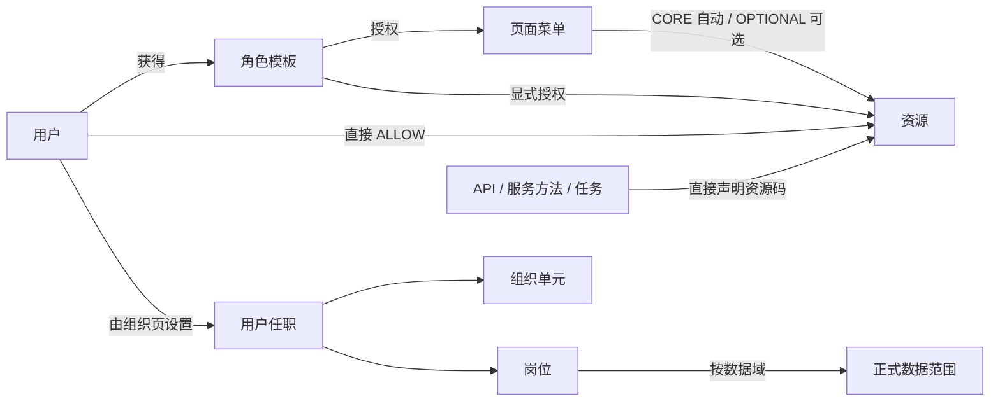

# 企业中台权限架构方案

> 版本：2.0（评审修订版）  
> 适用范围：单一小型企业内部中台  
> 核心模型：RBAC 角色模板 + 用户直接加授 + 菜单资源包 + 组织/岗位正式数据范围  
> 明确不包含：多租户、用户级 DENY、用户临时数据范围、API 资源层、报表/模板资源目录

## 1. 结论摘要

本方案把原“功能”统一改名为“资源”。资源是唯一可授权的原子业务动作，例如：

- 查看客户：`crm.customer.read`
- 新建采购单：`sc.purchase_order.create`
- 审批采购单：`sc.purchase_order.approve`

前端路由、按钮与后端控制器、服务方法、任务消费者共同使用同一个资源码。API 只是资源校验的执行点，不登记为资源，也不存在 API → 资源 → 功能的二次映射。

原先用于登记 REPORT / TEMPLATE 的“业务资源”实体整层取消。需要控制“查看销售报表”时，直接登记 `bi.sales_report.read` 这样的授权资源即可。

最终判定公式：

```text
有效资源(u)
  = 角色资源(u)
  ∪ 用户直接加授资源(u)
  ∪ 已授权页面菜单的 CORE 资源(u)

允许访问(u, resourceCode, row)
  = 用户已认证且启用
  AND resourceCode ∈ 有效资源(u)
  AND row ∈ 用户岗位在该资源数据域的正式范围
```

其中：

- 角色负责常规授权复用；
- 用户直接加授只支持 ALLOW，用于少量例外；
- 菜单是入口和资源包，不是后端安全边界；
- 组织与岗位负责用户正式任职和数据范围；
- 用户页不设置组织、岗位或数据范围；
- 本期不提供用户临时数据范围。

## 2. Scope 与设计原则

### 2.1 本期对象

| 类别 | 对象 | 职责 |
| --- | --- | --- |
| 主体 | 用户 | 登录主体、角色承载者、少量直接加授承载者 |
| 复用 | 角色 | 可复用的菜单与资源授权模板 |
| 能力 | 资源 | “能做什么”的原子业务动作与稳定授权码 |
| 入口 | 板块、目录、页面菜单 | 组织前端导航；页面菜单可绑定 CORE / OPTIONAL 资源包 |
| 组织 | 组织单元、岗位、用户任职 | 表达上下级关系和用户正式归属 |
| 数据 | 数据域、岗位数据策略 | 表达“能对哪些数据做” |
| 治理 | 审计、策略版本 | 追踪变更并驱动缓存失效 |

### 2.2 明确排除

- 多租户、租户管理员、`tenant_id` 与租户插件；
- 用户级显式 DENY；
- 角色嵌套、角色层级或按角色名称推导权限；
- 用户临时数据范围、临时部门白名单；
- API、URL、HTTP Method 作为可授权资源；
- REPORT / TEMPLATE 等第二层业务资源目录；
- 对象实例 ACL、字段级授权、任意 SQL 或表达式型 ABAC；
- 独立策略语言或通用策略引擎。

### 2.3 关键原则

1. **默认拒绝**：资源不存在、已停用、执行点未声明资源码或数据范围不命中时拒绝。
2. **后端强制**：前端隐藏菜单和按钮只改善体验，不能替代后端校验。
3. **语义稳定**：资源码随业务动作稳定，不随 URL、组件路径或技术框架变化。
4. **能力与数据相与**：拥有资源不代表拥有全量数据。
5. **角色做复用，直授做例外**：直授只加不减，权限不足时拆分角色，不引入 DENY。
6. **组织侧维护任职**：创建用户与设置组织岗位完全解耦。
7. **字段从简**：第一版只保存执行和治理所需的关键字段。
8. **变化可解释**：授权结果必须能说明来自角色、用户直授还是菜单 CORE。

## 3. 核心领域模型



### 3.1 用户 User

用户只表示账号主体。创建用户时不选择组织、岗位或初始角色。

本期关键字段：

| 字段 | 说明 |
| --- | --- |
| `id` | 内部主键 |
| `username` | 唯一登录账号 |
| `employee_no` | 唯一工号 |
| `display_name` | 姓名 |
| `status` | `ACTIVE / DISABLED` |
| `authz_version` | 用户授权上下文版本 |

邮箱、手机号、头像、密码策略等应由统一身份或员工主数据系统管理，不进入权限中心第一版核心表单。

### 3.2 角色 Role

角色是扁平、可复用的授权模板，不携带组织数据范围。

关键字段：`id`、`code`、`name`、`domain`、`status`。

不设置角色父级、角色继承、默认全量数据或隐式超管语义。

### 3.3 资源 Resource

资源是唯一授权原子，等价于此前方案中的“功能”，表示一个业务动作而不是一条 API。

关键字段：

| 字段 | 说明 |
| --- | --- |
| `id` | 内部主键 |
| `code` | 稳定资源码，例如 `sc.purchase_order.create` |
| `name` | 运营可理解名称，例如“新建采购单” |
| `domain` | 所属业务板块 |
| `risk_level` | `LOW / MEDIUM / HIGH` |
| `data_domain_code` | 可空；非空时参与行级数据范围判断 |
| `status` | `DRAFT / ACTIVE / DISABLED` |

动作类型、敏感标记、独立描述等暂不单独设字段：动作已体现在资源码中，高风险由 `risk_level` 表达。若后续确有自动审批或合规统计需要，再基于真实用例扩展。

#### 资源码规范

推荐格式：

```text
<业务域>.<业务对象>.<动作>
```

示例：

```text
crm.customer.read
crm.customer.create
crm.customer.export
sc.purchase_order.approve
designer.asset.review
iam.role.manage
```

资源码创建后不可原地改名。语义变化时新建资源、迁移引用，再停用旧资源。

### 3.4 菜单 Menu

菜单分为三级：

```text
板块 BOARD → 目录 DIRECTORY → 页面菜单 MENU
```

- 板块和目录只负责结构分组；
- 页面菜单是唯一可授权菜单叶子；
- 页面菜单绑定一个资源包；
- 父节点批量选择只展开当前叶子集合，不保存未来后代通配授权。

菜单关键字段：类型、名称、稳定编码、上级、菜单权限码、前端路由、状态。图标、排序和组件键可由前端注册表或默认配置管理，不作为第一版权限表单必填项。

### 3.5 组织、岗位与任职

组织单元形成单根树：公司 → 部门 → 小组。上下级关系只来自组织树，不按岗位名称或级别数字推导。

岗位属于一个组织单元，并承载按数据域配置的正式数据范围。

用户任职由组织管理员在“组织与岗位”页面维护：

1. 选择用户；
2. 选择组织；
3. 选择该组织下的岗位；
4. 保存并提升用户 `authz_version`；
5. 写入调岗前后审计。

第一版只保留一个主任职。若未来真实业务需要兼任，再把 `user.org_unit_id / position_id` 演进为独立多任职表，并明确主次和有效期。

## 4. 菜单资源包

页面菜单可绑定两类资源：

| 等级 | 语义 | 授权行为 |
| --- | --- | --- |
| `CORE` | 打开并正常浏览页面所需的安全最小资源 | 授予菜单时自动生效并在资源 Tab 反显 |
| `OPTIONAL` | 新建、编辑、导出、删除、审批等可选动作 | 显眼提示，由管理员单独勾选 |

约束：

- `HIGH` 风险资源不得配置为 CORE；
- CORE 反显是派生状态，不重复保存为用户或角色显式资源；
- OPTIONAL 被选择后，以显式资源授权保存；
- 撤销菜单只移除菜单来源，同一资源若仍由角色、直授或其他菜单提供则继续有效；
- 菜单包只绑定 `ACTIVE` 资源。

示例：

```text
采购订单菜单
  CORE
    sc.purchase_order.read
  OPTIONAL
    sc.purchase_order.create
    sc.purchase_order.approve   # HIGH，不能成为 CORE
```

## 5. 授权模型与流程

### 5.1 角色授权

角色可以获得页面菜单和显式资源：

```text
角色有效资源
  = 角色显式资源
  ∪ 角色菜单的 CORE 资源
```

保存前应预览新增、移除、CORE 派生、OPTIONAL 待选和受影响用户数。

### 5.2 用户授权

用户可以获得：

- 一个或多个角色模板；
- 页面菜单；
- 显式资源直接加授。

用户直授只支持 ALLOW，不提供 DENY。若用户应少于某角色，应移除或拆分该角色。

授权原因用于审计；失效时间可选，留空表示长期有效。失效时间只影响能力直授，不产生临时数据范围。

用户授权抽屉只展示：

1. 菜单；
2. 资源；
3. 有效权限来源。

不展示“数据范围”Tab。组织岗位和数据范围一律回到组织页维护。

### 5.3 生效与撤销

资源按来源合并：

```text
EffectiveResources(userId) = DISTINCT(
  active role grants
  + active direct grants
  + CORE resources from granted menus
)
```

每个有效资源保留来源列表：

```json
{
  "code": "crm.customer.read",
  "sources": [
    { "type": "ROLE", "name": "销售专员" },
    { "type": "MENU_CORE", "name": "客户列表" }
  ]
}
```

## 6. 数据权限

### 6.1 数据域

数据范围按业务对象分别配置，不能只有一个全局下拉框。示例数据域：

- `crm.customer`
- `crm.contract`
- `sc.purchase_order`
- `designer.asset`

资源的 `data_domain_code` 为空时只校验资源；非空时资源与数据范围必须同时满足。

### 6.2 固定范围枚举

| 范围 | 含义 |
| --- | --- |
| `NONE` | 无数据，默认拒绝 |
| `SELF` | 当前用户负责的数据 |
| `DEPT` | 当前任职组织的数据 |
| `DEPT_AND_DESCENDANTS` | 当前组织及全部下级组织 |
| `CUSTOM_DEPTS` | 指定组织集合，可选包含下级 |
| `ALL` | 全部数据，高风险 |

第一版由岗位在各数据域上配置一个正式策略。未配置等同 `NONE`。

### 6.3 数据字段约定

需要行级控制的业务表至少应明确：

```text
owner_user_id       当前负责人
owner_org_unit_id   当前归属组织
created_by          创建人（审计字段，不等同负责人）
```

员工调岗不会自动改写历史业务数据。需要转交时走业务转交流程并记录新旧负责人和归属组织。

### 6.4 查询约束

列表、详情、更新、删除、导出、批量和异步任务必须复用同一数据谓词。

错误做法：先按 ID 无范围查询，再只按 ID 更新。  
正确做法：以 `id + resolved_scope_predicate` 联合查询或更新。

## 7. 前端实施

### 7.1 登录上下文

后端返回：

```json
{
  "user": { "id": "u_101", "name": "林悦" },
  "policyVersion": 18,
  "resourceCodes": [
    "crm.customer.read",
    "crm.customer.create"
  ],
  "menuTree": []
}
```

前端不需要 API URL 权限表，也不需要完整资源元数据。

### 7.2 使用方式

```ts
const canCreate = hasResource('sc.purchase_order.create')

const route = {
  path: '/supply/purchase/list',
  meta: { menuCode: 'menu.supply.purchase.list' }
}
```

前端职责：

- 根据菜单树构建导航；
- 根据资源码控制按钮、批量操作、表格列入口与可选路由；
- 收到 401 / 403 时正确反馈并刷新上下文；
- 不在前端推导组织数据范围；
- 不把隐藏按钮视为安全控制。

## 8. 后端实施

### 8.1 执行点直接声明资源码

```java
@RequireResource("sc.purchase_order.create")
@PostMapping("/api/sc/purchase-orders")
public PurchaseOrderVO create(@RequestBody CreatePurchaseOrderCommand command) {
    return service.create(command);
}
```

或在服务层：

```java
permissionService.requireResource(userId, "sc.purchase_order.approve");
DataScope scope = dataScopeService.resolve(userId, "sc.purchase_order");
return repository.approveWithinScope(orderId, scope);
```

不创建 `POST /api/sc/purchase-orders` 这样的授权标识，也不维护 API 到资源的运营配置表。

### 8.2 默认拒绝与覆盖检查

管理端执行点满足任一条件时拒绝或使 CI 失败：

- 未明确标记公开且未声明资源码；
- 声明的资源码不存在；
- 资源未启用；
- 数据受控资源未应用数据谓词。

CI 可从代码扫描“执行点 → 资源码”生成覆盖报告，但该报告不是运行时授权资源表。

### 8.3 缓存与版本

推荐缓存键：

```text
authz:{userId}:{authzVersion}:{policyVersion}
```

以下变化提升版本：

- 角色或用户授权变化；
- 菜单资源包发布；
- 资源状态变化；
- 用户调岗；
- 岗位数据策略或组织树变化。

## 9. 最小数据模型

```text
iam_user
  id, username, employee_no, display_name, status, authz_version

iam_role
  id, code, name, domain, status

iam_resource
  id, code, name, domain, risk_level, data_domain_code, status

iam_menu
  id, parent_id, node_type, name, code,
  menu_permission_code, route_path, status

iam_user_role
  user_id, role_id

iam_role_permission
  role_id, permission_type(MENU|RESOURCE), permission_id

iam_user_direct_grant
  user_id, permission_type(MENU|RESOURCE), permission_id,
  reason, source_ticket, valid_from, valid_to

iam_menu_resource_binding
  menu_id, resource_id, bundle_level(CORE|OPTIONAL), status

org_unit
  id, parent_id, name, unit_type, leader_user_id, status

org_position
  id, org_unit_id, name, status

org_user_assignment
  user_id, org_unit_id, position_id, is_primary

iam_data_domain
  code, name, status

iam_position_data_policy
  position_id, data_domain_code, scope_type,
  include_descendants, custom_org_unit_ids

iam_audit_log
  actor_id, action, entity_type, entity_id,
  before_json, after_json, reason, created_at
```

实现可将菜单与资源放入统一 permission 表，也可分表；无论选哪种，业务语义与 API 契约必须保持一致。禁止重新引入 REPORT / TEMPLATE 资源表或 API 权限表。

## 10. 建议 API 契约

```text
GET  /api/users
POST /api/users

GET  /api/roles
POST /api/roles

GET  /api/catalog
POST /api/catalog/resources
PUT  /api/catalog/resources/{resourceId}

POST /api/menus
PUT  /api/menus/{menuId}/bindings

GET  /api/org
POST /api/org/units
POST /api/org/positions
PUT  /api/org/assignments/{userId}
PUT  /api/org/positions/{positionId}/scopes

GET  /api/subjects/{type}/{id}
PUT  /api/subjects/{type}/{id}

GET  /api/effective/{userId}
POST /api/simulate
GET  /api/audit
```

用户创建请求只包含基础字段：

```json
{
  "displayName": "李晨",
  "username": "li.chen",
  "employeeNo": "EMP0401",
  "status": "ACTIVE"
}
```

任职由组织页单独提交：

```json
{
  "orgUnitId": "o_supply",
  "positionId": "pos_purchase",
  "reason": "转入供应链中心"
}
```

## 11. 管理端页面与交互

### 11.1 用户管理

- 列表展示姓名、账号/工号、当前组织/岗位、角色、直授数、版本、状态；
- 新建只保留姓名、账号、工号、状态；
- 授权抽屉只含菜单、资源、有效权限；
- 不设置组织、岗位或数据范围。

### 11.2 角色模板

- 新建只保留名称、编码、业务板块、状态；
- 树形授权支持菜单与资源；
- 菜单对应 CORE 资源自动反显，OPTIONAL 显眼提示。

### 11.3 资源管理

- 单一资源列表，不再分“功能 / 业务资源”Tab；
- 支持新建、编辑、启停；
- 稳定资源码编辑时只读；
- 字段只保留名称、资源码、板块、风险、数据域、状态。

### 11.4 菜单权限包

- 左侧板块/目录/页面菜单树，右侧节点详情；
- 页面菜单可编辑 CORE / OPTIONAL 资源包；
- 高风险资源的 CORE 入口禁用并解释原因；
- 新建菜单只保留结构、稳定码和路由关键字段。

### 11.5 组织与岗位

- 左侧组织树，右侧岗位与成员；
- “设置用户任职”使用用户、组织、岗位下拉框；
- 岗位卡片展示当前成员并提供“分配用户”；
- 数据范围只在岗位侧维护；
- 明确不提供用户临时数据范围。

## 12. 开发与管理工作流

### 12.1 产品 / 后端新增业务动作

1. 判断是否已有同语义资源；
2. 无则登记资源名称、稳定资源码、板块、风险和可选数据域；
3. 后端执行点直接声明资源码；
4. 为数据受控资源应用统一数据谓词；
5. 补充正向、越权、停用和数据越界测试。

### 12.2 前端接入

1. 使用相同资源码控制按钮或交互入口；
2. 页面导航只消费后端菜单树；
3. 对 403 做明确反馈；
4. 不解析 API URL，不在前端拼数据范围。

### 12.3 菜单维护者

1. 创建板块、目录或页面菜单；
2. 页面菜单至少绑定一个安全 CORE 资源；
3. 将高风险和可选动作配置为 OPTIONAL；
4. 预览影响后发布。

### 12.4 权限管理员

1. 优先把常规菜单和资源配置到角色；
2. 把角色授给用户；
3. 仅在少量例外时直接加授菜单或资源；
4. 填写授权原因，可选填写失效时间和来源工单；
5. 通过有效权限页核对来源。

### 12.5 组织管理员

1. 维护组织树；
2. 在组织下创建岗位并配置正式数据策略；
3. 通过用户下拉框设置组织与岗位；
4. 调岗后核对策略版本和审计；
5. 若业务数据需要转交，另走业务转交流程。

## 13. 从 lite-mall API RBAC 迁移

现状以 `GET /api/crm/example` 一类 API 字符串作为前后端授权标识。迁移步骤：

1. **盘点**：导出 API 标识、角色、用户、前端绑定位置和实际访问日志；
2. **归并**：按业务动作建立资源目录，不按 API 数量机械一对一生成；
3. **映射**：形成只读迁移清单 `old_api_identifier → resource_code`；
4. **安全检查**：一个旧 API 涉及多个动作时拆资源，避免宽资源导致扩权；
5. **影子计算**：同一请求同时计算旧 API 权限与新资源权限，只记录差异；
6. **前端切换**：路由和按钮改用资源码；
7. **后端切换**：执行点改为直接声明资源码；
8. **灰度放量**：按板块切换强制判定；
9. **下线旧链**：停止返回 API 权限列表，迁移清单转为历史归档。

切换后不保留运行时 API → 资源配置层。

## 14. 审计与安全

以下操作必须记录 actor、主体、before/after、原因、时间和策略版本：

- 角色授权；
- 用户角色或直授变化；
- 菜单资源包发布；
- 资源启停或风险/数据域调整；
- 用户任职变化；
- 岗位数据策略变化；
- 组织树移动。

高风险建议：

- HIGH 资源不得成为 CORE；
- 批量、导出、删除、审批等资源单独建码；
- 超级管理员使用显式系统角色，不使用硬编码用户名；
- 被引用资源禁止物理删除，只允许停用；
- 服务端忽略客户端提交的伪造资源集合或数据范围。

## 15. 测试与验收 Gate

| 类别 | 验收标准 |
| --- | --- |
| 目录 | 资源码唯一；无旧业务资源或 API 资源表 |
| 用户 | 新建用户无组织/岗位字段，初始任职为空 |
| 任职 | 仅组织页可设置用户组织岗位，岗位必须属于所选组织 |
| 用户授权 | 无数据范围 Tab；无临时数据范围入口 |
| 菜单包 | CORE 自动反显；OPTIONAL 显眼提示；HIGH 不可 CORE |
| 授权 | 角色、直授、菜单 CORE 按来源合并，撤销单一来源不误删 |
| 后端 | 非公开管理执行点 100% 声明有效资源码 |
| 数据 | 资源 AND 数据范围；列表/详情/写操作/导出语义一致 |
| 缓存 | 授权、菜单包、任职、岗位策略变化后版本立即提升 |
| 审计 | 关键变更均有 before/after 与操作者 |
| 边界 | 无多租户、用户 DENY、临时数据范围或通用 ABAC |

## 16. 推荐落地顺序

### 第一阶段：模型与目录

- 建立单层资源目录；
- 删除旧业务资源模型；
- 统一前后端资源码；
- 实现角色、用户、菜单资源包。

### 第二阶段：组织数据权限

- 建立组织树、岗位和独立任职设置；
- 建立数据域与固定范围枚举；
- 在查询和写操作中统一数据谓词。

### 第三阶段：迁移与治理

- 对 lite-mall API 权限做影子比对；
- 灰度切换资源码；
- 完善覆盖扫描、审计、缓存和模拟器。

---

最终心智模型：

> **角色做复用，直授做例外，菜单做资源包，资源码贯穿前后端，组织页设置任职，岗位决定正式数据边界。**
