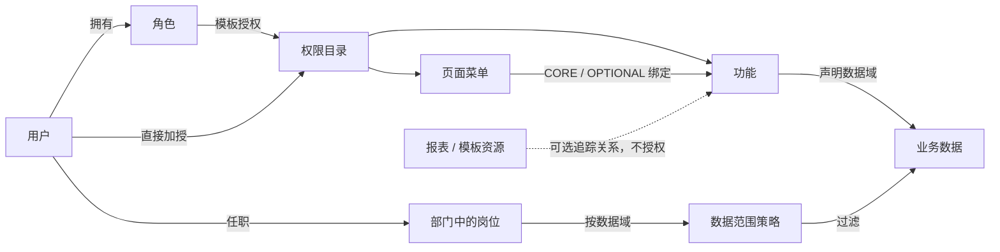
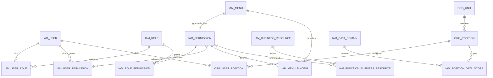
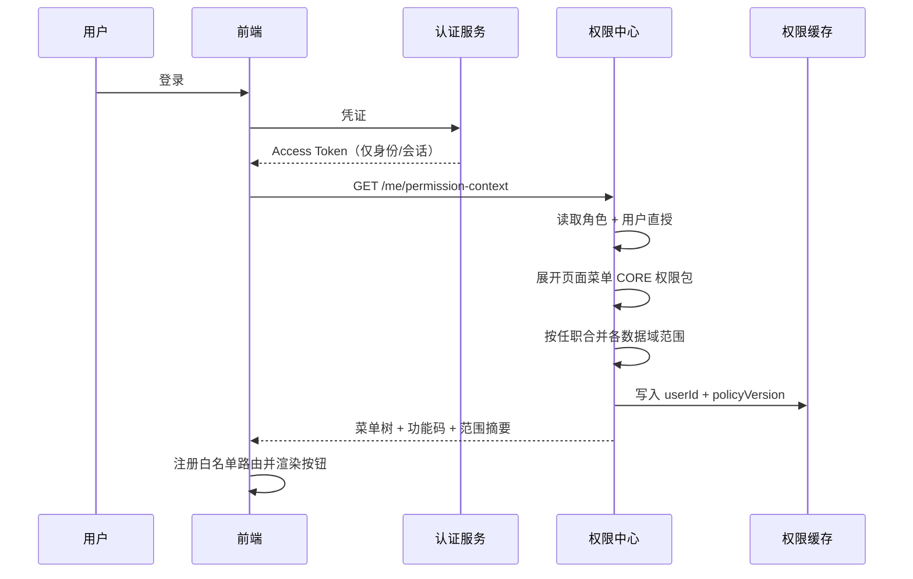
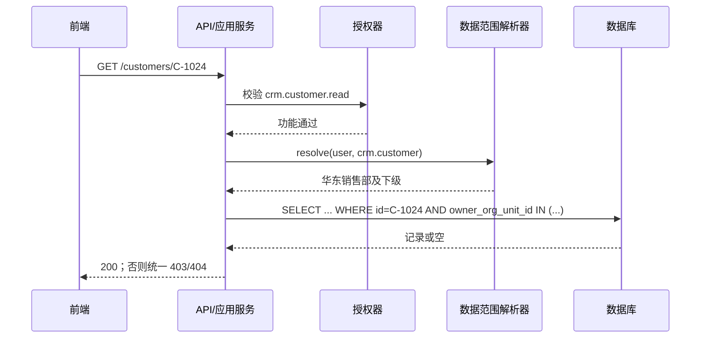

# 企业中台管理系统前后端权限架构方案

> 版本：1.1（功能码单一授权模型）  
> 日期：2026-08-10  
> 适用范围：单一企业内部中台；不包含多租户  
> 目标读者：产品/架构负责人、前端与后端研发、测试、系统权限管理员

---

## 1. 执行摘要

本方案建议将现有“`GET /api/...` 既是接口标识、又是前端按钮标识、又是运营授权语言”的模式，升级为：

> **RBAC 角色模板 + 用户直接加授 + 菜单权限包 + 组织/岗位数据范围**。

其中：

- **角色**解决常规权限的批量复用；
- **用户直授**解决少量、临时、可审计的例外；
- **菜单**解决导航与一键成包；
- **功能**成为业务和运营人员理解的主要授权语言；
- **功能**是前端、后端和权限管理员共同使用的唯一能力合同；
- **API/服务方法**只是功能校验的执行点，不建模为资源权限，也不参与二次授权；
- **业务资源**仅登记报表与模板，可选关联功能用于追踪，本身不可授权；
- **组织与岗位**决定用户能操作哪些业务数据；
- **前端**负责正确展示，**后端**负责真正放行或拒绝。

统一公式为：

```text
有效能力(u) = 角色授权(u) ∪ 用户直授(u) ∪ 菜单包展开(u)
有效数据范围(u, 数据域) = 并集(用户各有效任职对应的数据策略)

允许(u, 动作, 数据对象)
  = 已认证
  AND 动作对应的功能 ∈ 有效能力(u)
  AND 数据对象 ∈ 有效数据范围(u, 动作所属数据域)
```

这不是“纯 RBAC”，而是以 RBAC 为主体、以用户 ACL 作为加授例外的混合模型。这样命名更准确，也更有利于后续解释和排障。

### 1.1 最关键的架构决策

1. 运营侧只看到“查看客户、导出客户”等功能名称；研发侧使用稳定功能码，如 `crm.customer.read`。
2. 后端不再用 HTTP 方法+路径作为授权主键，改用 `@RequireFunction("crm.customer.read")` 等语义注解。
3. 角色与用户只获得菜单和功能权限；用户直授第一版只允许 **ALLOW**，不提供 DENY。
4. 菜单采用“板块 → 目录 → 页面菜单”三级语义；板块/目录是分组，页面菜单才是可持久化授权叶子。
5. 勾选父节点时保存“当前叶子集合”，而不是“未来所有后代”的通配授权。
6. 页面菜单的权限包分为 `CORE` 与 `OPTIONAL`：CORE 随菜单自动授予；删除、导出、审批等高风险动作默认单独勾选。
7. 数据权限按“岗位 + 数据域”配置；角色主要决定能做什么，岗位与部门主要决定能对哪些数据做。
8. 数据范围采用少量固定枚举，不引入任意 SQL、通用 ABAC 表达式或策略引擎。
9. 前端的路由/按钮隐藏只提升体验；后端对每次请求、每个对象 ID、每次导出或批量操作都必须校验。
10. 现有 API 权限资产不丢弃：迁移期保留为只读映射清单并做影子比对；切换后由 API/服务方法直接声明功能码，不保留运行时 API→资源→功能授权链。

---

## 2. 需求整理与范围边界

### 2.1 本期包含

| 范畴     | 对象                 | 本期能力                                             |
| -------- | -------------------- | ---------------------------------------------------- |
| 主体     | 用户、角色           | 多角色；角色模板；用户直接加授；状态与有效期         |
| 功能权限 | 功能                 | 业务语义功能码；风险等级；前后端统一消费             |
| 业务资源 | 报表、模板           | 可选资源目录与功能追踪；不可直接授权，不参与放行判断 |
| 导航权限 | 板块、目录、页面菜单 | 树形管理；菜单权限包；父子联动；影响预览             |
| 组织     | 公司、部门、小组     | 单根树；上下级关系；闭包表或等价实现                 |
| 岗位     | 岗位、用户任职       | 主任职/兼任；岗位数据范围模板                        |
| 数据权限 | 数据域、数据范围     | 本人、本部门、本部门及下级、指定部门、全部、无数据   |
| 治理     | 审计、解释、模拟     | 授权来源、变更差异、权限模拟、缓存版本               |

### 2.2 明确不做

- 多租户、租户套餐、跨租户管理员、`tenant_id`、租户插件；
- 嵌套角色或角色层级；
- 用户级 DENY、复杂 ALLOW/DENY 优先级；
- 任意 SQL/脚本/表达式型 ABAC；
- 字段级授权；敏感字段先通过 DTO、数据脱敏或专门接口处理；
- 外部 IAM、OPA/Casbin 等独立策略中心；
- 自动审批流式授权；第一版保留原因、有效期、审计与高风险确认；
- 将菜单隐藏或前端功能码当作安全边界；
- 依据“岗位级别数字”自动推导跨业务域上下级权限。

### 2.3 设计原则

- **业务语义稳定**：功能码随业务动作稳定，不随 URL、前端框架或组件路径变化。
- **默认拒绝**：功能未登记/未启用、执行点未声明功能码或数据范围未匹配时均拒绝。
- **最小权限**：方便授权不能以自动授予高风险能力为代价。
- **前后端同词不同责**：前端消费功能码做体验控制，后端用同一语义做强制控制。
- **功能与数据范围相与**：有“查看客户”功能，不代表能看全公司的客户。
- **来源可解释**：每一项有效权限都能回答“从哪个角色、用户直授或菜单包而来”。
- **变化可预览**：菜单包或岗位策略变更前，先展示新增/减少能力及受影响主体。
- **小企业优先**：用扁平角色、固定范围枚举和单体/模块化服务即可，不提前引入大型 IAM 复杂度。

---

## 3. 领域模型

### 3.1 核心对象职责

| 对象                       | 业务含义                       |         是否直接授权 | 主要维护者                  |
| -------------------------- | ------------------------------ | -------------------: | --------------------------- |
| 用户 User                  | 具体登录主体                   |                   是 | 权限管理员/HR 同步          |
| 角色 Role                  | 可复用的功能权限模板           |         是，授给用户 | 权限管理员                  |
| 功能 Function              | “能做什么”的原子业务动作       |                   是 | 产品+研发登记，管理员分配   |
| 业务资源 Business Resource | 报表或模板的可查阅目录         |                   否 | 研发/业务维护，可选关联功能 |
| 菜单 Menu                  | 导航入口与权限包               |     是，页面菜单叶子 | 产品/前端+管理员            |
| 部门 Org Unit              | 数据上下级关系                 |                   否 | 组织管理员                  |
| 岗位 Position              | 任职模板及数据范围来源         | 否，用户通过任职获得 | 组织/权限管理员             |
| 数据域 Data Domain         | 需要独立数据范围的业务对象类型 |                   否 | 架构/后端                   |
| 数据策略 Data Policy       | 某岗位在某数据域可见范围       |         通过岗位生效 | 权限管理员                  |

### 3.2 “功能、业务资源、API”三者区别

#### 功能：运营可理解的业务动作

```text
crm.customer.read       查看客户
crm.customer.create     新建客户
crm.customer.update     编辑客户
crm.customer.export     导出客户
sc.purchase.approve     审批采购单
designer.asset.publish  发布设计稿
```

命名规则推荐 `{业务域}.{业务对象}.{动作}`。动作词表应受控，优先使用 `read/create/update/delete/import/export/approve/assign/publish` 等稳定动词。

#### 业务资源：可选的非授权目录

业务资源只保留两类：`REPORT` 与 `TEMPLATE`。它不是业务数据行、不等同于 URL，也不进入角色/用户授权集合。典型示例：

```text
template.crm.customer_import       客户导入模板
report.crm.sales_overview          销售总览报表
```

业务资源可以从资源侧关联一个或多个功能，回答“通过哪些能力访问或维护这份资源”，但该关联仅用于追踪和影响分析。授予资源不会产生权限，授予功能也不会自动授予一项独立的“资源权限”。任务、集成、文件分类与对象实例不进入本期资源 scope。

#### API/服务方法：执行点

```text
GET  /api/crm/customers
GET  /api/crm/customers/{id}
POST /api/crm/customers/export
```

执行点直接声明所需功能码；它不是角色或用户的直接授权对象。URL 改名不改变功能码，也不需要迁移角色与用户授权。CI 可以从代码扫描“执行点 → 功能码”形成覆盖报告，但无需建立可配置的 API 资源层。

### 3.3 菜单层级

```text
信息板块（BOARD）
└─ 客户管理（DIRECTORY）
   └─ 客户列表（MENU）

供应链板块（BOARD）
└─ 采购管理（DIRECTORY）
   └─ 采购订单（MENU）
```

- `BOARD`：顶层业务板块；
- `DIRECTORY`：板块下的业务目录；
- `MENU`：可打开页面的叶子菜单，绑定 `routeName/componentKey` 与权限包；
- 按钮不是菜单节点，而是功能；
- BOARD/DIRECTORY 的勾选只是批量选择当前后代 MENU，数据库只保存叶子授权；
- 新增子菜单不会自动落入历史父节点授权，避免静默扩权。

### 3.4 授权关系图



---

## 4. 菜单权限包设计

### 4.1 CORE 与 OPTIONAL

以“信息板块 → 客户管理 → 客户列表”为例：

| 层级          | 权限                                            | 授予菜单时行为                         |
| ------------- | ----------------------------------------------- | -------------------------------------- |
| 菜单权限      | `menu.info.customer.list`                       | 授予并显示页面入口                     |
| CORE 功能     | `crm.customer.read`、`crm.customer.view_detail` | 自动随菜单授予                         |
| OPTIONAL 功能 | `create/update/export/delete`                   | 管理员单独勾选                         |
| 业务资源      | 导出模板、特殊报表                              | 不进入菜单包；仅在资源目录追踪关联功能 |

这样既满足“授予菜单时一并获得一组能力”，又避免“只想看列表却自动得到导出、删除、审批”的过度授权。

### 4.2 权限包发布机制

菜单绑定修改采用“草稿 → 影响分析 → 发布”：

1. 编辑 CORE/OPTIONAL 绑定，产生草稿版本；
2. 系统计算新增、删除功能、风险等级与受影响角色/用户；
3. 高风险新增要求二次确认并填写原因；
4. 发布后提升 `catalog_version/policy_version`；
5. 失效受影响用户的权限缓存；
6. 记录完整 before/after 审计。

第一版无需为每个历史授权固定一个包版本；所有主体跟随“当前已发布版本”。但任何包变更都必须显式发布，不能保存即静默扩权。

### 4.3 删除或撤销的来源语义

权限集合按来源去重。撤销某菜单，只移除该菜单贡献的派生来源；若同一功能仍来自角色直授、用户直授或其他菜单，则继续有效。

```text
crm.customer.read
├─ 角色「销售专员」
└─ 菜单包「客户列表」

撤销菜单后：角色来源仍在，因此权限仍有效。
```

管理界面必须展示来源链，避免管理员误以为“取消一个勾选就一定撤权”。

---

## 5. 有效权限计算

### 5.1 合并规则

对用户 `u`：

```text
RolePermissions(u)   = 用户所有有效角色的权限并集
DirectPermissions(u) = 用户未过期直接授权的权限集合
BasePermissions(u)   = RolePermissions(u) ∪ DirectPermissions(u)

GrantedLeafMenus(u)  = BasePermissions 中类型为 MENU 的叶子
MenuCore(u)           = 展开每个叶子菜单当前已发布的 CORE 绑定

EffectivePermissions(u) = BasePermissions(u) ∪ MenuCore(u)
VisibleMenus(u) = GrantedLeafMenus(u) ∪ 它们的所有祖先节点
```

OPTIONAL 功能被勾选后，作为角色或用户的功能权限直接存储，不依赖菜单包递归展开。第一版不支持权限包嵌套，避免循环和难以解释的继承。

### 5.2 用户直授规则

- 只做加授，不做 DENY；
- 支持立即生效、未来生效、到期；
- 必填授权原因；失效时间为选填，留空表示长期有效，临时或中高风险授权建议设置；
- 超过配置阈值时提示“建议抽成角色”，但不阻断合理例外；
- 调岗、离职、冻结时纳入自动复核；
- 若要让用户少于角色权限，应移除/拆分角色，而不是引入负权限。

### 5.3 后端最终判定

```text
CanInvoke(u, functionCode) = 功能存在且为 ACTIVE
                           AND functionCode ∈ EffectivePermissions(u)

CanOperate(u, action, row) = CanInvoke(u, action.functionCode)
                          AND row 满足 action.dataDomain 的数据谓词
```

管理端 API 命名空间采用默认拒绝：未标记为公开、未声明功能码，或声明了不存在/已停用功能码的接口不放行。复杂权限表达式应通过拆分语义单一的功能/API 解决，而不是在注解中堆叠难以测试的逻辑。

### 5.4 登录与缓存

推荐令牌只包含身份/会话，不在长效 JWT 中永久固化完整权限列表。

```text
登录成功
  -> 读取角色、用户直授、菜单包、任职与数据策略
  -> 计算 PermissionContext
  -> 按 userId + policyVersion 缓存
  -> 返回前端菜单树、功能码与数据范围摘要
```

角色、直授、菜单包、岗位或组织树变化后：

1. 找出受影响用户；
2. 提升用户或目录的授权版本；
3. 主动删除服务端缓存；
4. 前端下一次请求或版本轮询时重新获取权限上下文。

小型企业可先用应用内缓存或 Redis；关键不是技术选型，而是“撤权后不能等长效 Token 自然过期”。

---

## 6. 数据权限：组织与岗位

### 6.1 责任分离

```text
角色 / 用户直授：决定“能做什么”
部门 / 岗位任职：决定“能对哪些数据做”
```

本方案不把数据范围默认挂在业务角色上。一个“销售专员”角色可跨多个部门复用，而“华东销售主管”岗位在 CRM 客户域获得本部门及下级范围。这样不会因为给用户增加一个业务功能角色，就意外扩大其数据范围。

### 6.2 数据域

数据范围不能只有一个全局下拉框。至少按业务对象类型建立数据域，例如：

```text
crm.customer          客户
crm.contract          合同
sc.purchase_order     采购订单
sc.supplier           供应商
designer.asset        设计稿
```

同一岗位可在客户域看下级部门，但在合同域仅看本部门；这比一个全局“本部门及以下”更符合业务。

### 6.3 第一版范围枚举

| 范围                   | 含义                         | 典型岗位         |
| ---------------------- | ---------------------------- | ---------------- |
| `NONE`                 | 无数据，保护域默认值         | 无任职或未配置   |
| `SELF`                 | 本人负责的数据               | 销售专员、设计师 |
| `DEPT`                 | 当前任职部门                 | 部门运营         |
| `DEPT_AND_DESCENDANTS` | 当前部门及全部下级           | 部门主管         |
| `CUSTOM_DEPTS`         | 指定部门集合，可选是否含下级 | 跨部门支持岗     |
| `ALL`                  | 该数据域全部数据，高风险     | 业务总监/审计岗  |

多个有效任职按允许范围并集（OR）合并；`ALL` 占优，指定部门取并集。功能没有匹配数据策略时，对声明 `data_scoped=true` 的功能按 `NONE` 处理。

### 6.4 “上级看下级”的实现

- 上下级来自部门树，而不是岗位名称或级别数字；
- 岗位策略明确是否可使用部门后代范围；
- 用户可以有主任职和兼任，分别按“岗位 @ 部门”展开再合并；
- 推荐使用 `org_closure(ancestor_id, descendant_id, depth)` 闭包表；
- 部门移动后重建或增量维护闭包关系，并提升权限版本；
- 财务主管不会因为级别高而自动看设计师数据，除非其岗位在对应数据域有策略。

### 6.5 业务数据字段约定

受数据权限保护的表至少明确一个或多个归属字段：

```text
owner_user_id        当前负责人
owner_org_unit_id    当前归属部门
created_by           创建人，不等于当前负责人
```

禁止把 `created_by`、负责人和归属部门混为一谈。员工调岗不会自动批量改写历史业务数据；需要转交时走显式转交流程，记录旧/新负责人和部门。

### 6.6 数据谓词示例

```sql
-- SELF
WHERE customer.owner_user_id = :currentUserId

-- DEPT
WHERE customer.owner_org_unit_id IN (:currentPositionDeptIds)

-- DEPT_AND_DESCENDANTS
WHERE customer.owner_org_unit_id IN (
  SELECT descendant_id
  FROM org_closure
  WHERE ancestor_id IN (:currentPositionDeptIds)
)

-- CUSTOM_DEPTS
WHERE customer.owner_org_unit_id IN (:configuredDeptIds)
```

列表、详情、更新、删除、导出和批量操作必须复用同一数据谓词。更新/删除应使用“ID + 数据范围”条件执行，不能先无范围查询后仅按 ID 更新。

### 6.7 创建操作

创建通常没有既有数据行可过滤，采用以下规则：

1. 先校验创建功能；
2. 校验请求中的归属部门是否属于用户可创建范围；
3. 若前端未指定，按主任职部门和当前用户写入 owner 字段；
4. 后端覆盖不可信的 owner/department 输入，禁止客户端任意指定全公司部门。

---

## 7. 推荐数据模型

### 7.1 总体关系



### 7.2 主要表

#### 身份与角色

```text
iam_user
  id, username, display_name, status, authz_version, ...

iam_role
  id, code, name, status, description, ...

iam_user_role
  user_id, role_id, valid_from, valid_to, created_by, reason
  UNIQUE(user_id, role_id)
```

角色第一版保持扁平，不提供 parent_role_id。

#### 统一权限目录

```text
iam_permission
  id
  type                FUNCTION | MENU
  code                全局唯一稳定代码
  name                中文业务名称
  domain_code         所属业务域
  data_domain_code    可空；需要行级过滤时填写
  risk_level          LOW | MEDIUM | HIGH
  status              DRAFT | ACTIVE | DISABLED
  description
  owner_team
  created_at / updated_at
```

只有 `FUNCTION/MENU` 进入统一权限目录并共享授权关系。业务资源独立存放，避免被误授或进入有效权限集合。

```text
iam_function
  permission_id, action_type, ui_hint, is_sensitive

iam_business_resource
  id, code, name, domain_code
  resource_type        REPORT | TEMPLATE
  status               DRAFT | ACTIVE | DISABLED
  description, created_at, updated_at

iam_function_business_resource
  function_permission_id, resource_id
  # 仅用于追踪，不参与授权计算
  UNIQUE(function_permission_id, resource_id)

iam_menu
  id, parent_id, node_type, name, code
  permission_id        # 仅 MENU 叶子非空
  route_name, route_path, component_key, icon, sort_order
  status

iam_menu_binding
  menu_id
  bound_permission_id  # 只能是 FUNCTION
  bundle_level         # CORE | OPTIONAL
  draft_version
  published_version
  status
  UNIQUE(menu_id, bound_permission_id)
```

#### 角色授权与用户直授

为保留外键和简单约束，小型企业优先使用两张明确关联表，而不是难以约束的多态大表：

```text
iam_role_permission
  role_id, permission_id, created_by, reason, created_at
  UNIQUE(role_id, permission_id)

iam_user_permission
  user_id, permission_id
  valid_from, valid_to
  created_by, reason, source_ticket
  created_at
  UNIQUE(user_id, permission_id, valid_from)
```

第一版所有记录语义均为 ALLOW。

#### 执行点覆盖清单（代码生成，可选）

```text
build/authz-endpoint-report.json
  service_code, http_method, path_template
  handler_signature, function_codes, scan_version
```

该文件由 CI 扫描注解/声明生成，用于覆盖检查和审计，不是运行时授权数据源，也不进入用户/角色授权表。小型单体可只保留构建产物，无需新增接口注册数据库表。

#### 组织、岗位与数据策略

```text
org_unit
  id, parent_id, code, name
  unit_type            COMPANY | DEPARTMENT | TEAM
  status, sort_order

org_closure
  ancestor_id, descendant_id, depth
  UNIQUE(ancestor_id, descendant_id)

org_position
  id, org_unit_id, code, name, status, description

org_user_position
  user_id, position_id, is_primary
  valid_from, valid_to
  UNIQUE(user_id, position_id, valid_from)

iam_data_domain
  id, code, name
  owner_user_column, owner_org_column
  status

iam_position_data_scope
  id, position_id, data_domain_id
  scope_type           NONE | SELF | DEPT | DEPT_AND_DESCENDANTS | CUSTOM_DEPTS | ALL
  include_descendants  # CUSTOM_DEPTS 时使用
  valid_from, valid_to
  UNIQUE(position_id, data_domain_id, valid_from)

iam_scope_custom_org
  position_data_scope_id, org_unit_id
  UNIQUE(position_data_scope_id, org_unit_id)
```

所有表均不需要 `tenant_id`。

#### 版本与审计

```text
iam_policy_version
  catalog_version, org_version, published_at, published_by

iam_change_audit
  id, actor_user_id, action_type
  target_type, target_id
  before_json, after_json, diff_json
  reason, request_id, created_at
```

权限对象优先停用而非物理删除；审计记录不保存密码、Token 等敏感凭证。

### 7.3 索引与约束

- `iam_permission.code` 全局唯一；发布后禁止随意改码，只能停用并迁移；
- 功能动作与业务资源类型属于稳定身份的一部分，创建后不可原地修改；语义变化时新建对象并迁移引用；
- 所有关系表设唯一索引，避免重复来源膨胀；
- `org_closure` 建 `(ancestor_id, descendant_id)` 与反向查询索引；
- `iam_user_permission(valid_to, user_id)` 支持到期扫描；
- 业务表的 `owner_user_id/owner_org_unit_id` 建组合索引并结合常用查询评估；
- 禁止物理删除仍被角色、菜单包或代码执行点引用的功能；
- 发布时校验菜单包只能绑定 ACTIVE FUNCTION，叶子菜单才有 MENU 权限；
- 业务资源只能是 REPORT/TEMPLATE，且外键关系不得被授权计算读取。

---

## 8. 后端架构与实现

### 8.1 分层

```text
认证层 Authentication
  -> 请求默认规则（管理端默认需认证、未登记拒绝）
  -> 功能授权层 Capability Authorization
  -> 应用服务对象级授权 Object Authorization
  -> 数据访问范围层 Data Scope
  -> 审计与业务执行
```

推荐把权限中心作为中台内的独立模块，而不是第一版就拆成远程策略微服务。各业务模块依赖统一的授权 SDK/Starter，并从同一数据库或缓存读取 `PermissionContext`。

### 8.2 语义注解

```java
@Target({ElementType.METHOD, ElementType.TYPE})
@Retention(RetentionPolicy.RUNTIME)
public @interface RequireFunction {
    String[] value();
    MatchMode mode() default MatchMode.ALL;
}

@Target({ElementType.METHOD, ElementType.TYPE})
@Retention(RetentionPolicy.RUNTIME)
public @interface UseDataScope {
    String domain();
}
```

业务示例：

```java
@RestController
@RequestMapping("/api/crm/customers")
class CustomerController {

    @GetMapping
    @RequireFunction("crm.customer.read")
    public Page<CustomerVO> list(CustomerQuery query) {
        return customerAppService.list(query);
    }

    @PostMapping("/export")
    @RequireFunction("crm.customer.export")
    public ExportTaskVO export(CustomerQuery query) {
        return customerAppService.export(query);
    }
}
```

`GET /api/...` 不再出现在角色、前端按钮或运营授权界面中。框架或 CI 扫描注解，验证每个非公开执行点直接声明了存在且启用的功能码。若导出确有模板，可在业务资源目录登记模板并关联 `crm.customer.export`，但后端仍只校验功能码。

### 8.3 服务层与数据范围

关键业务动作建议在应用服务边界再次保护，避免非 HTTP 调用绕过：

```java
@Service
class CustomerAppService {

    @RequireFunction("crm.customer.update")
    @UseDataScope(domain = "crm.customer")
    @Transactional
    public void update(long customerId, UpdateCustomerCommand command) {
        Customer customer = customerRepository
            .findByIdWithinScope(customerId, DataScopeContext.current())
            .orElseThrow(NotFoundOrForbiddenException::new);
        customer.update(command);
    }
}
```

注意 Spring AOP 自调用、异步任务和事务代理边界。可采用统一应用服务入口、AspectJ/代理规范或显式调用授权服务，测试必须覆盖真实调用链。

### 8.4 数据范围接口

```java
public interface DataScopeResolver {
    DataPredicate resolve(long userId, String dataDomainCode);
}

public record DataPredicate(
    boolean all,
    Set<Long> ownerUserIds,
    Set<Long> ownerOrgUnitIds
) {}
```

DAO 层可以通过 MyBatis-Plus 数据权限拦截器、查询构造器或统一 Repository 注入条件，但必须有以下边界：

- 手写 XML SQL、报表 SQL、联表、子查询必须显式纳入覆盖清单；
- 详情、更新、删除、导出不能只依赖列表过滤；
- 异步任务必须携带用户授权快照或受限服务身份；
- 系统内部任务不能默认以超级管理员全量运行；
- 对象 ID 篡改测试必须成为集成测试的一部分。

### 8.5 接口覆盖检查

CI 至少执行：

```text
1. 扫描所有 /api/admin 或中台管理端接口；
2. 排除显式 @Public/@PermitAll 白名单；
3. 验证其至少有 RequireFunction；
4. 验证注解代码在权限目录中存在且为 ACTIVE；
5. 验证高风险接口不是被过宽功能意外覆盖；
6. 输出孤儿功能、未知功能码、已下线接口，以及没有执行点或前端消费方的功能。
```

新接口未登记时构建失败或运行时默认拒绝。

### 8.6 权限上下文接口

```http
GET /api/iam/me/permission-context
```

```json
{
  "policyVersion": 37,
  "user": { "id": 101, "name": "王小明" },
  "roles": [
    { "code": "sales_rep", "name": "销售专员" }
  ],
  "menus": [
    {
      "code": "menu.info.customer.list",
      "type": "MENU",
      "parentCode": "menu.info.customer",
      "name": "客户列表",
      "routeName": "CustomerList",
      "componentKey": "crm/customer/list"
    }
  ],
  "functionCodes": [
    "crm.customer.read",
    "crm.customer.create"
  ],
  "dataScopeSummary": [
    {
      "domain": "crm.customer",
      "scope": "DEPT_AND_DESCENDANTS",
      "source": "岗位「销售主管」@华东销售部"
    }
  ]
}
```

前端不需要拿到 HTTP 路径或业务资源列表来做鉴权。业务资源由其业务页面按普通数据接口加载，权限上下文只返回菜单和功能码。

### 8.7 管理 API 建议

```text
GET  /api/iam/users
GET  /api/iam/users/{id}/effective-permissions
GET  /api/iam/roles
POST /api/iam/roles/{id}/permissions/preview
PUT  /api/iam/roles/{id}/permissions
POST /api/iam/users/{id}/direct-permissions/preview
PUT  /api/iam/users/{id}/direct-permissions
GET  /api/iam/menus/tree
POST /api/iam/menus/{id}/bindings/preview
POST /api/iam/menus/{id}/bindings/publish
GET  /api/iam/org/tree
PUT  /api/iam/positions/{id}/data-scopes
POST /api/iam/simulate
GET  /api/iam/audits
```

所有写操作采用乐观锁/版本号，返回冲突而不是覆盖其他管理员刚发布的变更。

---

## 9. 前端架构与实现

### 9.1 前端拿什么、相信什么

前端拿到菜单树和功能码，用于：

- 生成可访问导航；
- 过滤路由；
- 控制按钮、批量操作、导出入口；
- 展示 403 和权限原因；
- 在 `policyVersion` 变化后刷新上下文。

前端不得认为“按钮隐藏后接口就安全”。任何本地缓存、DOM 修改或手工请求都不能绕过后端。

### 9.2 路由

```ts
const componentRegistry = {
  'crm/customer/list': () => import('@/views/crm/customer/list.vue'),
  'sc/purchase/list': () => import('@/views/sc/purchase/list.vue'),
};

function registerMenuRoute(menu: MenuDTO) {
  const loader = componentRegistry[menu.componentKey];
  if (!loader) throw new Error(`Unknown componentKey: ${menu.componentKey}`);
  router.addRoute({
    name: menu.routeName,
    path: menu.routePath,
    component: loader,
    meta: { menuCode: menu.code },
  });
}
```

数据库不得通过任意字符串直接决定前端加载哪段代码；`componentKey` 必须在前端白名单注册。

### 9.3 页面和按钮

Vue 示例：

```vue
<Button v-if="can('crm.customer.create')" @click="openCreate">
  新建客户
</Button>

<Button v-function="'crm.customer.export'" @click="exportCustomers">
  导出
</Button>
```

React/Ant Design Pro 示例：

```tsx
const access = useAccess();

<Access accessible={access.can('crm.customer.create')}>
  <Button onClick={openCreate}>新建客户</Button>
</Access>
```

禁止在业务按钮中硬编码 `role === 'admin'`，也禁止绑定 `POST /api/...`。

### 9.4 直接访问与错误处理

- 路由拦截失败显示统一 403 页面；
- 后端返回 403 时保留业务上下文，提示用户联系权限管理员；
- 404/403 的对象级策略由后端统一，避免泄露对象是否存在；
- 前端不能把 403 转成空列表或“操作成功”；
- 授权版本失效时先刷新上下文，仍失败则按真实 403 展示。

### 9.5 前端研发工作流

1. 与后端确认功能码及中文说明；
2. 为页面菜单注册 `componentKey`；
3. 路由只绑定菜单码，按钮绑定功能码；
4. 不绑定 API URL、不依赖角色名；
5. 补充无权限、直达路由、权限刷新、403 回退测试；
6. 联调时用权限模拟器核对来源，而不是人工拼接角色。

---

## 10. 权限管理 UI 方案

### 10.1 总体信息架构

建议权限中心包含：

```text
总览
用户
角色
功能目录
业务资源（报表 / 模板）
菜单与权限包
组织与岗位
授权审计
权限模拟
方案文档
```

### 10.2 用户授权抽屉

采用右侧宽抽屉，避免在长列表中跳页丢失上下文：

| 页签     | 内容                           |
| -------- | ------------------------------ |
| 角色     | 已分配角色、有效期、状态       |
| 额外授权 | 菜单/功能树，仅表示用户加授    |
| 数据范围 | 按数据域展示岗位来源与最终范围 |
| 有效权限 | 只读合并结果，逐项显示来源标签 |
| 变更记录 | before/after 时间线            |

保存前固定显示：新增、删除、仍由其他来源保留、风险项、到期时间与原因。

### 10.3 角色授权抽屉

- 左侧：板块 → 目录 → 页面菜单树；
- 中间：页面菜单的 CORE 与 OPTIONAL 功能；
- 右侧：本次角色有效权限预览；
- 支持搜索、只看已选、展开/折叠、高风险筛选；
- 父节点显示半选；点击父节点时说明将保存多少个当前叶子；
- 名称为主、功能码为次；API 路径不在默认视图中。

### 10.4 菜单与权限包

- 树表固定类型：板块、目录、页面菜单；
- 页面菜单编辑路由、组件键与权限包；
- CORE 功能用蓝色标识，OPTIONAL 用灰色，高风险用橙红提示；
- 发布前展示受影响用户/角色和新增高风险能力；
- 不允许目录直接绑定按钮级能力；
- 删除/停用菜单前检查是否仍被角色或用户授权。

### 10.5 组织与岗位

- 部门用树表；岗位在选中部门后显示；
- 用户任职支持主任职、兼任、生效期；
- 数据范围按数据域逐行配置，而不是一个全局下拉框；
- `ALL` 高风险醒目标记；
- 组织移动前展示范围变化与受影响人员。

### 10.6 权限模拟器

```text
用户：王小明
动作：导出客户
对象：客户 C-1024

结果：拒绝
功能：crm.customer.export（来自用户临时加授）
数据范围：岗位「销售」@华东销售部，仅本部门
对象归属：华南销售部
结论：功能通过，数据范围不通过
```

模拟器输出最终结果、功能来源、数据策略来源和对象归属，是管理员与研发排障的共同语言。

---

## 11. 授权流程

### 11.1 登录与前端初始化



### 11.2 一次业务请求



### 11.3 管理员发布授权

```text
编辑草稿
 -> 计算角色/用户/菜单来源差异
 -> 展示新增、删除、仍由其他来源保留的权限
 -> 展示高风险项、数据范围扩大与受影响人数
 -> 管理员填写原因并确认
 -> 乐观锁检查版本
 -> 原子提交授权与审计
 -> 提升 policyVersion
 -> 失效受影响用户缓存
 -> 用户端刷新权限上下文
```

若发布失败，授权关系、版本和审计必须一起回滚，不能出现“数据库已改但缓存/审计未更新”的半完成状态。

---

## 12. 三类人员的实施工作流

### 12.1 后端研发：新增“导出客户”

#### 第一步：声明业务权限

在代码库中的权限清单（YAML/JSON/Java DSL 均可）登记：

```yaml
permissions:
  - code: crm.customer.export
    type: FUNCTION
    name: 导出客户
    domain: crm
    dataDomain: crm.customer
    riskLevel: HIGH
    ownerTeam: CRM
```

清单随代码评审和发布，数据库只接受受控同步，避免权限管理员直接创建无法执行的“空功能”。

#### 第二步：保护执行点

```java
@PostMapping("/export")
@RequireFunction("crm.customer.export")
public ExportTaskVO export(CustomerQuery query) { ... }
```

#### 第三步：复用数据范围

导出查询调用与列表相同的 `CustomerDataScopeSpecification`，不得用一个无过滤的报表 SQL 重新实现。

#### 第四步：建立菜单关联

将 `crm.customer.export` 作为“客户列表”的 OPTIONAL 高风险功能，而不是 CORE。若存在导出模板，在业务资源目录将模板关联此功能，仅作研发与运营追踪。

#### 第五步：测试

- 有功能+本部门数据：只导出本部门；
- 有功能+无数据策略：导出 0 条/拒绝；
- 无功能+全数据范围：仍拒绝；
- 修改筛选条件或对象 ID：不能越权；
- 旧角色只有列表 API 时：迁移不能自动获得导出。

### 12.2 前端研发：新增客户导出按钮

```vue
<Button
  v-function="'crm.customer.export'"
  :loading="exporting"
  @click="exportCustomers"
>
  导出客户
</Button>
```

实施要求：

1. 使用业务功能码，不引用 HTTP 路径；
2. 按钮隐藏之外仍处理后端 403；
3. 不按角色名判断；
4. 导出入口属于“客户列表”页面，但 OPTIONAL 权限由权限中心控制；
5. 权限上下文更新后组件可响应刷新；
6. E2E 覆盖“可见但数据为空”和“按钮不可见但直接请求仍拒绝”。

### 12.3 权限管理员：建立“销售专员”角色

1. 在“角色”中新建 `销售专员`；
2. 打开角色授权抽屉；
3. 在树中勾选“信息板块 → 客户管理 → 客户列表”；
4. 系统保存当前页面菜单叶子，并自动带出 CORE：查看列表、查看详情；
5. 根据职责额外勾选“新建客户、编辑客户”，不勾选导出/删除；
6. 在预览区检查最终能力和高风险项；
7. 填写“销售一线基础职责”并发布；
8. 给用户分配角色。

数据范围不在该角色中配置。用户通过“销售专员 @ 华东销售一部”任职获得 `SELF` 或 `DEPT` 范围。

### 12.4 权限管理员：为用户临时直授

场景：王小明需要临时协助月度客户导出。

1. 打开用户“额外授权”；
2. 搜索“导出客户”；
3. 勾选 `crm.customer.export`；
4. 填写原因、关联工单和到期时间；
5. 预览显示：角色权限不变，新增一个用户来源的高风险功能；
6. 检查其岗位数据范围——直授功能不会自动扩大数据；
7. 保存后系统立即失效缓存；
8. 到期任务自动停用直授并生成审计。

### 12.5 组织管理员：新建主管岗位

1. 在华东销售部下创建“销售主管”岗位；
2. 为 `crm.customer` 配置 `DEPT_AND_DESCENDANTS`；
3. 为 `crm.contract` 配置 `DEPT`；
4. 给张经理建立主任职；
5. 权限模拟器验证：能看下级部门客户，但合同仍只看本部门；
6. 发布并失效张经理权限缓存。

### 12.6 入职、调岗、离职

| 场景         | 自动/人工动作                            | 权限结果                             |
| ------------ | ---------------------------------------- | ------------------------------------ |
| 入职         | 创建用户、分配部门岗位、分配基础角色     | 功能与数据范围同时具备后才可访问     |
| 兼任         | 新增带有效期的岗位任职                   | 对应数据域范围按并集扩大             |
| 调岗         | 结束旧任职、建立新任职；业务数据另走转交 | 组织范围更新，历史数据归属不自动改写 |
| 离职         | 冻结账号、结束角色/直授/任职、清会话缓存 | 立即拒绝登录和业务访问               |
| 临时授权到期 | 定时停用并清缓存                         | 仅移除该来源；其他来源仍保留         |

---

## 13. 完整计算示例

### 13.1 配置

用户：张经理

- 角色：`销售专员`、`客户主管`；
- 用户直授：`crm.customer.export`，月底到期；
- 任职：`销售主管 @ 华东销售部`；
- 岗位数据策略：`crm.customer = DEPT_AND_DESCENDANTS`；
- 菜单：客户列表（CORE 绑定查看列表/详情）；
- 客户 C-1001：归属华东销售一部；
- 客户 C-2001：归属华南销售部。

### 13.2 有效能力

```text
角色权限
  + 销售专员：客户列表菜单、创建客户
  + 客户主管：编辑客户、分配客户

用户直授
  + 导出客户（有到期时间）

菜单展开
  + 查看客户列表
  + 查看客户详情

最终功能
  = read + view_detail + create + update + assign + export
```

### 13.3 最终判断

| 请求             | 功能判断       | 数据判断                   | 结果                 |
| ---------------- | -------------- | -------------------------- | -------------------- |
| 查看 C-1001      | 通过           | 华东下级部门，范围内       | 允许                 |
| 导出 C-1001      | 直授通过       | 范围内                     | 允许，记录高风险操作 |
| 查看 C-2001      | 通过           | 华南，不在范围             | 拒绝                 |
| 删除 C-1001      | 无 delete 功能 | 即使范围内也不计算为允许   | 拒绝                 |
| 直达客户列表路由 | 有菜单         | 前端展示；后端仍逐请求校验 | 允许进入             |

这说明功能与数据范围是 AND；用户直授增加动作，但不会把数据范围扩大到全公司。

---

## 14. 从 lite-mall API 标识模式迁移

### 14.1 迁移目标

```text
旧：GET /api/crm/customer/list
  同时被后端、路由、按钮、角色和运营人员理解

新：crm.customer.read（查看客户）
  角色/用户/前端/后端都消费业务语义
  GET /api/... 只存在于代码与 CI 扫描报告
```

### 14.2 阶段 0：盘点

导出：

- 后端所有旧注解；
- 角色—API 权限关系；
- 前端路由/按钮—API 标识关系；
- 实际最近使用情况；
- 孤儿权限、重复路径、同一路径不同方法、通配路径；
- 前端有而后端无、后端有而前端无的差异。

形成映射清单：

| 旧标识                           | 新执行点                  | 候选功能                   | 处理                   |
| -------------------------------- | ------------------------- | -------------------------- | ---------------------- |
| `GET /api/crm/customers`         | `api.crm.customer.list`   | `crm.customer.read`        | 直接映射               |
| `GET /api/crm/customers/{id}`    | `api.crm.customer.detail` | `crm.customer.view_detail` | 独立功能或 read 子能力 |
| `POST /api/crm/customers/export` | `api.crm.customer.export` | `crm.customer.export`      | 高风险独立功能         |
| 混合查询/导出接口                | 一个执行点多个行为        | 不应粗暴合并               | 优先拆接口             |

### 14.3 阶段 1：建立权限目录

产品与研发以业务动作建功能，不是一条 API 机械生成一个功能。一个功能可以覆盖多个语义一致的执行点；同一个旧接口如果承担多个风险不同的动作，应拆分。

旧 API 暂时保留在迁移映射清单中，保证影子比对精度；它不写入业务资源表，也不成为新的可授权对象。

### 14.4 阶段 2：影子计算

实际放行仍使用旧模型，同时新引擎计算结果并记录：

```text
old_allow != new_allow
```

差异分类：

- 功能粒度过粗；
- API→功能映射遗漏；
- 旧系统前后端本就不一致；
- 菜单包带出了额外能力；
- 数据范围默认值不同；
- 缓存或角色状态不同。

影子阶段只记录必要上下文，不记录 Token 或敏感业务内容。

### 14.5 阶段 3：安全回填

- 角色拥有某功能覆盖的全部必要旧 API 时，可回填该功能；
- 角色只拥有其中一部分 API 时，不能直接授予更宽功能；应拆成功能粒度更小的执行点，或在该模块切换完成前继续走旧鉴权；
- 用户例外回填到用户直授，并补充原因与期限；
- 菜单按现有可访问叶子回填，不保存父节点未来通配；
- 对导出、删除、审批逐项人工复核。

### 14.6 阶段 4：双轨切换

1. 登录接口同时返回旧 API 标识与新功能码；
2. 前端逐模块切换到功能码；
3. 后端逐模块使用 `@RequireFunction` 直接校验功能码；
4. 低风险查询先切，高风险写入/审批/导出后切；
5. 每批次跑角色矩阵、对象 ID 篡改与数据范围回归；
6. 保留模块级回滚开关，但回滚行为进入审计。

### 14.7 阶段 5：退役

当影子差异稳定归零、前后端均完成切换后：

- 停止向前端返回 API 权限列表；
- 权限管理员界面不再展示 HTTP 路径作为主权限；
- 旧标识保留只读审计窗口；
- 最终删除旧兼容代码；
- CI 生成的执行点覆盖报告继续保留，用于研发排障，无需在线接口资源表。

---

## 15. 测试与验收

### 15.1 权限组合矩阵

- 无角色、只有用户直授；
- 只有角色；
- 角色+用户直授；
- 两个角色提供同一功能；
- 同一功能来自角色、菜单包、用户直授三个来源；
- 角色停用、直授到期、菜单停用；
- 撤销一个来源但其他来源仍保留；
- 用户没有任何数据策略时默认 NONE。

### 15.2 菜单

- 板块/目录全选、半选、反选；
- 保存时只落当前叶子；
- 父节点授权后新增子菜单不会自动获得；
- CORE 自动带出，OPTIONAL 需要单选；
- 修改菜单包前影响预览正确；
- 高风险 CORE 绑定被校验或强提醒；
- 组件键不在白名单时前端拒绝注册。

### 15.3 数据权限

- `NONE/SELF/DEPT/DEPT_AND_DESCENDANTS/CUSTOM_DEPTS/ALL`；
- 主任职+兼任；
- 部门移动、调岗、岗位停用；
- 列表、详情、创建、修改、删除、导出、批量；
- URL/path/query/body 中对象 ID 篡改；
- 自定义 XML、联表、子查询、报表 SQL；
- 异步任务与定时任务；
- 功能通过但数据拒绝、数据范围很宽但功能拒绝。

### 15.4 后端覆盖

- 所有非公开管理接口至少声明一个有效功能码；
- 注解代码不存在时构建失败；
- 停用权限不放行；
- 直接调用服务层仍受保护；
- 缓存失效后旧权限不能继续使用；
- 403/404 策略不会泄露对象存在性；
- 授权异常和写操作失败时事务正确回滚。

### 15.5 前端

- 路由过滤、按钮显示、直达 403；
- 后端 403 不被吞掉；
- `policyVersion` 更新后刷新；
- 无菜单但直授功能时给管理员“不可达功能”提示；
- 用户直授、角色继承、菜单带出使用不同来源标签；
- 搜索、键盘操作、半选状态与抽屉焦点满足可访问性要求。

### 15.6 上线验收线

以下条件全部满足才切换某业务模块：

1. 该模块执行点覆盖率为 100%，公开接口有显式白名单；
2. 旧/新影子计算差异已逐项关闭；
3. 关键角色、用户例外和高风险权限已复核；
4. 数据域字段、详情/写入/导出路径均完成测试；
5. 撤权与组织变更能在约定时间内失效缓存；
6. 权限管理员能通过模拟器解释允许/拒绝原因；
7. 回滚方案和审计查询已演练。

---

## 16. 安全、治理与运维

### 16.1 最小权限与超级管理员

- “权限管理员”只管理授权，不自动拥有全部业务数据；
- 业务超级管理员与权限管理员分离；
- 保留一个受控的 break-glass 账号，日常禁用、使用即告警；
- `ALL`、删除、导出、审批与高风险用户直授标记为高风险；
- 第一版不实现完整职责分离引擎，但可对明显冲突功能做警告。

### 16.2 审计事件

至少记录：

- 用户/角色/权限/菜单包/岗位策略新增、变更、停用；
- 用户直授生效、到期、撤销；
- `ALL` 数据范围与高风险功能发布；
- 权限模拟请求；
- 授权失败的安全事件；
- break-glass 使用；
- 角色、岗位、组织树批量调整。

审计包含 actor、target、before、after、diff、reason、request_id、time。业务敏感内容、密码和访问令牌不得写入。

### 16.3 定期复核

- 即将到期和长期未过期的用户直授；
- 已停用用户/角色/岗位残留关系；
- 超过阈值的个人直授，建议抽取角色；
- 90 天未使用的高风险功能（阈值由公司制度配置）；
- 孤儿菜单、孤儿权限、孤儿接口；
- 数据域没有 owner 字段或有绕过 SQL 的模块；
- 组织调整后范围异常扩大的用户。

### 16.4 可观测性

建议指标：

```text
授权判定次数 / 拒绝次数
PermissionContext 命中率与计算耗时
版本失效传播耗时
影子计算差异数
未登记执行点数
高风险直接授权数量
即将到期授权数量
数据范围绕过测试失败数
```

指标用于发现退化和错配，不应把业务对象内容或权限完整清单当作高基数标签。

### 16.5 性能策略

- 有效权限用哈希集合；
- 数据范围解析结果按 `userId + dataDomain + policyVersion` 缓存；
- 组织后代集合按 `orgVersion` 缓存；
- 权限变更以受影响用户为单位失效，小企业规模下无需提前做复杂增量图计算；
- 列表 SQL 必须用可索引的 owner 字段，避免在大表上运行动态字符串表达式；
- 权限上下文只向前端返回必要菜单和功能码，不返回 API 清单或业务资源目录。

---

## 17. 实施路线

| 阶段            | 目标                | 主要交付                                     |
| --------------- | ------------------- | -------------------------------------------- |
| 0. 决策与盘点   | 统一语义与边界      | 功能词表、数据域、旧 API 清单、角色矩阵      |
| 1. 权限底座     | 建目录与计算引擎    | 表结构、注解、上下文、缓存版本、审计         |
| 2. 权限中心 UI  | 让管理员可配置/解释 | 用户/角色抽屉、树形授权、菜单包、模拟器      |
| 3. 组织数据范围 | 让行级隔离生效      | 部门/岗位、闭包表、数据策略、Repository 规范 |
| 4. 影子迁移     | 证明新旧等价        | 映射、差异日志、回填工具、回归矩阵           |
| 5. 分模块切换   | 逐步替换旧标识      | 前后端功能码、双轨开关、监控与回滚           |
| 6. 治理优化     | 降低长期维护成本    | 到期复核、风险报表、孤儿检测、性能优化       |

建议先选一个中等复杂度、读写完整但风险可控的模块试点，例如客户管理；不要先选最简单的字典模块，因为它验证不了数据范围，也不要先选财务审批等最高风险模块。

---

## 18. 决策记录

| 决策         | 采用                           | 不采用/原因                                   |
| ------------ | ------------------------------ | --------------------------------------------- |
| 权限主语言   | 业务功能码                     | HTTP 方法+路径对运营不友好且不稳定            |
| 基本模型     | RBAC + 用户 ALLOW 直授         | 纯 RBAC 无法满足用户例外；DENY 第一版过于复杂 |
| 角色结构     | 扁平角色                       | 小企业暂不需要角色层级                        |
| 菜单父节点   | 保存当前叶子快照               | 未来后代通配会静默扩权                        |
| 菜单包       | CORE 自动 + OPTIONAL 单选      | 全部自动带出会违背最小权限                    |
| 数据策略来源 | 岗位 + 数据域                  | 角色同时带功能和 ALL 范围容易无意扩权         |
| 多策略合并   | 允许范围并集                   | 与 additive grants 一致，UI 必须预览放大结果  |
| 执行位置     | 后端逐请求 + 对象级 + DAO 过滤 | 前端隐藏不足以成为安全边界                    |
| 组织隔离     | 数据权限规则                   | 部门不是租户，不引入多租户插件                |
| 权限缓存     | 服务端版本化缓存               | 长效 JWT 固化权限难以及时撤权                 |
| 字段权限     | 暂不纳入                       | 先用 DTO/脱敏，避免把行级与字段级混淆         |

---

## 19. 参考资源

以下资源用于校准行业做法和安全边界；本方案根据“小型企业、单一中台、无多租户”的目标做了主动收敛。

- [NIST Role Based Access Control](https://csrc.nist.gov/Projects/Role-Based-Access-Control)：核心 RBAC 的用户、角色、权限关系及可选扩展。
- [NIST RBAC FAQ](https://csrc.nist.gov/Projects/role-based-access-control/faqs)：核心 RBAC、角色层级与职责分离的边界。
- [OWASP Authorization Cheat Sheet](https://cheatsheetseries.owasp.org/cheatsheets/Authorization_Cheat_Sheet.html)：最小权限、默认拒绝、逐请求校验、授权测试。
- [OWASP API1:2023 Broken Object Level Authorization](https://owasp.org/API-Security/editions/2023/en/0xa1-broken-object-level-authorization/)：对象 ID 场景的数据对象级校验。
- [Spring Security Method Security](https://docs.spring.io/spring-security/reference/servlet/authorization/method-security.html)：请求级与方法级授权、`@PreAuthorize` 等执行机制。
- [Umi Max Permissions](https://umijs.org/en-US/docs/max/access/) 与 [Layout and Menu](https://umijs.org/en-US/docs/max/layout-menu/)：前端访问键、路由和菜单控制。
- [Vben Admin 权限](https://doc.vben.pro/guide/in-depth/access.html)：前端、后端与混合权限模式，按钮权限码。
- [RuoYi-Vue-Pro 功能权限](https://doc.iocoder.cn/resource-permission/)：语义权限标识与后端方法注解。
- [RuoYi-Vue-Pro 菜单路由](https://doc.iocoder.cn/vue3/route/)：动态菜单和前端权限体验定位。
- [RuoYi-Vue-Pro 数据权限](https://doc.iocoder.cn/data-permission/)：本人/部门/下级/指定部门/全部范围与 SQL 条件注入。
- [MyBatis-Plus 数据权限插件](https://baomidou.com/en/plugins/data-permission/)：查询前追加数据权限 SQL 片段。
- [用友官方帮助：部分范围数据权限](https://success.yonyou.com/community/askDetail?aId=c746631aac67590195c57fbadb84e6c94d18ee5b40403971&themeType=3)：角色/用户作为授权对象与数据范围维度。

---

## 20. 一句话结论

> **角色解决批量复用，用户直授解决少量例外，菜单解决一键成包，组织和岗位解决数据边界；前端负责让界面看起来正确，后端负责让系统实际上安全。**
