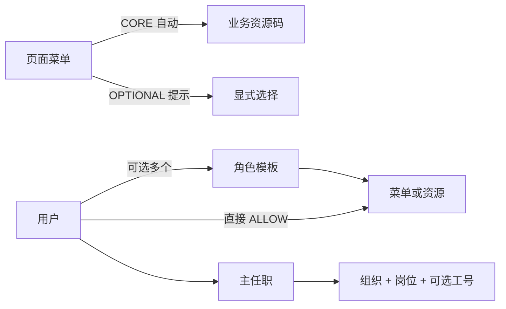

# 企业中台权限架构方案

> 当前口径：单企业、资源码唯一授权原子、角色模板 + 用户直接 ALLOW、菜单 CORE / OPTIONAL 资源包、组织页独立设置任职。

## 1. 目标

把原先形如 `GET /api/crm/example` 的技术接口权限，升级为运营人员能理解、前后端能稳定复用的业务资源码：

```text
sc.purchase_order.create
sc.purchase_order.approve
crm.customer.export
```

API、服务方法、任务和按钮只是资源的执行点，不再形成第二层授权目录。

## 2. 当前 Demo 范围

静态 Nuxt Demo 已实现：

- 用户、角色、菜单、资源；
- 角色批量授权、用户多角色和直接加授；
- 板块 → 目录 → 页面菜单树；
- 菜单绑定 CORE / OPTIONAL 资源；
- 勾选角色或直接菜单后，菜单与 CORE 在相应页签实时反显；
- OPTIONAL 黄色高亮，区分“角色已授 / 用户已授 / 待选”；
- 组织、岗位与用户主任职；
- 任职时可选补录工号；
- 有效权限来源解释和 Mock 审计。

Demo 不包含数据域、数据范围、客户数据行或权限模拟器交互。正式系统的数据边界作为后端二期建议，不应误写为 Demo 已实现。

界面字段口径：

- 角色：名称、角色编码、状态；没有板块字段；
- 用户列表：姓名、账号、任职、角色、直授和状态；不显示内部策略版本；
- 创建用户：姓名、登录账号、状态；没有工号、组织、岗位或角色；
- 任职：选择用户、组织、岗位，工号选填；
- 用户授权：角色多选优先展示，其次是菜单、资源和有效权限。

## 3. 模型



有效资源：

```text
角色显式资源
∪ 角色菜单 CORE
∪ 用户直接资源
∪ 用户直接菜单 CORE
```

只保留 ALLOW。结果过滤停用和过期关系，按资源去重并保留全部来源。

## 4. 编码

| 对象 | 格式 | 示例 |
| --- | --- | --- |
| 板块 | `BOARD_<DOMAIN>` | `BOARD_INFO` |
| 目录 | `DIR_<DOMAIN>_<GROUP>` | `DIR_INFO_CUSTOMER` |
| 页面菜单 | `MENU_<DOMAIN>_<PAGE>` | `MENU_INFO_CUSTOMER_LIST` |
| 角色 | `ROLE_<DUTY>` | `ROLE_SALES_MANAGER` |
| 业务资源 | `<domain>.<object>.<action>` | `crm.customer.export` |

菜单与角色编码使用大写字母、数字和下划线。业务资源码全小写、点分段，不包含 HTTP Method、URL、组件名或数据库表名。编码全局唯一，启用后不原地改义。

## 5. 菜单资源包

- 只有页面菜单可授权；板块和目录只做导航分组；
- CORE 是页面可运行的最低资源，随菜单自动生效；
- OPTIONAL 是页面内选配动作，不自动授予；
- 高风险资源不得设为 CORE；
- 同一菜单与资源不能同时是 CORE 和 OPTIONAL；
- 父节点勾选保存当时启用的页面叶子，不包含未来新菜单；
- CORE 是实时引用，不复制到每个用户或角色关系表。

用户授权抽屉中，勾选角色后应立即反显该角色的菜单、显式资源和菜单 CORE；OPTIONAL 使用黄色高亮，并标明是否已由角色或用户直授满足。角色与 CORE 反显属于只读投影，不得复制进用户直授关系。

## 6. 组织与岗位

用户账号与任职分开维护：

```text
创建用户
→ 组织与岗位页面选择用户
→ 选择组织与岗位
→ 可选补录工号
→ 保存主任职并记录审计
```

一期每个用户只有一个有效主任职。岗位必须属于所选组织。调岗不自动改变角色，也不迁移业务数据归属。

## 7. 前后端职责

### 前端

- 从后端获取有效菜单树和资源码集合；
- 用 `useAuthorization().can(code)` 作为统一逻辑源；
- 结构性内容使用 `<Can>` 或 `v-if`；
- 原生 DOM 操作可用 `v-permission`；
- 路由 meta 和 Nuxt middleware 只改善导航体验；
- 加载失败时默认不展示受控入口；
- 不根据角色名硬编码按钮。

```ts
const { can } = useAuthorization()
const canApprove = computed(() =>
  can('sc.purchase_order.approve')
)
```

### 后端

- 从可信 Principal 获取当前用户；
- 每个非公开业务服务方法校验资源码；
- Spring 可用 `@EnableMethodSecurity` 与 `@PreAuthorize`；
- 未标注方法不会自动受保护，必须使用 CI 扫描和受控服务边界；
- 授权变化同时写关系、版本、审计和缓存失效事件；
- 未命中规则、目录加载失败或资源停用时默认拒绝。

```java
@PreAuthorize("hasAuthority('sc.purchase_order.approve')")
@Transactional
public PurchaseOrderVO approve(long orderId) {
    return doApprove(orderId);
}
```

前端隐藏不是安全边界，直接调用 API 仍必须由后端返回 403。

## 8. 数据表建议

核心表：

```text
iam_user
iam_role
iam_resource
iam_menu
iam_menu_resource_binding
iam_user_role
iam_role_resource
iam_role_menu
iam_user_resource_grant
iam_user_menu_grant
iam_org_unit
iam_position
iam_user_assignment
iam_audit_log
iam_outbox
```

重要约束：

- `iam_user` 不存工号；
- `iam_user_assignment.employee_no` 可空；
- `iam_user_assignment.user_id` 一期唯一；
- 角色表没有板块字段；
- 菜单包主键为 `(menu_id, resource_id)`；
- 角色与用户表只保存显式菜单/资源；
- CORE 派生结果不反写；
- 用户直授原因必填、失效时间可空；
- 被引用对象优先停用，不物理删除。

## 9. 管理流程

### 新增资源

1. 确认没有同义资源；
2. 登记业务资源码、名称、风险与状态；
3. 前后端生成常量；
4. 后端执行点声明资源码；
5. 前端入口使用同一资源码；
6. 配置角色或菜单包；
7. 增加允许和拒绝测试。

### 用户授权

1. 先多选角色模板，并即时核对角色菜单反显；
2. 再选择直接菜单；
3. 检查角色菜单或直接菜单自动反显的 CORE；
4. 根据黄色提示按需选择尚未满足的 OPTIONAL 或其他直接资源；
5. 填写原因；
6. 失效时间按需填写；
7. 保存并查看 diff、审计和有效来源。

### 角色授权

1. 选择菜单叶子；
2. 核对 CORE 自动集合；
3. 选择 OPTIONAL 与独立资源；
4. 保存显式关系；
5. 提升受影响用户版本。

## 10. 后端二期数据边界建议

二期可引入“岗位 × 数据域”，固定范围为 `NONE`、`SELF`、`DEPT`、`DEPT_AND_DESCENDANTS`、`CUSTOM_DEPTS`、`ALL`。

基本规则：

- 正式范围只绑定岗位；
- 用户授权页不配置临时范围；
- 无任职或无策略默认 `NONE`；
- 范围由服务端解析并下推 SQL；
- 列表、详情、更新、删除、导出和任务使用一致谓词；
- 前端不计算范围；
- 可先用显式 SQL / QuerySpec，规模扩大后再评估 MyBatis-Plus `DataPermissionInterceptor`。

这部分不是当前 Demo 能力。

## 11. 安全与测试

必须遵循：最小权限、默认拒绝、逐请求后端校验、对象级检查、统一错误、适当日志与自动化测试。

重点测试：

- 用户、角色、资源或菜单停用；
- 直授尚未生效或已经到期；
- 同一资源多来源与单来源撤销；
- OPTIONAL 未选；
- HIGH CORE 和重复绑定；
- 用户多角色合并；
- 工号为空的任职；
- 岗位不属于组织；
- 组织树成环；
- 直接调用隐藏操作 API；
- 两名管理员并发发布；
- 授权加载失败与事务回滚。

## 12. 迁移

```text
盘点旧 API 标识
→ 建立业务资源映射
→ 回填角色与菜单包
→ 新旧规则影子计算
→ 前后端切换资源码
→ 按板块灰度
→ 停止返回旧标识
→ 删除旧运行时链路
```

不要一条 API 机械创建一个资源。迁移映射只服务差异分析，完成后归档。

## 13. 交付顺序

1. 目录与编码治理；
2. 资源、菜单与菜单包；
3. 角色、用户多角色和直接授权；
4. 组织、岗位、任职与可选工号；
5. 后端资源校验、前端体验控制；
6. 版本、缓存、审计和迁移；
7. 二期岗位数据边界。

## 14. 参考

- [NIST Role-Based Access Control](https://csrc.nist.gov/Projects/Role-Based-Access-Control)
- [NIST IR 6192](https://csrc.nist.gov/pubs/ir/6192/final)
- [OWASP Authorization Cheat Sheet](https://cheatsheetseries.owasp.org/cheatsheets/Authorization_Cheat_Sheet.html)
- [Spring Security Method Security](https://docs.spring.io/spring-security/reference/servlet/authorization/method-security.html)
- [Vue Custom Directives](https://vuejs.org/guide/reusability/custom-directives.html)
- [Nuxt Route Middleware](https://nuxt.com/docs/4.x/directory-structure/app/middleware)
- [MyBatis-Plus Data Permission Plugin](https://baomidou.com/plugins/data-permission/)

> 最终原则：角色做复用，直授做例外，菜单做资源包，资源码贯穿前后端，组织页负责任职；Demo 只演示一期交互，数据边界留到后端二期实现。
