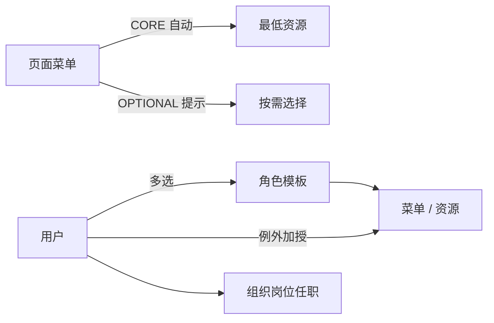

# 企业中台权限架构研发演示概要

> 用于评审和研发宣讲。核心：业务资源码、角色模板、用户直接 ALLOW、菜单资源包、组织页独立任职。

## 1 / 9　为什么调整

旧方案把 `GET /api/crm/example` 同时用于后端注解、前端路由和按钮：

- 技术含义过强，运营人员难以理解；
- URL 重构会影响授权；
- 一个业务动作可能跨多个接口；
- 菜单和按钮缺少清晰业务语义。

新方案统一使用：

```text
crm.customer.read
crm.customer.export
sc.purchase_order.approve
```

API 只是执行点，不再成为授权目录。

## 2 / 9　最终模型



角色负责复用，用户直授负责例外，菜单负责打包，资源码负责前后端合同。

## 3 / 9　当前 Demo 交互

已演示：

- 用户和角色的创建、筛选、编辑与授权；
- 用户角色多选，且角色优先展示；
- 板块 → 目录 → 页面菜单树；
- 资源目录；
- 菜单 CORE / OPTIONAL 包；
- 角色一经勾选，其菜单和 CORE 资源立即反显；
- OPTIONAL 黄色高亮，区分角色已授与待选；
- 组织、岗位和用户主任职；
- 任职时工号可选；
- 有效权限来源和 Mock 审计。

Demo 没有数据域、数据范围、客户数据行和权限模拟器交互。这些不属于当前演示完成范围。

## 4 / 9　页面字段口径

| 页面 | 关键字段 |
| --- | --- |
| 用户 | 姓名、账号、任职、角色、直授、状态；列表无内部策略版本 |
| 创建用户 | 姓名、登录账号、状态；无工号和任职 |
| 角色 | 名称、`ROLE_` 编码、状态；无板块字段 |
| 资源 | 名称、业务资源码、风险、状态 |
| 菜单 | 类型、名称、编码、父级、页面路由、状态 |
| 任职 | 用户、组织、岗位、可选工号 |

用户创建、任职和授权是三个独立动作，避免一个表单承担过多职责。

## 5 / 9　编码规范

```text
BOARD_INFO
DIR_INFO_CUSTOMER
MENU_INFO_CUSTOMER_LIST
ROLE_SALES_MANAGER
crm.customer.export
```

- 板块、目录、菜单和角色使用明确大写前缀；
- 业务资源码使用 `<domain>.<object>.<action>`；
- 资源码不含 URL、HTTP Method、组件名或表名；
- 编码启用后不原地改义。

## 6 / 9　菜单包

```text
授予客户列表菜单
→ 自动得到 crm.customer.read（CORE）
→ 看到 crm.customer.export（OPTIONAL）提示
→ 管理员按职责决定是否勾选导出
```

- CORE 是页面可运行的最低能力；
- OPTIONAL 不是默认赠送；
- HIGH 风险资源不能进入 CORE；
- CORE 实时展开，不复制到每个授权关系；
- 父菜单勾选只保存当时启用的页面叶子。

## 7 / 9　前后端协作

前端：

```ts
const { can } = useAuthorization()
const showApprove = computed(() =>
  can('sc.purchase_order.approve')
)
```

可使用 `<Can>`、`v-if`、原生 DOM 上的 `v-permission` 和 Nuxt route middleware；它们只改善体验。

后端：

```java
@PreAuthorize("hasAuthority('sc.purchase_order.approve')")
public PurchaseOrderVO approve(long orderId) {
    return doApprove(orderId);
}
```

后端逐请求裁决，前端隐藏不构成安全边界。

## 8 / 9　生产实现重点

```text
iam_user
iam_role
iam_resource
iam_menu
iam_menu_resource_binding
iam_user_role
iam_role_resource / iam_role_menu
iam_user_resource_grant / iam_user_menu_grant
iam_org_unit / iam_position / iam_user_assignment
iam_audit_log / iam_outbox
```

- 显式授权关系入库，CORE 派生结果不入库；
- 工号存任职表并允许为空；
- 角色表没有板块字段；
- 用户直授原因必填、失效时间可选；
- 授权、版本、审计和缓存失效同事务；
- 变更使用乐观并发；
- 默认拒绝并测试绕过路径。

## 9 / 9　路线图

一期：

1. 目录和编码治理；
2. 菜单资源包；
3. 角色与用户直接授权；
4. 组织岗位任职；
5. 后端资源校验、前端体验控制；
6. 审计、版本、缓存和旧标识迁移。

二期后端建议：按岗位 × 数据域增加正式数据边界，将谓词下推 Repository / SQL；不在用户授权页配置，不由前端过滤。

> 评审结论建议：先把资源码确认为唯一能力合同，保持角色和菜单包简单可解释；当前 Demo 只呈现一期范围，数据边界在后端二期单独建设。
