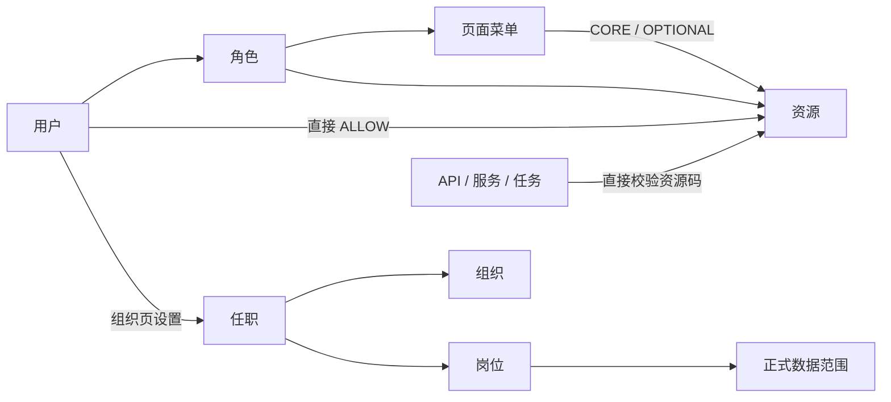

# 企业中台权限架构研发演示概要

> 评审修订版 · 建议讲述 10–12 分钟  
> 核心：单层资源码、菜单资源包、组织页设置任职、岗位正式数据范围

## 1 / 10　一句话方案

```text
角色做复用
用户直授做例外
菜单做资源包
资源码贯穿前后端
组织页设置任职
岗位决定正式数据边界
```

适用于单一小型企业，不引入多租户、用户 DENY、角色层级或通用策略引擎。

## 2 / 10　评审后的概念收敛

| 调整前 | 调整后 |
| --- | --- |
| 功能 | 统一改名为资源 |
| 功能 + REPORT/TEMPLATE 业务资源 | 只保留单层授权资源 |
| API → 资源 → 功能 | 执行点直接声明资源码 |
| 用户创建时选组织岗位 | 组织页单独设置任职 |
| 用户授权抽屉展示数据范围 | 用户页不展示数据范围 |
| 预留临时数据范围 | 本期不做 |

资源示例：

```text
crm.customer.read
sc.purchase_order.create
sc.purchase_order.approve
```

API 只是执行点，不是可授权资源。

## 3 / 10　核心对象



只有页面菜单和资源进入授权集合。

## 4 / 10　最终判定

```text
EffectiveResources(u)
  = RoleResources(u)
  ∪ DirectAllowResources(u)
  ∪ MenuCoreResources(u)

Allow(u, resource, row)
  = resource ∈ EffectiveResources(u)
  AND row ∈ PositionScope(u, resource.dataDomain)
```

| 资源授权 | 数据范围 | 结果 |
| --- | --- | --- |
| 有 | 命中 | 允许 |
| 有 | 不命中 / NONE | 拒绝 |
| 无 | ALL | 拒绝 |

## 5 / 10　菜单资源包

| 等级 | 规则 |
| --- | --- |
| CORE | 随页面菜单自动生效，在资源 Tab 锁定反显 |
| OPTIONAL | 显眼提示，管理员按需单独勾选 |
| HIGH | 永远不能成为 CORE |

```text
采购订单菜单
  CORE:     sc.purchase_order.read
  OPTIONAL: sc.purchase_order.create
  OPTIONAL: sc.purchase_order.approve  # HIGH
```

父节点只保存当前页面菜单叶子集合，未来新增子菜单不会自动扩权。

## 6 / 10　用户与组织岗位解耦

### 用户页

- 新建：姓名、账号、工号、状态；
- 授权：角色、菜单、资源；
- 不设置组织、岗位；
- 不展示数据范围；
- 不提供临时数据范围。

### 组织与岗位页

```text
选择用户 → 选择组织 → 选择岗位 → 保存主任职 → 提升策略版本
```

岗位卡片展示当前成员。调岗覆盖主任职并写 before / after 审计。

## 7 / 10　岗位正式数据范围

固定枚举：

```text
NONE
SELF
DEPT
DEPT_AND_DESCENDANTS
CUSTOM_DEPTS
ALL
```

按数据域配置：

```text
销售主管 @ 客户成功部
  crm.customer → DEPT_AND_DESCENDANTS

采购专员 @ 供应链中心
  sc.purchase_order → DEPT
```

上级关系来自组织树，不从岗位名称或级别数字推导。

## 8 / 10　前后端统一资源码

```ts
// 前端：体验控制
const canCreate = hasResource('sc.purchase_order.create')
```

```java
// 后端：安全边界
@RequireResource("sc.purchase_order.create")
@PostMapping("/api/sc/purchase-orders")
```

服务端仍需：

1. 校验资源存在且 ACTIVE；
2. 解析用户有效来源；
3. 若资源声明数据域，则应用岗位数据谓词；
4. 列表、详情、写操作、导出和异步任务复用相同语义。

CI 只生成执行点覆盖报告，不建立运行时 API 资源表。

## 9 / 10　最小数据结构

```text
iam_user
iam_role
iam_resource
iam_menu
iam_user_role
iam_role_permission
iam_user_direct_grant
iam_menu_resource_binding

org_unit
org_position
org_user_assignment
iam_data_domain
iam_position_data_policy

iam_audit_log
```

关键字段精简：

| 对象 | 保留字段 |
| --- | --- |
| 用户 | 姓名、账号、工号、状态 |
| 角色 | 名称、编码、板块、状态 |
| 资源 | 名称、资源码、板块、风险、数据域、状态 |
| 菜单 | 类型、名称、编码、上级、菜单码、路由 |
| 组织 | 名称、上级、类型、负责人 |
| 岗位 | 名称、所属组织、正式数据策略 |

## 10 / 10　迁移与验收 Gate

### lite-mall 迁移

```text
盘点旧 API 标识
→ 按业务动作建立资源
→ 维护只读迁移映射
→ 新旧双轨影子计算
→ 前端切资源码
→ 后端执行点直绑资源码
→ 分板块灰度
→ 下线旧 API 权限列表
```

### Gate

| 类别 | 标准 |
| --- | --- |
| 目录 | 只有单层资源，无旧业务资源或 API 资源 |
| 用户 | 创建时无组织岗位；授权抽屉无数据范围 |
| 任职 | 仅组织页设置，岗位必须属于所选组织 |
| 菜单包 | CORE 反显、OPTIONAL 提示、HIGH 不可 CORE |
| 后端 | 管理执行点 100% 声明有效资源码 |
| 数据 | 资源 AND 数据范围，未配置默认 NONE |
| 审计 | 授权、菜单包、资源、任职、岗位策略均可追溯 |

> 最终建议：把“资源码”确认为唯一能力合同；用户直授保持 ALLOW only；组织岗位与用户账号分开维护；本期不要增加临时数据范围和第二层资源目录。
