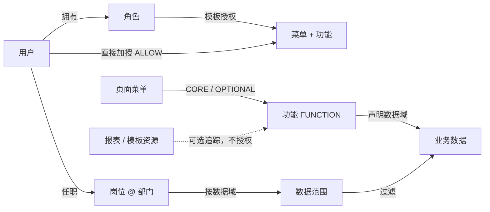
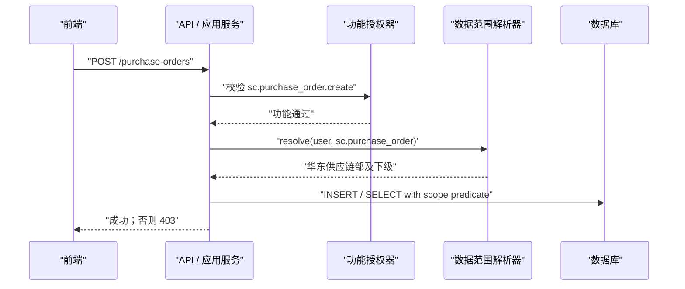

# 企业中台权限架构｜研发会议演示概要

> 12 个 slide-like sections · 建议 10–14 分钟 · 研发向 / a little geeky  
> 版本 1.1 · 详细设计见[《企业中台权限架构方案》](./企业中台权限架构方案.md)

---

## 1 / 12　统一授权语言：只认业务功能码

```text
旧：GET /api/crm/customers
    = 后端注解 = 前端按钮 = 角色权限 = 运营语言

新：crm.customer.read（查看客户）
    = 前端体验控制 + 后端强制校验 + 管理员授权

API = 执行点，不是资源权限
```

| 旧问题                    | 新方向                  |
| ------------------------- | ----------------------- |
| URL 改名影响授权          | API 与业务权限解耦      |
| 运营人员看不懂            | 中文功能名 + 稳定功能码 |
| API→资源→功能形成二次映射 | 执行点直接声明功能码    |
| 只控制“能否调接口”        | 功能 `AND` 数据范围     |

**一句话：`sc.purchase_order.create` 是前端、后端与权限中心唯一的能力合同。**

---

## 2 / 12　边界先锁死：小企业、单公司、默认拒绝

| 本期采用           | 明确不做                          |
| ------------------ | --------------------------------- |
| RBAC 角色模板      | 多租户 / `tenant_id` / 租户插件   |
| 用户 ALLOW 直授    | 用户级 `DENY` 与复杂优先级        |
| 菜单权限包         | 嵌套角色 / 角色层级               |
| 组织、岗位、数据域 | 任意 SQL / 通用 ABAC 表达式       |
| 报表/模板资源目录  | API 资源、任务/集成资源、对象 ACL |
| 服务端版本化缓存   | 把完整权限固化进长效 JWT          |

```text
功能不存在 / 已停用 / API 未声明功能码 / 数据范围未命中 => DENY
```

---

## 3 / 12　核心模型：只有菜单与功能可授权



| 对象              | 责任                       |
| ----------------- | -------------------------- |
| 角色 / 用户直授   | 决定“能做什么”             |
| 功能              | 唯一可授权的原子业务动作   |
| 菜单              | 页面入口与功能权限包       |
| API / 服务方法    | 直接校验功能码的执行点     |
| REPORT / TEMPLATE | 非授权资源目录，仅用于追踪 |
| 部门 / 岗位       | 决定“能对哪些数据做”       |

---

## 4 / 12　授权公式：来源取并集，能力与数据相与

```text
RoleFunctions(u)   = 用户有效角色的功能并集
DirectFunctions(u) = 用户未过期的 ALLOW 功能直授
MenuCore(u)        = 已授权页面菜单的已发布 CORE 功能

EffectiveFunctions(u)
  = RoleFunctions(u) ∪ DirectFunctions(u) ∪ MenuCore(u)

Allow(u, functionCode, row)
  = Authenticated(u)
  AND functionCode ∈ EffectiveFunctions(u)
  AND row ∈ EffectiveDataScope(u, function.dataDomain)
```

| 场景                      | 结果         |
| ------------------------- | ------------ |
| 有导出功能 + 无数据策略   | 拒绝 / 0 条  |
| 无导出功能 + `ALL` 范围   | 拒绝         |
| 用户直授导出 + 本部门范围 | 只导出本部门 |

---

## 5 / 12　菜单是可发布的功能包，不是安全边界

```text
供应链板块 BOARD
└─ 采购管理 DIRECTORY
   └─ 采购订单 MENU
      ├─ CORE：read
      └─ OPTIONAL：create / update / export / approve
```

| 机制       | 规则                              |
| ---------- | --------------------------------- |
| `CORE`     | 授予页面菜单时自动展开            |
| `OPTIONAL` | 管理员显式选择，以功能授权存储    |
| 高风险动作 | 导出、删除、审批不得进入 CORE     |
| 父节点勾选 | 只保存“当前页面叶子”快照          |
| 新增子菜单 | 不静默进入历史授权                |
| 包变更     | 草稿 → 影响分析 → 发布 → 提升版本 |

菜单包只能绑定 ACTIVE FUNCTION，不能绑定业务资源。

---

## 6 / 12　数据权限：岗位 × 部门 × 数据域

```text
采购主管 @ 华东供应链部
  sc.purchase_order = DEPT_AND_DESCENDANTS
  sc.supplier       = DEPT
```

| 范围                   | 语义                     |
| ---------------------- | ------------------------ |
| `NONE`                 | 无数据；受保护域默认值   |
| `SELF`                 | 本人负责的数据           |
| `DEPT`                 | 任职所在部门             |
| `DEPT_AND_DESCENDANTS` | 当前部门及全部下级       |
| `CUSTOM_DEPTS`         | 指定部门集合             |
| `ALL`                  | 该数据域全部数据；高风险 |

```sql
WHERE owner_org_unit_id IN (
  SELECT descendant_id FROM org_closure
  WHERE ancestor_id IN (:positionDeptIds)
)
```

上级关系来自组织树，不从岗位名称或级别数字推导。

---

## 7 / 12　一次请求的真实执行链



列表、详情、修改、删除、导出、批量与异步任务复用同一功能和数据范围语义。

---

## 8 / 12　研发契约：前后端使用同一个 Code

```java
@PostMapping("/purchase-orders")
@RequireFunction("sc.purchase_order.create")
public PurchaseOrderVO create(CreateCommand command) { ... }
```

```vue
<Button v-function="'sc.purchase_order.create'" @click="openCreate">
  新建采购单
</Button>
```

| 后端                             | 前端                             |
| -------------------------------- | -------------------------------- |
| 功能码必须存在且 `ACTIVE`        | 不绑定 API URL、不硬编码角色名   |
| 未保护管理端执行点构建失败或拒绝 | 按菜单注册路由、按功能显示按钮   |
| 关键应用服务再次保护             | 后端 403 不吞掉、不伪装成功      |
| 对象用“ID + 数据范围”查询        | `policyVersion` 变化后刷新上下文 |

CI 从代码生成执行点覆盖报告即可，不需要在线 API 资源表。

---

## 9 / 12　目录模型与可编辑生命周期

| 子域     | 关键表                                                    |
| -------- | --------------------------------------------------------- |
| 身份     | `iam_user`、`iam_role`、`iam_user_role`                   |
| 权限目录 | `iam_permission`（FUNCTION / MENU）、`iam_function`       |
| 授权     | `iam_role_permission`、`iam_user_permission`              |
| 菜单包   | `iam_menu`、`iam_menu_binding`                            |
| 业务资源 | `iam_business_resource`、`iam_function_business_resource` |
| 组织范围 | `org_unit`、`org_closure`、岗位与数据范围表               |
| 治理     | `policy_meta`、`iam_audit_log`                            |

```text
功能 / 业务资源：DRAFT → ACTIVE → DISABLED
稳定代码 + 动作/资源类型：创建后不可编辑
名称、描述、风险、数据域、状态、资源关联：可编辑
每次编辑：必填原因 + before / after + catalogVersion
```

业务资源类型仅 `REPORT | TEMPLATE`，且永远不进入授权关系。

---

## 10 / 12　PermissionContext：发给前端刚好够用

```json
{
  "policyVersion": 37,
  "roles": [{ "code": "purchaser", "name": "采购专员" }],
  "menus": [{
    "code": "menu.sc.purchase_order.list",
    "componentKey": "sc/purchase-order/list"
  }],
  "functionCodes": [
    "sc.purchase_order.read",
    "sc.purchase_order.create"
  ],
  "dataScopeSummary": [{
    "domain": "sc.purchase_order",
    "scope": "DEPT"
  }]
}
```

```text
Token：身份 / 会话
服务端缓存键：userId + authzVersion + policyVersion
前端上下文：菜单 + 功能码 + 范围摘要
不返回：API 路径权限、业务资源、完整授权目录
```

---

## 11 / 12　lite-mall 迁移：双轨证明，不做宽映射

```text
0. 盘点：旧注解 + 角色/API + 前端绑定 + 实际使用
1. 建功能目录：按业务动作归并，不按 API 数量机械生成
2. 影子计算：旧模型放行；记录 old_allow != new_allow
3. 安全回填：全覆盖才回填；部分覆盖就拆功能
4. 双轨切换：前端功能码 + 后端 RequireFunction，按模块灰度
5. 退役：停止返回 API 权限列表，删除旧运行时映射
```

旧 API 只保留在迁移清单和 CI 扫描报告，不写入 REPORT/TEMPLATE 资源表。最高风险仍是把多个旧 API 粗暴合成一个宽功能，导致历史角色扩权。

---

## 12 / 12　上线 Gate 与拍板项

| Gate       | 验收                                       |
| ---------- | ------------------------------------------ |
| 执行点覆盖 | 非公开管理 API 100% 声明有效功能码         |
| 授权对象   | 角色/用户只能选择菜单与功能                |
| 资源隔离   | REPORT/TEMPLATE 不得进入角色、直授或菜单包 |
| 组合矩阵   | 角色、直授、菜单多来源与到期均覆盖         |
| 对象级安全 | ID 篡改，详情/写入/导出均不能越权          |
| 迁移等价   | 影子差异逐项关闭                           |
| 撤权时效   | 版本提升与缓存失效达到约定 SLA             |
| 可解释性   | 模拟器说明“哪个功能来源 + 哪个数据范围”    |

建议确认：功能码为唯一授权合同；直授保持 ALLOW only；CORE 只含进入页面所需能力；未配置数据范围默认 NONE；功能码+动作、资源码+类型创建后不可改。

> **最终心智模型：角色做复用，直授做例外，菜单做成包，功能码贯穿前后端，岗位做数据边界；资源只追踪，不授权。**
