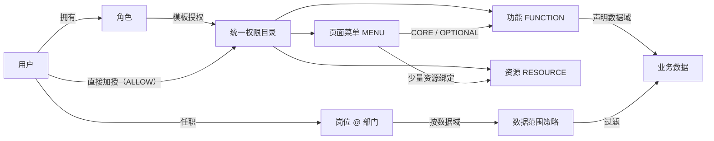
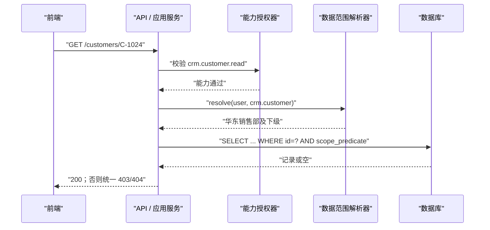

# 企业中台权限架构｜研发会议演示概要

> 12 个 slide-like sections · 建议 10–14 分钟 · 研发向 / a little geeky  
> 详细设计见[《企业中台权限架构方案》](./企业中台权限架构方案.md)

---

## 1 / 12　我们要改的不是权限码格式，而是授权语言

> 建议 45 秒

```text
旧：GET /api/crm/customers
    = 后端注解 = 前端按钮 = 角色权限 = 运营语言

新：crm.customer.read（查看客户）
    = 稳定业务功能码

    GET /api/... 只留在执行点注册表
```

| 旧问题 | 新方向 |
|---|---|
| URL 改名影响授权 | API 与业务权限解耦 |
| 运营人员看不懂 | 功能名称面向业务 |
| 菜单、按钮、接口混成一层 | 功能、资源、菜单、执行点分层 |
| 只控制“能否调接口” | 同时控制“能对哪些数据做” |

**一句话目标：让运营侧 less geeky，让执行链更严谨。**

---

## 2 / 12　边界先锁死：小企业、单公司、默认拒绝

> 建议 50 秒

| 本期采用 | 明确不做 |
|---|---|
| RBAC 角色模板 | 多租户 / `tenant_id` / 租户插件 |
| 用户直接加授 | 用户级 `DENY` 与复杂优先级 |
| 菜单权限包 | 嵌套角色 / 角色层级 |
| 组织、岗位、数据域 | 任意 SQL / 通用 ABAC 表达式 |
| 固定数据范围枚举 | 字段级权限 / 外部策略引擎 |
| 服务端版本化缓存 | 把完整权限固化进长效 JWT |

```text
默认规则：未登记 / 未绑定 / 未命中数据范围 => DENY
用户直授：ALLOW only；要“少于角色”就拆角色或移除角色
```

---

## 3 / 12　核心模型：RBAC + 用户 ACL + 关系型数据范围

> 建议 65 秒



| 对象 | 责任 |
|---|---|
| 角色 / 用户直授 | 决定“能做什么” |
| 功能 | 运营可理解的原子业务动作 |
| 资源 | 报表、模板、任务、集成操作等受控资产 |
| API / 服务方法 | 执行点；不直接成为运营授权对象 |
| 部门 / 岗位 | 决定“能对哪些数据做” |

---

## 4 / 12　授权公式：来源取并集，能力与数据相与

> 建议 70 秒

```text
RolePermissions(u)   = 用户有效角色的权限并集
DirectPermissions(u) = 用户未过期的 ALLOW 直授
MenuCore(u)          = 已授权页面菜单的已发布 CORE 展开

EffectivePermissions(u)
  = RolePermissions(u)
  ∪ DirectPermissions(u)
  ∪ MenuCore(u)

EffectiveDataScope(u, domain)
  = OR(各有效“岗位 @ 部门”在该数据域的策略)
```

```text
Allow(u, action, row)
  = Authenticated(u)
  AND action.permission ∈ EffectivePermissions(u)
  AND row ∈ EffectiveDataScope(u, action.dataDomain)
```

| 场景 | 结果 |
|---|---|
| 有导出功能 + 无数据策略 | 拒绝 / 0 条，不是全量 |
| 无导出功能 + `ALL` 数据范围 | 拒绝 |
| 用户直授导出 + 本部门范围 | 只导出本部门 |

**核心不变量：功能 `AND` 数据范围。**

---

## 5 / 12　菜单不是安全边界，而是可发布的权限包

> 建议 60 秒

```text
信息板块 BOARD
└─ 客户管理 DIRECTORY
   └─ 客户列表 MENU
      ├─ CORE：read / view_detail
      └─ OPTIONAL：create / update / export / delete
```

| 机制 | 规则 |
|---|---|
| `CORE` | 授予页面菜单时自动展开 |
| `OPTIONAL` | 管理员显式勾选；按角色/用户功能权限存储 |
| 高风险动作 | 导出、删除、审批默认不得进入 CORE |
| 父节点勾选 | 只保存“当前页面菜单叶子” |
| 新增子菜单 | 不自动落入历史父节点授权 |
| 包变更 | 草稿 → 影响分析 → 发布 → 版本提升 → 清缓存 |

撤销菜单只撤掉该菜单贡献的来源；相同功能若仍来自角色或直授，继续有效。

---

## 6 / 12　数据权限：岗位 × 部门 × 数据域

> 建议 70 秒

```text
同一岗位，不同数据域可以不同：

销售主管 @ 华东销售部
  crm.customer = DEPT_AND_DESCENDANTS
  crm.contract = DEPT
```

| 范围 | 语义 |
|---|---|
| `NONE` | 无数据；受保护数据域默认值 |
| `SELF` | 本人负责的数据 |
| `DEPT` | 任职所在部门 |
| `DEPT_AND_DESCENDANTS` | 当前部门及全部下级 |
| `CUSTOM_DEPTS` | 指定部门集合 |
| `ALL` | 该数据域全部数据；高风险 |

```sql
-- 上级看下级：来自组织闭包关系，不来自“岗位级别数字”
WHERE owner_org_unit_id IN (
  SELECT descendant_id FROM org_closure
  WHERE ancestor_id IN (:positionDeptIds)
)
```

多任职按允许范围并集；业务表明确 `owner_user_id`、`owner_org_unit_id`，调岗不自动改写历史数据归属。

---

## 7 / 12　一次请求的真实执行链

> 建议 75 秒



```text
认证
 -> 管理端默认拒绝规则
 -> 功能 / 资源授权
 -> 服务层对象级授权
 -> DAO 数据范围
 -> 审计与业务执行
```

列表、详情、修改、删除、导出、批量、异步任务都要复用同一数据范围语义。

---

## 8 / 12　研发契约：后端语义注解，前端只消费业务码

> 建议 65 秒

```java
@PostMapping("/export")
@RequireFunction("crm.customer.export")
@RequireResource("res.crm.customer.export_template")
public ExportTaskVO export(CustomerQuery query) { ... }
```

```vue
<Button v-function="'crm.customer.export'" @click="exportCustomers">
  导出客户
</Button>
```

```ts
// 后端菜单只给 componentKey；前端白名单决定实际代码
const componentRegistry = {
  'crm/customer/list': () => import('@/views/crm/customer/list.vue'),
};
```

| 后端 | 前端 |
|---|---|
| 注解代码必须存在且 `ACTIVE` | 不绑定 API URL、不硬编码角色名 |
| 管理端未保护接口构建失败或拒绝 | 按菜单注册路由、按功能显示按钮 |
| 关键应用服务再次保护 | 后端 403 不吞掉、不伪装成功 |
| 对象用“ID + 数据范围”查询 | `policyVersion` 变化后刷新上下文 |

---

## 9 / 12　最小数据模型与接口面

> 建议 60 秒

| 子域 | 关键表 |
|---|---|
| 身份 | `iam_user`、`iam_role`、`iam_user_role` |
| 权限目录 | `iam_permission`（FUNCTION / RESOURCE / MENU） |
| 授权 | `iam_role_permission`、`iam_user_permission` |
| 菜单包 | `iam_menu`、`iam_menu_binding` |
| 执行点 | `iam_endpoint`、`iam_endpoint_permission` |
| 组织 | `org_unit`、`org_closure`、`org_position`、`org_user_position` |
| 数据范围 | `iam_data_domain`、`iam_position_data_scope` |
| 治理 | `iam_policy_version`、`iam_change_audit` |

```http
GET  /api/iam/me/permission-context
POST /api/iam/roles/{id}/permissions/preview
POST /api/iam/menus/{id}/bindings/publish
PUT  /api/iam/positions/{id}/data-scopes
POST /api/iam/simulate
```

写接口统一：乐观锁 + 差异预览 + 原子审计 + `policyVersion` + 定向清缓存。所有表均无 `tenant_id`。

---

## 10 / 12　PermissionContext：发给前端刚好够用

> 建议 50 秒

```json
{
  "policyVersion": 37,
  "roles": [{ "code": "sales_rep", "name": "销售专员" }],
  "menus": [{
    "code": "menu.info.customer.list",
    "componentKey": "crm/customer/list"
  }],
  "functionCodes": [
    "crm.customer.read",
    "crm.customer.create"
  ],
  "dataScopeSummary": [{
    "domain": "crm.customer",
    "scope": "DEPT_AND_DESCENDANTS"
  }]
}
```

```text
Token：身份 / 会话
服务端缓存键：userId + policyVersion
前端上下文：菜单 + 功能码 + 少量 UI 资源 + 范围摘要
不返回：完整 API 路径权限列表、完整执行点注册表
```

撤权、角色、菜单包、岗位或组织变化后，不能等待 Token 自然过期。

---

## 11 / 12　lite-mall 迁移：双轨证明，不做大爆炸替换

> 建议 75 秒

```text
0. 盘点
   旧注解 + 角色/API + 前端绑定 + 实际使用
       ↓
1. 建目录
   API 执行点 -> 候选业务功能
       ↓
2. 影子计算
   旧模型实际放行；记录 old_allow != new_allow
       ↓
3. 安全回填
   全覆盖才回填功能；部分覆盖则拆功能/保留兼容
       ↓
4. 双轨切换
   前端功能码 + 后端语义注解，按模块灰度
       ↓
5. 退役
   停止返回 API 权限列表；注册表继续用于覆盖检查
```

**最高风险：把多个旧 API 粗暴合成一个宽功能，导致历史角色被扩权。**

优先试点“客户管理”；导出、删除、审批逐项人工复核，并保留模块级回滚开关与审计。

---

## 12 / 12　测试门槛与本次需要拍板的事项

> 建议 70 秒

### 上线门槛

| Gate | 验收 |
|---|---|
| 执行点覆盖 | 非公开管理接口 100% 受保护 |
| 组合矩阵 | 角色、直授、菜单多来源与到期均覆盖 |
| 对象级安全 | ID 篡改，详情/写入/导出均不能越权 |
| SQL 覆盖 | XML、联表、报表、异步任务已验证 |
| 迁移等价 | 影子差异逐项关闭 |
| 撤权时效 | 版本提升与缓存失效达到约定 SLA |
| 可解释性 | 模拟器能说明“哪个能力来源 + 哪个数据范围” |

### 建议会议确认

1. 首个试点采用客户管理；
2. 直授保持 `ALLOW only`，高风险直授要求到期时间；
3. 菜单 CORE 原则上只含进入页面所需的读能力；导出/删除/审批为 OPTIONAL；
4. 受保护数据域无岗位策略时默认 `NONE`，多任职范围取并集；
5. 统一对象不存在/无权时的 403/404 策略；
6. 明确权限变更缓存失效 SLA 与影子期退出标准。

> **最终心智模型：角色做复用，直授做例外，菜单做成包，岗位做数据边界；前端管体验，后端管事实。**
